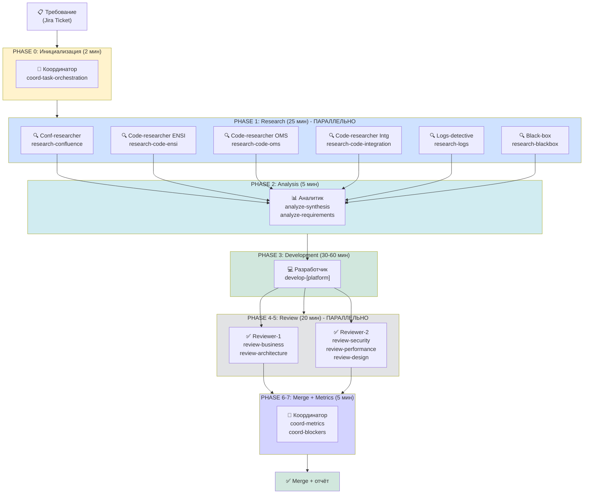
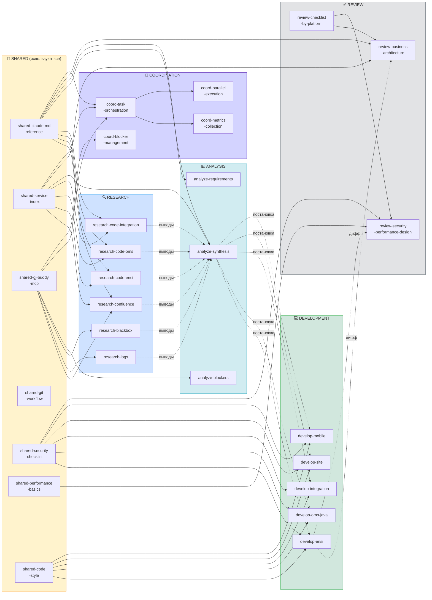
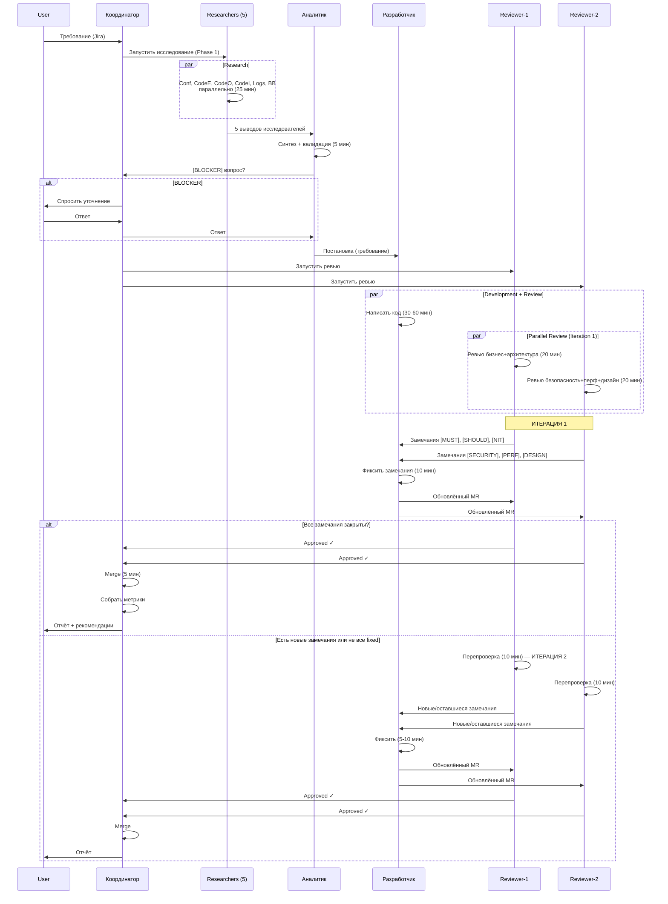
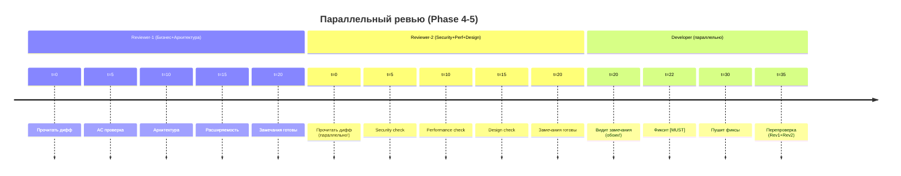
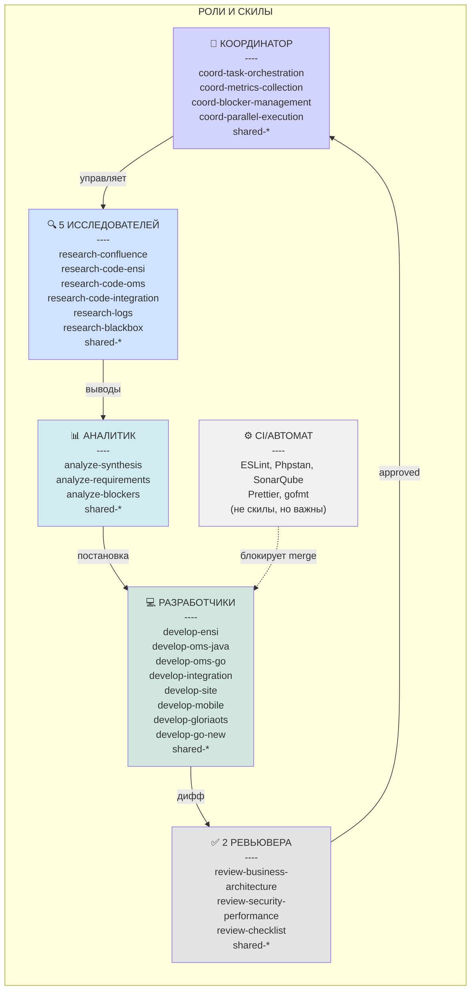
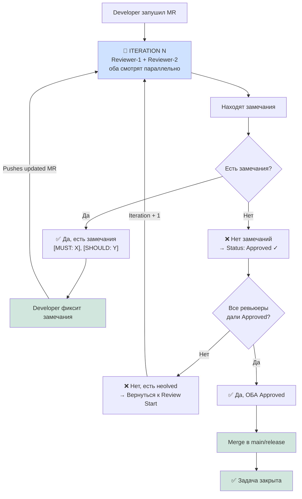
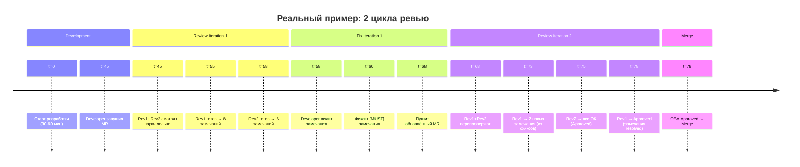

# Архитектура системы скилов: визуальное представление

## Диаграмма 1: Фазы выполнения и роли агентов



---

## Диаграмма 2: Граф зависимостей скилов



---

## Диаграмма 3: Поток данных между фазами (с циклическим ревью)



---

## Диаграмма 4: Параллелизм в Phase 1 (Research)

```mermaid
timeline
    title Параллельное исследование (Phase 1)
    
    section Conf-researcher
        t=0: Старт Confluence
        t=2: Читает ТЗ
        t=4: Читает AC
        t=5: Читает историю
        t=8: Выводы готовы
    
    section Code-researcher (ENSI)
        t=0: Старт кода ENSI
        t=5: Codegraph
        t=8: OpenAPI
        t=10: Выводы готовы
    
    section Code-researcher (OMS)
        t=0: Старт кода OMS
        t=6: BPMN процесс
        t=10: Handlers
        t=12: Выводы готовы
    
    section Code-researcher (Integration)
        t=0: Старт кода Integration
        t=4: Маршруты
        t=7: Контракты
        t=10: Выводы готовы
    
    section Logs-detective
        t=0: Старт логов
        t=5: Стенд запрос
        t=8: Лаг анализ
        t=10: Edge-case check
        t=15: Выводы готовы
    
    section Black-box-researcher
        t=0: Старт API
        t=3: Запросы на тест
        t=6: Ответы анализ
        t=8: Edge-cases
        t=12: Воспроизводимость
        t=15: Выводы готовы
```



→ **Итого: 25 мин (не 100 мин последовательно!)**

---

## Диаграмма 5: Параллелизм в Phase 4-5 (Review)



→ **Итого: 35 мин (не 60 мин последовательно!)**

---

## Диаграмма 6: Связность скилов — как они не теряются

```mermaid
graph TB
    Start["Требование (Jira)"]
    
    Start -->|Coord запускает| R1["research-confluence<br/>research-code-{e,o,i}<br/>research-logs<br/>research-blackbox"]
    
    R1 -->|Researchers используют| Shared1["shared-claude-md<br/>shared-service-index<br/>shared-gj-buddy-mcp"]
    
    R1 -->|Выводы идут к| Analyst["analyze-synthesis<br/>analyze-requirements<br/>analyze-blockers"]
    
    Analyst -->|Аналитик использует| Shared2["shared-claude-md<br/>shared-service-index"]
    
    Analyst -->|Если [BLOCKER]| Coord["coord-blocker<br/>-management"]
    
    Analyst -->|Постановка идёт к| Dev["develop-ensi<br/>develop-oms-java<br/>develop-integration<br/>develop-site<br/>develop-mobile"]
    
    Dev -->|Developer использует| Shared3["shared-code-style<br/>shared-security-checklist<br/>shared-performance-basics<br/>shared-git-workflow"]
    
    Dev -->|MR дифф идёт к| Rev["review-business<br/>-architecture<br/>+<br/>review-security<br/>-performance-design"]
    
    Rev -->|Reviewers используют| Shared4["shared-security-checklist<br/>shared-performance-basics<br/>review-checklist<br/>-by-platform"]
    
    Rev -->|Замечания идут к| Dev2["Developer фиксит"]
    
    Dev2 -->|Фиксы к| Rev2["Reviewers перепроверяют"]
    
    Rev2 -->|Approved| Coord2["coord-metrics<br/>-collection"]
    
    Coord2 -->|Отчёт| End["✅ Merge + Metrics"]
    
    style Start fill:#fff3cd
    style Shared1 fill:#ffe0b2
    style Shared2 fill:#ffe0b2
    style Shared3 fill:#ffe0b2
    style Shared4 fill:#ffe0b2
    style End fill:#d1e7dd
```

**Ключевой принцип:** 
- **Входит** → скилл загружается
- **Использует SHARED** → скилл опирается на общие скилы
- **Выводит** → информация передаётся следующему агенту
- **Не теряется** → каждый скилл явно загружается на нужную фазу

---

## Диаграмма 7: Разделение ролей — кто что делает



---

## Как проверить связность системы скилов?

### Checklist для валидации

- [ ] Каждый скилл явно указан в SKILLS_INDEX.md
- [ ] Каждый скилл разделён по роли ([RESEARCH], [DEVELOPMENT] и т.д.)
- [ ] Каждый скилл имеет "Входит", "Выходит", "Процесс", "Правила"
- [ ] Shared скилы используются всеми кто их нуждается
- [ ] Нет дублирования (один скилл = одно назначение)
- [ ] Граф зависимостей ацикличен (нет циклов в скилах)
- [ ] [BLOCKER] вопросы явно идут к Координатору
- [ ] [NB] вопросы не блокируют Development
- [ ] Ревьюеры не пишут код, только комментируют
- [ ] Разработчик не ревьюит себя
- [ ] Исследователи не пишут код
- [ ] Координатор не пишет код, только управляет
- [ ] Каждый агент получает нужный контекст (<20K токенов)

---

## Быстрая диаграмма: "Как запустить задачу"

```mermaid
flowchart LR
    Start["Требование"]
    
    Start -->|1. Coord запускает<br/>task-research-and-analyze| Phase1["Phase 1: Research<br/>25 мин"]
    
    Phase1 -->|2. Conf, Code×3,<br/>Logs, BB работают<br/>параллельно| Outputs["5 выводов"]
    
    Outputs -->|3. Analyst синтезирует| Phase2["Phase 2: Analysis<br/>5 мин"]
    
    Phase2 -->|4. Postановка<br/>или [BLOCKER]| Decision{Есть<br/>[BLOCKER]?}
    
    Decision -->|Да| Coord["Coord спрашивает<br/>человека"]
    Coord -->|Ответ| Phase2
    
    Decision -->|Нет| Phase3["Phase 3: Development<br/>30-60 мин"]
    
    Phase3 -->|5. Developer пишет| MR["MR готов"]
    
    MR -->|6. Запустить ревью| Phase45["Phase 4-5: Review<br/>20 мин параллельно"]
    
    Phase45 -->|7. Rev1 + Rev2| Comments["Замечания"]
    
    Comments -->|8. Developer фиксит| Dev2["Фиксы"]
    
    Dev2 -->|9. Перепроверка| Approved{Approved<br/>both?}
    
    Approved -->|Да| Phase67["Phase 6-7: Merge"]
    Approved -->|Нет| Dev2
    
    Phase67 -->|10. Coord merge| End["✅ Done"]
    
    style Start fill:#fff3cd
    style Phase1 fill:#cfe2ff
    style Phase2 fill:#d1ecf1
    style Phase3 fill:#d1e7dd
    style Phase45 fill:#e2e3e5
    style Phase67 fill:#d3d3ff
    style End fill:#d1e7dd
```

---

## Диаграмма 8: Циклический процесс ревью (ВАЖНО!)



**Ключевые моменты:**
- ♾️ **Цикл может повторяться 2-3 раза** (редко более)
- **Оба ревьюера должны дать Approved** перед merge
- Developer фиксит в цикле, не последовательно
- Каждая итерация: Review (20 мин) + Fix (10 мин) = 30 мин за цикл

---

## Диаграмма 9: Временная шкала с циклическим ревью



→ **Итого: 78 мин на ревью + фиксы (вместо 90+ если бы последовательно)**

---

**Диаграммы обновлены:** 2026-10-06  
**Версия:** 1.1 (добавлено циклическое ревью)  
**Ссылка на mermaid.live:** https://mermaid.live/ (копируй-вставляй диаграммы)
