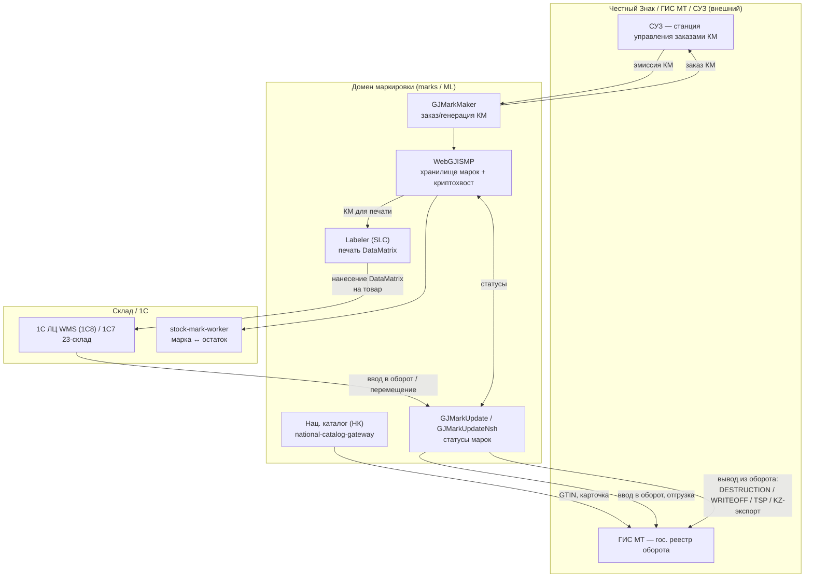
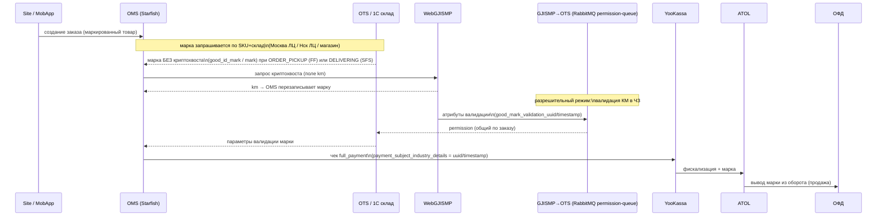
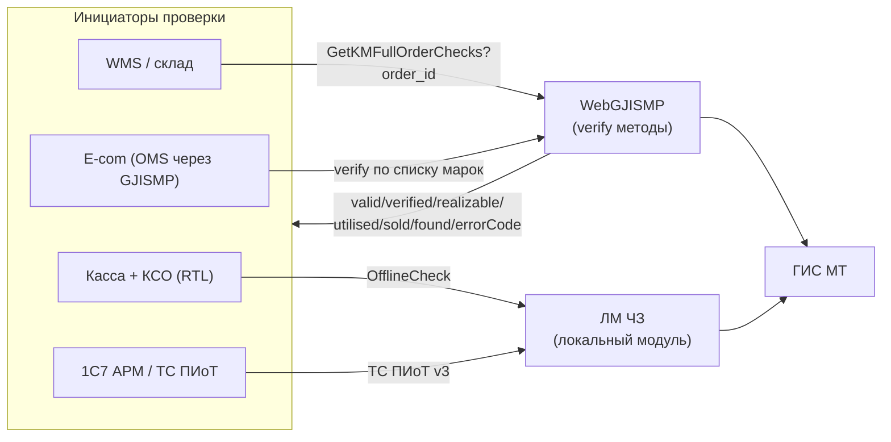

# Карта процессов маркировки товаров (Честный Знак / ГИС МТ)

> **Дата:** 2026-06-03 · **Тип:** architecture / process-map (read-only research) · **Owner домена:** IT-архитектура
> **Скоуп:** legal/product marking (Честный Знак, ГИС МТ, КИ/КиЗ, криптохвост, DataMatrix) и его стык с e-commerce контуром (OMS / OTS / Integration / YooKassa / ATOL / ОФД).
>
> Источник фактов — Confluence (spaces **ML**, **OMNIES**, **002**, **RTL**, **OPSLOG**, **MWHNSH**) + Buddy system-map. Ссылки даны по `page_id` — **не дублируем длинные выжимки**, навигируемся по id.
> Секреты (пароли RabbitMQ, X-API-KEY ISMP и т.п.) намеренно **не** вынесены в этот документ.

---

## 0. Три разных «маркировки» — не путать

| Контур | Что это | Где описано | В этом документе |
|---|---|---|---|
| **A. Домен маркировки (ML / marks)** | Легальная маркировка ЧЗ/ГИС МТ: заказ КМ, нанесение DataMatrix, движение марок, вывод из оборота, верификация (разрешительный режим) | space **ML**, частично **002/RTL/OPSLOG** | ✅ основной фокус (разделы 2–4) |
| **B. E-commerce контур (OMNIES)** | Как марка/криптохвост/параметры валидации проходят через интернет-заказ: OMS → OTS → чек YooKassa → ATOL → ОФД | space **OMNIES** | ✅ раздел 3 |
| **C. Операционная BP-4.3 «Маркировка товара»** | **НЕ ЧЗ.** Складская идентификация посылки: накладные, сопроводительные документы, этикетки ТК | OMNIES `60696316` | ⚠️ раздел 6 (отдельный блок «не ЧЗ») |

> ⚠️ Также не путать с `cancellationStage` в OMS BPMN (атрибут отмены заказа) и с BY-datamatrix external tasks в OMS (`datamatrixCodeGetterActivity` и др. — это маркировка для рынка Беларуси, см. раздел 5).

---

## 1. Системы домена (system ↔ GitLab)

Полный single-source-of-truth — Confluence **`165403624`** «Карта систем ↔ GitLab», раздел «Маркировка — system map». Здесь — рабочая выжимка. **Ни одного из этих репо нет в `platform/` клонах** (см. раздел 8).

| Система | Роль | GitLab | Реестр ИС |
|---|---|---|---|
| **WebGJISMP** | Основной marking gateway: единое хранилище марок, выдача криптохвоста (`km`), верификация КМ | `marks/WebGJISMP` | Jira `DEVLBL001` |
| **GJMarkMaker** | Генерация/заказ марок (КМ) | `project/GJMarkMaker` | — |
| **GJMarkUpdate** | Передача статусов марок: 1С (7/8) ↔ WebGJISMP, ввод/вывод из оборота, KZ-экспорт | `project/GJMarkUpdate` | — |
| **GJMarkUpdateNsh** | Мост 1С7 ЛЦ НШ (Новошахтинск) → WebGJISMP | (в кластере `project/GJMark*`) | space MWHNSH |
| **MarkStatusSyncService** | Синхронизация статусов марок | `project/MarkStatusSyncService` | — |
| **RemarkControlService** | Контроль перемаркировки | `project/RemarkControlService` | — |
| **stock-mark-worker** | Воркер привязки марок к остаткам | `project/stock-mark-worker` | — |
| **Национальный Каталог (НК)** | Карточки товара/GTIN для ГИС МТ | `project/national-catalog-gateway` | Реестр ИС №21 |
| **Labeler (SLC)** | Печать/нанесение DataMatrix (desktop) | `project/labeler` + `project/labeleravalonia` | Реестр ИС №16 |
| **certifimport** | Импорт сертификатов соответствия | `project/certifimport` | proxy |
| **ЛМ ЧЗ / ТС ПИоТ** | Локальный модуль Честного Знака / товарная система «ПИоТ» (offline-проверка КМ) | вендор (ЧЗ), интеграция через WebApi | — |

**Смежные системы (вне домена marks, но участвуют):** OMS (`starfish-oms/cloud/core`), OTS (`gloriaots`), Integration Service (`avg-integration-service`), 1С ЛЦ WMS (`1s8-enterprise/1c-lc`), 1С7 АРМ/ЦБР (1С-платформа), YooKassa + ATOL + ОФД (внешние), ГИС МТ / СУЗ / Честный Знак (внешний регулятор).

---

## 2. Сквозной жизненный цикл марки (inbound: производство/импорт → склад → вывод)

**Ключевые INT-цепочки inbound/withdrawal (space ML):**
- `15977939` — INT 1C → GJMarkUpdate → WebGJISMP (базовая связка 1С↔марки)
- `118313917` — OUT (DESTRUCTION) вывод из оборота (уничтожение)
- `118313951` — OUT (WRITEOFF) вывод из оборота (утрата)
- `130141896` — INT 41.9(97).Х 1С7 23-склад → GJMU → TSP (техническое списание)
- `165407495` — INT ??.97.1 1С8 23-склад → WebGJISMP → SP СПИСАНИЕ (ЗАО) DONATION/DESTRUCTION
- `82000156` — INT 63.213.7 1С8 ЛЦ НСК → GJMarkUpdate → KZ-экспорт в Казахстан
- `89984131` — «Описание методов WebGJISMP» (API reference)
- `3572799` — Mandatory Labeling Home (хаб домена, команда)

---

## 3. E-commerce контур: марка в интернет-заказе (R-10 крипто-tail + фискализация)

Главные страницы: **`81989395`** (R-10, криптохвост в Ecom) и **`130145593`** («Использование марок для проведения заказов» — рабочий сквозной чеклист со статусами).

**Что важно (из `130145593`):**
- Марка добавляется в заказ на статусе **ORDER_PICKUP** (FF, через дебаг ОТС/склад) или **DELIVERING** (SFS, через АРМ).
- Параметры валидации (`uuid/timestamp`) идут в финальный чек **full_payment** в массиве `payment_subject_industry_details`; без них финальный чек не оформится.
- При **оплате при получении (COD)** фиктивную марку использовать нельзя — идёт реальный запрос криптохвоста в WebGJISMP; при невалидной марке OTS бесконечно сыплет статус **CHECKED_INVALID**.
- В выгрузках заказа в 1С марка передаётся как `<serial_number>`: `INT 132.31.1` (1С Ecomm), `INT 132.25.1` (1С ЦБР, `63470442`).
- Связанные INT: `130133580` (INT 97.65.5 GJISMP→OTS, разрешительный режим, RabbitMQ, поля `good_mark_validation_*`).

> **⚠️ Code-verified уточнение (2026-07-01):**
> - **ОТС = `gloriaots`** (.NET, в клонах), отдельная система, НЕ часть OMS. Криптохвост запрашивает **сам gloriaots** у WebGJISMP: `OrderToPickup.BuildParamsWithMarksAndCrypto()` → `WebGjIsmpClient` `POST /api/KM/GetKMFull?from=OTS` → пишет `good_id_mark_cryptotail`. Стрелка «OMS → WebGJISMP» на схеме выше — **упрощение/ошибка** (запрос идёт от ОТС).
> - OMS↔ОТС — **через Интеграцию**: gloriaots публикует статус+марку в Kafka (`OrderStatusNotifiers/Starfish/Sender.cs`), Integration `TransferService::transferOtsOrderStatus()` потребляет и шлёт в OMS (`good_id_mark` → `datamatrixCode` без обрезки, `:2108-2110`). «Одёжная» обрезка `substr(18,13)` — в экспортном мутаторе Integration в 1С (`AbstractOrderExport1CMutator.php:1165`).
> - РР: gloriaots принимает permission-queue (RabbitMQ `MarkPermissionRequestedEvent`), прокидывает `good_mark_validation_uuid/timestamp` в каждый товар на `≥ DELIVERING` (`ResultConversionService`). `inst`/`version` пока НЕ реализованы (ни gloriaots, ни Integration).
> - **Прежние доки (эта карта §0/§8, research `2026-06-19`) ошибочно писали «ОТС=Starfish, gloriaots не участвует» — из-за gitignore-ловушки при grep. Исправлено.**
> Контур марки косметики (процесс + доработки): `research/2026-07-01-beauty-marking-process.md`.

---

## 4. Верификация КМ (разрешительный режим / offline-проверка)

**Методы / страницы (space ML / 002 / RTL):**
- `165407120` — INT WMS → WebGJISMP: `GET /api/ISMPInfo/GetKMFullOrderChecks?inn=&order_id=` — список марок по IDD заказа (валидность, криптоподпись, оборот, продажа, `errorCode 10 = нет в ГИС МТ`)
- `130131200` — INT ЧЗ.97.0.1 WebGJISMP: верификация по списку марок (разрешительный режим)
- `165406831` — INT 17.228.2 WebApi → ЛМ ЧЗ `/api/Mark/v2/OfflineCheck`
- `149750417` — INT 17.228 WebApi → ЛМ ЧЗ `/api/Mark/OfflineCheck` (v1)
- `165388354` — Разрешительный режим с ТС ПИОТ (002)
- `165404419` — INT 24-24Х.1 1С7 АРМ → ТС ПИОТ (запрос инфо о маркированном товаре, протокол v3)
- `165403769` — Касса + КСО: ТС ПИоТ — проверка марок в ЧЗ без ЛМ ЧЗ (RTL)

---

## 5. Региональные / отдельные потоки

| Поток | Суть | Системы | Страницы / код |
|---|---|---|---|
| **BY (Беларусь)** | Обязательная маркировка через DataMatrix внутри OMS BPMN | OMS camunda-worker | external tasks `datamatrixCodeGetterActivity`, `datamatrixCodeValidation`, `decommissioningActivity` (`docs/bp/source/oms-processes.md`) |
| **KZ (Казахстан)** | Экспорт марок в КЗ + запуск e-com | GJMarkUpdate, OMNIES | `82000156`; KZ e-com: `165404571`, `165404000`, `165404828` |
| **НШ (Новошахтинск ЛЦ)** | Запуск ЛЦ НШ, мост 1С7 НШ → WebGJISMP | GJMarkUpdateNsh | space **MWHNSH**: `165405524`, `165405070` |
| **Beauty / косметика в e-com** | Запуск маркированной косметики на сайте/МП (OPSOMN001-247, релиз ~20.07.2026) | OMNIES, OPSLOG | корень `165406763`; ТЗ `165408124` (маркировка), `165408218` (OMS), `165408217` (ИС), `165408096` (потоки), `165397174` (склад) — **см. §5.1** |
| **Многоместные отправления** | Марки в multi-package заказах | OMNIES | `165406777` |

---

### 5.1. Beauty / косметика (OPSOMN001-247) — контур маркировки

Программа запуска маркированной косметики в e-com. Процесс маркировки и доработки (WebGJISMP→ОТС→ИС→OMS): `research/2026-07-01-beauty-marking-process.md`.

**Формат КМ (отличие от одежды):**
- Косметика: чистый КМ **24 символа** = `010+GTIN13+21+serial6`; **serial = 6 символов** (у одежды/обуви/парфюма = 13). Пример: `0104620302844650215ABC00`.
- В 1С косметическая марка добивается до 13 символов: `serial6 + ZZZZZZZ`; в интеграциях/WebGJISMP — чистая (6 или 24). `КодТипаМарки=1522` (ТГ chemistry).

**Ключевые правила (`165408124`):**
- SYS-MRK-01: парсер GS1, полный КМ косметики 24 симв.; SYS-MRK-03: **не резать** косметический КМ по «одёжному» правилу; SYS-MRK-08: OTS→WebGJISMP передаёт чистую 24-символьную марку.
- SYS-MRK-04: **WebGJISMP** — инициатор отчёта о нанесении (`POST /api/v3/utilisation`); **OMS не вызывает AddByBox** (работа с марками в обороте).
- Выбытие: розница/выкуп в магазине — через **чек кассы**; e-com курьерка (оба типа оплаты) — **чек по COMPLETED → 1С ЦБР → GJMarkUpdate → ГИС МТ** (подтверждено архитектором 06.07.2026; схема идентична действующей для легпрома/обуви, Q&A `165405413`); чек YooKassa (prepaid) — фискализация 54-ФЗ с маркой в реквизитах, не отдельный канал выбытия. Beauty-дельта: корректный идентификатор марки косметики в `serial_number` выгрузки ЦБР — вход GJMarkUpdate. Разбор: `research/2026-07-03-arm-store-marking-process.md` §3.3, §8 п.3. Возврат по MVP отдельным IT-контуром не развивают.
- Дедлайн: **01.07.2026** — обязательная передача выбытия через ККТ.

**Роли систем (по ТЗ + code-verify 2026-07-01):**
- **gloriaots (ОТС, .NET)** — **центральный участник контура марок** (исправлено 2026-07-01; уточнено 2026-07-06): хранит марку (`OrderGood.DataMatrix`), строит КМ (`MarkUtils`), сам запрашивает криптохвост у WebGJISMP (`/api/KM/GetKMFull?from=OTS`, только COD-заказы с марками), принимает permission-queue РР, отдаёт `GoodsMark`/`good_mark_validation_*` в Kafka → ИС → OMS. **Криптохвост в Kafka НЕ уходит** (`GoodReachingService` кладёт в `GoodsV2` только `good_id_mark`) и **в ТК не передаётся** (carrier-мапперы поля марки отбрасывают; причина — ТК не участники оборота ЧЗ и КМ не принимают) — криптохвост для чека OMS получает сама ИС вторым походом в WebGJISMP (marking-экспорт). Детали: `research/2026-07-03-arm-store-marking-process.md` §3.6–3.7.
- **OMS Starfish** — snapshot beauty при создании заказа, `markable`/`markingCode`, хранит `datamatrixCode` на позиции после pick (INT 65.132.4 / 132.0.94). Конфликт **OQ-OMS-01**: INT 65.132.4 сейчас кладёт `good_id_mark` (6/13) в `datamatrixCode`, а beauty требует 24 + `good_id_mark` 6 отдельно.
- **ИС (avg-integration-service)** — транспорт OTS(gloriaots)→OMS (INT 65.132.4, `TransferService`) и Catalog→OMS (136.132.1); плюс собственный вызов `WebGjISmpClient::getKMFull`. Checkout (132.0.6) и 1С АРМ (132.24.1) минуют ИС.
- **WebGJISMP** — хранилище марок, криптохвост (вызывают gloriaots и ИС), отчёт о нанесении, verify.

**Дорабатываемые INT:** `27.136.5` (mark_type в SKU), `136.132.1` (markable в OMS), `65.132.4` (OTS→OMS КМ), `132.0.94` (обновление КМ), `97.132.1`/`132.0.102` (WebGJISMP↔OMS), `132.24.1` (OMS↔1С АРМ), INT-M-08 (`/api/v3/utilisation`), INT-M-10 (`api/Ref/TGChZ`, ТГ chemistry, код типа марки 1522).

---

## 6. ⚠️ Операционная BP-4.3 «Маркировка товара» — это НЕ Честный Знак

Confluence **`60696316`** (BP-4.3, серия BP-4 «Комплектация заказа»):
- **Назначение:** обеспечить посылки данными для идентификации — наклейка накладных и сопроводительных документов на **посылку** (не товар).
- **Вход:** скомплектованный заказ доставлен в зону маркировки. **Выход:** заказы обеспечены идентификацией для доставки. **Роль:** маркировщик.
- **Статус:** почти все поля **TBD (yellow)** — карточка-заготовка 2022 г., не дополнена.
- Родитель: BP-4 `60696309`; сосед BP-4.4 `60696318` (финализация оплаты, чеки) — **вот он** косвенно связан с фискализацией ЧЗ-марки (раздел 3), но сам по себе про деньги, не про КМ.

> Вывод: BP-4.3 — складская «наклейка на посылку», к ЧЗ/ГИС МТ отношения не имеет. Держим отдельным блоком, чтобы не смешивать с доменом A.

---

## 7. Таблица процессов

| ID | Название | Триггер | Акторы | Системы | Вход → Выход | Confluence |
|---|---|---|---|---|---|---|
| ML-1 | Заказ и эмиссия КМ | Потребность в марках (новая партия) | Сервис Марок | GJMarkMaker, СУЗ, WebGJISMP | заявка → КМ в хранилище | `89984131`, `3572799` |
| ML-2 | Нанесение DataMatrix | КМ выпущены | Маркировщик/склад | Labeler, 1С склад | КМ → DataMatrix на товаре | `3572799` |
| ML-3 | Ввод в оборот / движение | Перемещение/отгрузка | 1С (7/8) | GJMarkUpdate, WebGJISMP, ГИС МТ | DataMatrix → статус «в обороте» | `15977939` |
| ML-4 | Вывод из оборота | Списание/уничтожение/утрата | 1С склад | GJMarkUpdate, ГИС МТ | КМ → выведен (DESTRUCTION/WRITEOFF/TSP) | `118313917`, `118313951`, `130141896`, `165407495` |
| ML-5 | KZ-экспорт марок | Отгрузка в КЗ | 1С8 ЛЦ НСК | GJMarkUpdate | КМ → экспорт КЗ | `82000156` |
| ECOM-1 | Получение криптохвоста | Смена статуса заказа / пробитие чека | OMS (авто) | OMS, OTS, WebGJISMP | марка без km → марка с km | `81989395` |
| ECOM-2 | Валидация марки (разреш. режим) | Проверка КМ в заказе | GJISMP (авто) | WebGJISMP, RabbitMQ, OTS | КМ → permission (uuid/timestamp) | `130133580`, `130131200` |
| ECOM-3 | Фискализация марки | Финальный чек (выкуп) | OMS (авто) | YooKassa, ATOL, ОФД | uuid/timestamp → чек full_payment + вывод из оборота | `81989395`, `130145593` |
| ECOM-4 | Выгрузка `serial_number` в 1С | Статус COMPLETED | OMS (авто) | OMS, 1С Ecomm/ЦБР | марка → `<serial_number>` в пакете | `63470442` (132.25.1), 132.31.1 |
| VER-1 | Верификация по заказу | По требованию (WMS) | WMS | WebGJISMP, ГИС МТ | order_id → статусы марок | `165407120` |
| VER-2 | Offline-проверка на кассе | Продажа на кассе/КСО | Касса, КСО | ЛМ ЧЗ / ТС ПИоТ | КМ → valid/realizable | `165403769`, `165406831`, `149750417`, `165388354` |
| OPS-BP4.3 | (не ЧЗ) Идентификация посылки | Заказ в зоне маркировки | Маркировщик | склад | посылка → накладные/этикетки | `60696316` |

---

## 8. Gaps / TBD / риски

1. **Кода маркировки нет в `platform/`** — все системы домена (`marks/*`, `project/GJMark*`, `national-catalog-gateway`, `labeler`) живут в GitLab, не клонированы. Code-trace сейчас невозможен без клонирования (раздел 9).
2. **BP-4.3 (`60696316`) — TBD-заготовка**, к ЧЗ не относится; реальная операционка маркировки посылок не описана.
3. **Криптохвост-схемы R-10 (`81989395`)** — это drawio-диаграммы внутри страницы (не извлекаемы как текст); revision от 2023, проверить актуальность против текущего OMS/OTS.
4. **ЛМ ЧЗ / ТС ПИоТ** — вендорские/1С компоненты, нет GitLab-локации; разрешительный режим завязан на внешний ЧЗ.
5. **GJISMP→OTS через RabbitMQ** (`130133580`) — общий permission по всему заказу (один невалидный КМ = «неуспех» по всему заказу); secrets (vhost/creds) лежат прямо в Confluence — риск.
6. **Дубли verify-методов** (`OfflineCheck` v1 `149750417` vs v2 `165406831`; verify по списку `130131200` vs по заказу `165407120`) — частичная миграция, возможны параллельно живые версии.
7. **BY-datamatrix** живёт в OMS camunda-worker как brand/region-specific external tasks (hard-coded) — отдельная ветка маркировки, не через WebGJISMP.

---

## 9. Рекомендации: что клонировать в `platform/` для code-trace

Создать новую платформу `platform/marks/` (или подпапку) и клонировать:
1. `marks/WebGJISMP` — ядро домена (криптохвост, verify, хранилище) — **приоритет 1**
2. `project/GJMarkUpdate` (+ `GJMarkUpdateNsh`) — статусы марок 1С↔WebGJISMP, вывод из оборота, KZ
3. `project/GJMarkMaker` — заказ/эмиссия КМ
4. `project/national-catalog-gateway` — НК/GTIN
5. `project/MarkStatusSyncService`, `project/RemarkControlService`, `project/stock-mark-worker` — вспомогательные воркеры
6. `project/labeler` + `project/labeleravalonia` — печать DataMatrix (по необходимости)

После клонирования — обновить `CLAUDE.md` + `docs/service-index.md` и завести skill/agent навигации по marks-домену (по образцу gloriaots). Для cross-trace e-com↔marks связать с OMS BPMN (`paymentProcess.bpmn`, BY datamatrix handlers) и Integration.

---

## 10. Индекс Confluence page_id (для навигации)

**Хабы:** `165403573` (Buddy anchor Маркировка) · `165403624` (system↔GitLab map) · `3572799` (Mandatory Labeling Home) · `11208114` (Labeling summary, ML)
**E-com:** `81989395` (R-10 криптохвост) · `130145593` (использование марок в заказах) · `130133580` (GJISMP→OTS валидация) · `60696318` (BP-4.4 чеки)
**Верификация:** `165407120` · `130131200` · `165406831` · `149750417` · `165388354` · `165404419` · `165403769`
**Lifecycle/1С:** `15977939` · `89984131` · `118313917` · `118313951` · `130141896` · `165407495` · `82000156`
**Регионы/категории:** KZ `165404571`/`165404000`/`165404828` · НШ `165405524`/`165405070` · Beauty (OPSOMN001-247) корень `165406763` + ТЗ `165408124`/`165408218`/`165408217`/`165408096`/`165397174` · multi-package `165406777`
**Операционная (не ЧЗ):** `60696316` (BP-4.3) · `60696309` (BP-4)
