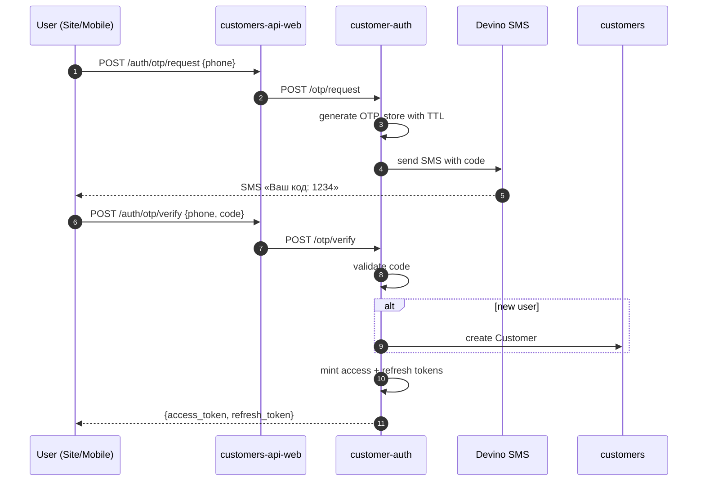

# 02 — Customer Lifecycle

**Value Stream:** VS-2 (Customer Acquisition)  
**Главные системы:** ENSI (customer-auth, customers, customers-api-web), внешний 1C-loyalty  
**Источник:** [`source/ensi-processes.md`](source/ensi-processes.md) раздел 3  
**Confluence:** разрозненно (см. `source/confluence-findings.md` раздел 4)

---

## Цель

Покрыть весь путь покупателя — от регистрации до удаления аккаунта. Включает идентификацию (телефон + SMS OTP), управление профилем и адресами, привязку программы лояльности и compliance (152-ФЗ).

---

## Перечень процессов

| ID | Название | Триггер | Owner |
|---|---|---|---|
| BP-CUS-01 | Регистрация по телефону (SMS OTP) | POST /register | customer-auth + Devino (SMS) |
| BP-CUS-02 | Логин и токен-flow (V1/V2 + Passport) | POST /login | customer-auth |
| BP-CUS-03 | Обновление профиля и адресов | UI client | customers |
| BP-CUS-04 | Бонусная программа / Discount-карта | Регистрация / триггер | customers + 1С XML-API |
| BP-CUS-05 | Удаление аккаунта / персональных данных (152-ФЗ) | По заявлению клиента | customers + audit |
| BP-CUS-06 | Delivery preferences | UI client | customers |
| BP-CUS-A | Admin-Auth (служебно) | Сотрудник админки | units/admin-auth |

---

## BP-CUS-01 — Регистрация по телефону (SMS OTP)

**Цель:** новый пользователь регистрируется только по номеру телефона; пароль не используется.

**Сервисы:** `customers/customer-auth` → внешний SMS-провайдер **Devino** → `customers/customers`.

### Шаги

### Quirks

- OTP TTL и rate-limit — в конфиге `customer-auth`.
- Если Devino даун — пользователь не получает SMS, регистрация блокируется (нет fallback на email).

### Код

- `platform/ensi/apps/customers/customer-auth/app/Domain/Auth/`

---

## BP-CUS-02 — Логин и токен-flow

**Цель:** существующий пользователь логинится.

**Реализации:** **V1** (legacy) и **V2** (актуальный). На бэке Passport с кастомными grant'ами.

### Варианты

| Канал | Endpoint | Grant |
|---|---|---|
| Site (web) | `/auth/login` V2 | OTP-based, либо social |
| Mobile (RN) | `/auth/login` V2 | OTP-based |
| Legacy | V1 | сохранён для бэк-совместимости |

### Token-flow

- **Access token** — JWT, время жизни ≈ короткое (минуты).
- **Refresh token** — длинный TTL, ротация при использовании.
- После логина клиент получает `access + refresh`. При истечении access — refresh-вызов даёт новую пару.

### Quirks

- Сосуществуют V1 и V2 — клиенты на старых билдах ходят по V1.

---

## BP-CUS-03 — Обновление профиля и адресов

**Сервис:** `customers/customers` через BFF `customers-api-web`.

### Сущности

- `Customer` — имя, email, дата рождения, пол, согласия.
- `CustomerAddress` — адресная книга (получатель, телефон, доставка, billing).
- Связь с `bu` (если корпоративный клиент — юр.лицо).

### Шаги

1. Клиент через UI меняет поле → PATCH в BFF → `customers`.
2. `customers` валидирует и сохраняет.
3. Kafka-event `customers_customer_updated` → пробрасывается в order-group, baskets, audit.

---

## BP-CUS-04 — Бонусная программа / Discount-карта

**Цель:** связать клиента с внешним сервисом лояльности (1С Retail).

**Сервис:** `customers/customers` + внешний 1С через **XML-API**.

### Шаги

1. При регистрации (или по триггеру в админке) — `customers` вызывает 1С XML-API: «выпусти карту/верни существующую».
2. Номер карты записывается на `Customer.discountCard`.
3. При расчёте корзины (см. `03-browse-cart-precheckout.md` BP-BSK-03) карта учитывается.

### Quirks

- XML-API — синхронный, медленный, нестабильный.
- На стороне 1С нет outbox: повтор запроса может выдать новый номер.

---

## BP-CUS-05 — Удаление аккаунта (152-ФЗ)

**Цель:** выполнить право пользователя на удаление персональных данных (закон РФ 152-ФЗ).

### Шаги

1. Клиент подаёт заявку через UI (или письмом в саппорт).
2. Бэкенд:
   - Анонимизирует `Customer.{name, email, phone}` → null или хеш.
   - Сохраняет `Order`, `Basket` исторические данные (требование бухгалтерии и налоговой), но обезличивает.
   - Удаляет токены / sessions.
   - Audit пишет факт удаления.
3. Уведомляет внешние системы (1С loyalty, рассылки) — если они хранят персональные данные.

### Quirks

- Полный perm-delete невозможен из-за финансовых требований. Реальная операция — **анонимизация**.
- Удаление из всех систем (CDN-кешированных аватарок, MindBox, Flocktory) — отдельные процедуры, не всегда автоматизированы.

---

## BP-CUS-06 — Delivery preferences

**Контекст:** свежая фича (Feb 2026). Пользователь может задать «предпочтения по доставке» — любимый адрес, любимый тариф/перевозчик.

**Сервис:** `customers/customers`.

### Использование

- На pre-checkout (см. `03-browse-cart-precheckout.md` BP-CHK-01) — preferences предзаполняют форму.

### Quirks

- См. checkout-flow research [`do../research/2026-05-20-checkout-order-creation.md`](../research/2026-05-20-checkout-order-creation.md): `customerDeliveryPreferences` не содержит `selectedIntervalId` — только carrier. Это **намеренно**, чтобы избежать stale interval-id (см. там же).

---

## BP-CUS-A — Admin-Auth (служебно)

Аутентификация сотрудников админки. Отдельный сервис `units/admin-auth`. Не клиентский. Упоминается для полноты.

---

## Сводная Kafka-карта (исходящая из домена customer)

| Топик | Эмитент | Слушают |
|---|---|---|
| `customers_customer_created` | customers | order-group, baskets, audit, event-dispatcher |
| `customers_customer_updated` | customers | baskets (привязка корзины), event-dispatcher |
| `customers_customer_deleted` | customers | order-group (анонимизация заказов), audit |

---

## Системные quirks

1. **Devino SMS** — единая точка отказа для регистрации/логина.
2. **Passport custom grant** — нестандартное расширение Laravel Passport, требует осторожности при апгрейдах.
3. **XML-API 1С Retail для discount-card** — нестабильный и медленный.
4. **152-ФЗ** — анонимизация, не удаление. Чек-лист обновлять при появлении новых хранилищ PII.
5. **V1 и V2 одновременно** — старые мобильные билды могут ходить по V1.

---

## Confluence

| Тема | Confluence |
|---|---|
| Регистрация и Auth | разрозненно в OPSOMN, MARKAPP |
| Профиль / адреса | в карточке BFF |
| Discount-карта | в спейсе RTL (1С Retail) |

Подробнее — [`source/confluence-findings.md`](source/confluence-findings.md) раздел 4.

---

**Дата создания:** 2026-05-16  
**Поддерживается:** команда identity / B2C
