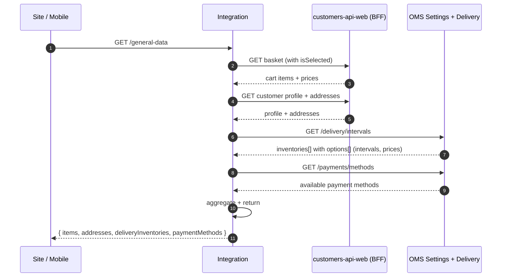

# 03 — Browse, Cart & Pre-Checkout

**Value Stream:** VS-3 (Browse to Cart)  
**Главные системы:** Site / Mobile → ENSI `customers-api-web` (BFF) → ENSI `baskets`, `offers`, `catalog-cache` → Integration → OMS  
**Источники:**
- [`source/ensi-processes.md`](source/ensi-processes.md) разделы 4, 5
- [`source/integration-processes.md`](source/integration-processes.md) разделы BP-INT-01, BP-INT-02, BP-INT-07
- [`../research/2026-05-16-checkout-flow.md`](../research/2026-05-16-checkout-flow.md) — **опорный артефакт** для pre-checkout
- Confluence: BP-2 (Корзина), OMS-3 (Чекаут)

---

## Цель

Покрыть путь от показа каталога до момента, когда у пользователя есть собранная корзина с просчитанной стоимостью доставки, доступными способами оплаты и готовностью нажать «Оформить заказ».

> **«Pre-checkout»** в нашей архитектуре — это **набор запросов в Integration** (general-data / delivery quote), которые отдают расчёт **до** `POST /order/create`. Эти запросы **не создают заказ**, они только моделируют его.

---

## Перечень процессов

| ID | Название | Триггер | Owner |
|---|---|---|---|
| BP-BFF-01 | Витрина: поиск, карточки, рекомендации | UI | customers-api-web → catalog-cache |
| BP-BSK-01 | Жизненный цикл корзины | Add to cart | baskets |
| BP-BSK-02 | Изменение состава, isSelected, пересчёт | UI | baskets + offers |
| BP-BSK-03 | Промокод и купоны | UI | baskets + (внешний) PromotionService |
| BP-BSK-04 | Реакция корзины на изменения офферов | Kafka in | baskets |
| BP-BSK-05 | Реакция на оформленный заказ | Kafka in `orders_order_created` | baskets |
| BP-BSK-06 | Избранное (favorites) | UI | baskets (отдельная сущность) |
| BP-CHK-PRE-01 | Pre-checkout general-data | UI «Перейти к оформлению» | Integration → OMS + ENSI |
| BP-CHK-PRE-02 | Delivery quote / split-shipment / интервалы | UI выбор адреса | Integration (V1 или V4) → OMS Settings |
| BP-CHK-PRE-03 | Доступные способы оплаты | UI | Integration |
| BP-CHK-PRE-04 | Подели quote (BNPL) | UI выбор Подели | Integration → Подели API |
| BP-CHK-PRE-05 | Pickup-points list | UI | Integration (BP-INT-22 cron-кеш) |

---

## BP-BFF-01 — Витрина

**Сервис:** `customers-api-web` (BFF) → `catalog-cache`.

Все запросы на каталог (поиск, фильтры, карточка, рекомендации, баннеры) идут через единый BFF, который агрегирует из catalog-cache, cms, customers (для персонализации).

### Quirks

- BFF читает **только** `catalog-cache`, не PIM. Лаги индексации = лаги витрины.

---

## BP-BSK-01 — Жизненный цикл корзины

**Сервис:** `orders/baskets`.

### Состояния

```
[пусто] ─add item─▶ [active]
[active] ─items=0─▶ [пусто]
[active] ─order_created event─▶ [archived]
[active] ─TTL 24h─▶ [expired]
```

### Шаги

1. Анонимная сессия — `BasketId` хранится в cookie/локально.
2. После логина — корзина мерджится с серверной (если была).
3. Активная корзина живёт ~24 часа от последнего изменения.
4. После успешного `POST /order/create` (см. `04-checkout-order-creation.md`) — Kafka `orders_order_created` → baskets archives корзину.

### Quirks

- Merge-стратегия при логине — приоритет серверной, локальные позиции дописываются. Дубли по SKU + size схлопываются с суммой qty.

---

## BP-BSK-02 — Изменение состава, isSelected, пересчёт

**Цель:** корзина поддерживает «частичное оформление» — у каждой позиции есть флаг `isSelected`. На pre-checkout попадают только выбранные.

### Шаги

1. UI меняет `qty` / `isSelected` → PATCH в BFF.
2. baskets валидирует:
   - Существование SKU в catalog-cache.
   - Наличие остатка в offers (на минимум 1 склад).
3. Пересчитываются цены (с учётом активных промо, см. BP-BSK-03).
4. Если позиция стала недоступной (нет в catalog или out-of-stock везде) — UI её показывает заблокированной.

### Quirks

- `isSelected` — конструкция UX. На pre-checkout фильтруется фронтом и backend'ом независимо.

---

## BP-BSK-03 — Промокод и купоны

**Сервисы:** `baskets` + внешний `PromotionService`.

### Шаги

1. Клиент вводит промокод.
2. baskets отдаёт корзину + код в `PromotionService` → получает корректировки (скидка % / руб., бонусные акции).
3. Корректировки сохраняются на корзине.
4. На pre-checkout / order-create этот же промокод применяется ещё раз — конечная сумма должна совпасть.

### Quirks

- Описание сценариев промо фрагментировано в Confluence (AKZ-* / MARKMTG-*).
- Двойной расчёт (на корзине и при создании заказа) — риск рассинхронизации, если правила в PromotionService поменялись между шагами.

---

## BP-BSK-04 — Реакция корзины на изменения офферов

**Триггер:** Kafka `offers_offer_*` events.

### Сценарии

- Цена выросла → в корзине обновляется, в UI плашка «цена изменилась».
- Товар стал obsolete → позиция помечается недоступной.
- Остатки = 0 на всех складах → позиция блокируется (нельзя купить).

---

## BP-BSK-05 — Реакция на оформленный заказ

**Триггер:** Kafka `orders_order_created` (от `order-group-service`, см. `04-checkout-order-creation.md`).

→ Корзина переходит в `archived`, активной становится новая пустая.

---

## BP-BSK-06 — Избранное (Favorites)

Отдельная сущность от корзины, но управляется тем же `baskets`-сервисом. Не конвертируется автоматически — клиент сам добавляет из «Избранного» в корзину.

---

## BP-CHK-PRE-01 — Pre-checkout general-data

**Endpoint:** `GET /general-data` (через Integration), агрегирует всё нужное для рендера формы чекаута.

> Подробное описание pre-checkout — в [`../research/2026-05-16-checkout-flow.md`](../research/2026-05-16-checkout-flow.md). Здесь — оркестрация L1.

### Шаги (сокращённо)



### Quirks (см. checkout-flow.md)

- **Interval ID — rolling hash** в OMS Settings. Не идемпотентен между запросами (timezone, daily cache eviction at 09:00).
- **Site** избегает проблемы — не отправляет stale `selectedIntervalId`, бэк сам выбирает.
- **Mobile (release-3.31.0)** — **отправляет** stale id (см. checkout-flow.md, «самое плохое место»).

---

## BP-CHK-PRE-02 — Delivery quote / split-shipment / интервалы

**Сервисы:** Integration V1 или V4 → OMS Settings → OMS Delivery (carrier tariffs).

### V1 (legacy, стабильнее)

- Endpoint: `POST /logistics/delivery/quote` V1
- Возвращает `inventories[]` с `cartAvailability` для каждой группы товаров на складе.
- Matching выбранного интервала по 7 полям (`dispatchWarehouse, date, dispatchDate, carrierId, tariffId, from, to`).
- File: `platform/integration/integration/www/.../V1/Delivery/DeliveryService.php:287-303`.

### V4 (split-shipment, новый)

- Endpoint: V4 — другой формат запроса/ответа.
- Имеет известную регрессию: `courier` matching по `deliveryOptionId` (id), а не по полям → подвержен interval-id non-idempotency.
- Ticket: OPSOMN-11195.

### Split-shipment

Фича «комплектации 2 из 3, 4 из 5» **существует только в pre-checkout**. На `/order/create` Integration **собирает всё обратно в один package** (см. `04-checkout-order-creation.md`). См. detail в [`../research/2026-05-16-checkout-flow.md`](../research/2026-05-16-checkout-flow.md) → «Структурное несоответствие — split-shipment».

---

## BP-CHK-PRE-03 — Доступные способы оплаты

Список зависит от:
- Канала (Site / Mobile),
- Региона/склада,
- Корзины (наличие подарочных карт, ограничения по сумме),
- Доступности интеграций (YooKassa up/down).

**Источник:** Integration отдаёт уже отфильтрованный список. Полную карту методов оплаты см. в `05-payment.md`.

---

## BP-CHK-PRE-04 — Подели quote (BNPL)

**Сервис:** Integration → Подели API.

### Шаги

1. Клиент выбирает «Подели» как способ оплаты.
2. Integration запрашивает у Подели рассрочку: «Можно разбить N тыс. руб. на 4 платежа?»
3. Подели возвращает план (даты, суммы).
4. UI показывает план; клиент подтверждает.

### Quirks

- Решение Подели зависит от их скоринга — не у всех клиентов будет доступно.
- См. BP-INT-07 в [`source/integration-processes.md`](source/integration-processes.md).

---

## BP-CHK-PRE-05 — Pickup-points list

**Сервис:** Integration (читает локальный кеш-таблицу).

Кеш собирается cron'ом `BP-INT-22`: периодически Integration ходит во все carriers (CDEK, 5post, RPost, …) и собирает список ПВЗ → пишет в локальную БД → отдаёт UI.

### Quirks

- При устаревании кеша некоторые ПВЗ могут «исчезнуть» из UI, а заказ туда уйдёт «в воздух» и упадёт у carrier (см. возвраты).

---

## Связанные cron-задачи (фоновые)

| ID | Что делает | Cron | Документ |
|---|---|---|---|
| BP-INT-22 | Pickup-points rebuild | ежедневно | `08-master-data-sync.md` |

---

## Системные quirks (доменные)

1. **Interval-id non-idempotency** — главный риск checkout-flow. Подробное расследование — [`../research/2026-05-16-checkout-flow.md`](../research/2026-05-16-checkout-flow.md).
2. **V1 / V4 одновременно** — site/mobile на старых билдах гоняют V1; новые — V4. Бизнес-правила должны быть симметричны.
3. **Двойной промо-расчёт** — на корзине и на /order/create.
4. **split-shipment**: видимость на pre-checkout ≠ реальное разделение поставки в OMS.

---

## Confluence

| Тема | Confluence page |
|---|---|
| BP-2 Корзина | дочерние от `60696260` |
| OMS-3 Чекаут | `60695639` |
| OMS-3 подразделы (по типам доставки) | дочерние |
| Подели | в `60695639` |

Подробнее — [`source/confluence-findings.md`](source/confluence-findings.md) разделы 5–8.

---

**Дата создания:** 2026-05-16  
**Поддерживается:** команда чекаута + Integration
