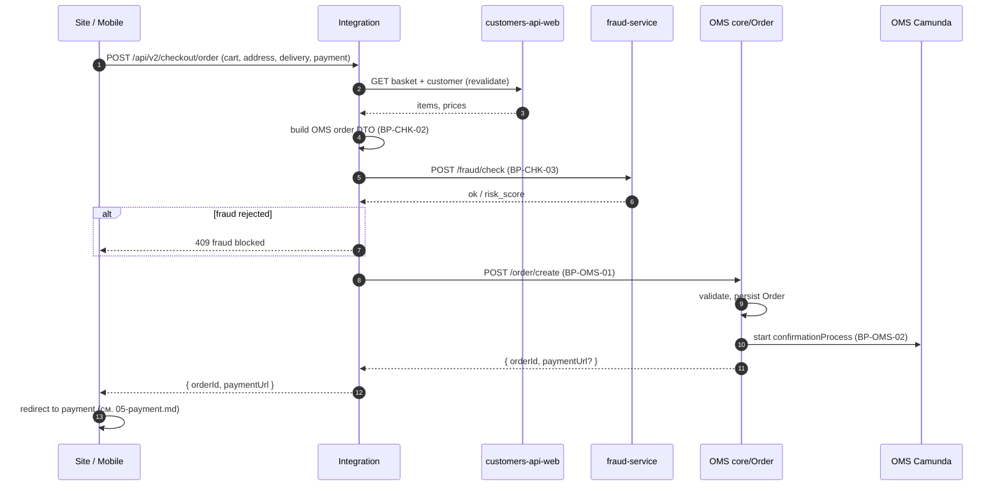
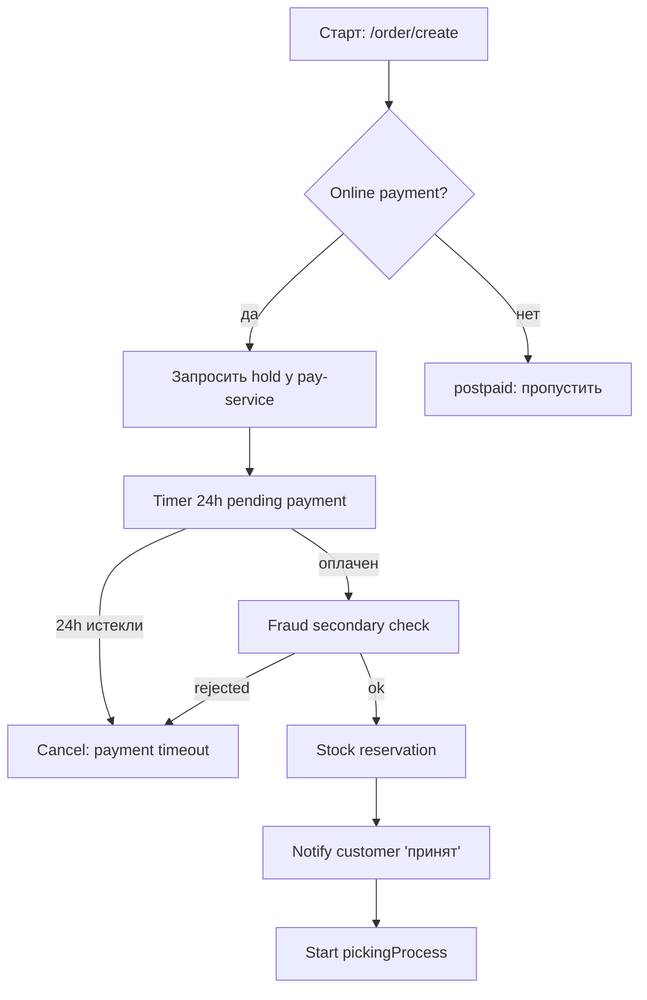

# 04 — Checkout & Order Creation

**Value Stream:** VS-4 (Order to Cash) — часть «от submit до confirmation»  
**Главные системы:** Site / Mobile → Integration → OMS (`/order/create`) → Camunda `confirmationProcess.bpmn`  
**Источники:**
- [`source/integration-processes.md`](source/integration-processes.md) разделы BP-INT-03..05, 08, 15
- [`source/oms-processes.md`](source/oms-processes.md) BP-OMS-01, BP-OMS-02
- [`../research/2026-05-20-checkout-order-creation.md`](../research/2026-05-20-checkout-order-creation.md) — глубокий разбор submit-пути
- Confluence: OMS-3 «Чекаут», OMS-4 «Модель заказа» (`60695933`), `confirmationProcess.bpmn`

---

## Цель

Превратить корзину + выбор пользователя в заказ в OMS. Покрыть валидацию, преобразование форматов между системами, fraud-check, инициирование BPMN-процесса подтверждения.

---

## Перечень процессов

| ID | Название | Триггер | Owner |
|---|---|---|---|
| BP-CHK-01 | Order submit | UI «Оплатить» / «Оформить» | Integration |
| BP-CHK-02 | Преобразование cart → OMS order DTO | Submit | Integration |
| BP-CHK-03 | Fraud check | Submit | Integration → fraud-service |
| BP-CHK-04 | Создание заказа в OMS | Integration | OMS `core/Order` |
| BP-OMS-01 | Order creation / validation (на стороне OMS) | HTTP `/order/create` | OMS `core/Order` |
| BP-OMS-02 | Confirmation flow | После /order/create + payment | Camunda `confirmationProcess.bpmn` |
| BP-INT-08 | Order confirmation callback | OMS подтвердил | Integration |
| BP-CHK-05 | Order routing «куда положить заказ» | После create | ENSI order-group + Integration cron |

---

## Submit endpoints — обзор версий

Integration принимает submit на четырёх параллельно живых endpoint'ах:

| Версия | Endpoint | Где живёт | Кто использует | Состояние |
|---|---|---|---|---|
| V1 | `POST /order/create` | `V1/Order/OrderService.php` | старый Mobile, legacy | работает, эталон корректности |
| V2 | `POST /order/create` V2 | `V2/...` | переходный | legacy |
| V3 | `POST /order/create` V3 | `V3/...` | mid-version | legacy |
| **V4** | `POST /order/create` V4 | `V4/Order/OrderService.php:439-606` | **современный Site, Mobile release-3.31.0** | actively used |

Полное описание — [`source/integration-processes.md`](source/integration-processes.md) BP-INT-03..05.

### Когда какой используется

- Site (`stage`/`release/production`) — **V4**.
- Mobile (`release-3.31.0`) — **V4** + `mobile/v5/checkout/commit` (mobile-обёртка вокруг V4).
- Старые мобильные билды — V1.

---

## BP-CHK-01 — Order submit (Integration оркестрация)

**Endpoint (внешний):** `POST /api/v2/checkout/order` (Site) либо `POST /api/mobile/v5/checkout/commit` (Mobile).

### Шаги



### Quirks

- Submit **не идемпотентен**: повторный POST с тем же `basketId` создаст второй заказ. Защита на UI — disable button после клика.
- В Mobile V5 — отдельная проблема stale `deliveryCourierId` (см. checkout-flow.md «самое плохое место»).

---

## BP-CHK-02 — Преобразование cart → OMS order DTO

**Файл:** `V4/Order/OrderService.php:439-606`.

### Что делает Integration

1. Маппит позиции корзины в OMS items (с offerId, priceWithDiscount, qty, sizeId).
2. Сворачивает split-shipment обратно в **один package**: `addPackages` строит `packages[0]` со всеми позициями (см. `V1/Order/OrderService.php:3181`).
3. Подставляет адрес (для курьерской) или pickupPointId (для самовывоза).
4. Привязывает `paymentMethod` и `deliveryMethod`.
5. Применяет промокоды / купоны заново (валидирует с PromotionService).

### Сущности OMS Order (со стороны Integration)

```
Order
 ├─ customer { name, phone, email, customerId }
 ├─ delivery { type, address|pickupPointId, carrierId, intervalId, … }
 ├─ payment { methodId, amount }
 ├─ items[]   { offerId, qty, price, finalPrice, sizeId, … }
 └─ packages[] { items[] }   // всегда один элемент
```

### Quirks

- Split-shipment **теряется** — OMS заказ всегда single-shipment.
- Если клиент видел в UI «комплектация 2 из 3» — фактически заказ уйдёт целиком с одного склада.

---

## BP-CHK-03 — Fraud check

**Сервис:** внешний fraud-service.

### Шаги

1. Integration отправляет в fraud-service анонимизированный профиль заказа (сумма, адрес, история).
2. Получает risk score / verdict.
3. Если risk выше порога — отказ с кодом, заказ не уходит в OMS.

### Quirks

- Сервис внешний; SLA не контролируется нами. На случай его падения — fallback: пропускать всё (open question, проверить).

---

## BP-OMS-01 — Order creation / validation (на стороне OMS)

**Сервис:** `core/Order` → `OrderController.create()`.

### Шаги внутри OMS

1. **Sync validate** структуры (схема DTO, обязательные поля).
2. **Domain validate**:
   - existence складов / pickup-points (`core/Settings`),
   - доступность тарифа (`core/Delivery`),
   - валидность интервала (если передали `intervalId`) — **opaque store**, не валидируется на актуальность,
   - корректность offers (через прайс-сервис),
   - расчёт сумм.
3. **Persist** в БД (Order, Shipping, Item).
4. **Стартует Camunda BPMN** `confirmationProcess.bpmn` (см. BP-OMS-02).
5. Возвращает `orderId` + (для онлайн-оплаты) `paymentUrl` или `paymentToken`.

### Сущности

```
Order ─┬─ Shipping (1:1)
       │      ├─ deliveryAddress
       │      ├─ deliveryIntervalId (opaque)
       │      ├─ carrierId, tariffId
       │      └─ status
       ├─ Item[] (позиции, привязаны к OMS-product)
       └─ Payment[] (см. 05-payment.md)
```

### Quirks

- `deliveryIntervalId` сохраняется как opaque string, OMS не валидирует, что он всё ещё «живой» (см. checkout-flow.md).
- В заказе **нет split-shipment**: одна Shipping = одна physical отгрузка.
- Полная карта endpoints — [`source/oms-processes.md`](source/oms-processes.md) Appendix B.

---

## BP-OMS-02 — Confirmation flow (Camunda)

**BPMN:** `awg/bpmn-process/process/confirmationProcess.bpmn` (2438 строк, **самый большой по логике**).

### Что внутри

- **Long timer 24h** — ждём оплату (для онлайн-оплаченных).
- Ветка **fraud-check** (отдельно от Integration: OMS делает свою проверку).
- Service tasks:
  - резервирование стока (см. BP-OMS-10 в `06-fulfillment-and-delivery.md`),
  - формирование заявки на picking,
  - notifications «заказ принят» (см. BP-OMS-09 в `07-post-order-and-comms.md`).
- Точки выхода:
  - **подтверждён** → стартует `pickingProcess` (см. BP-OMS-03).
  - **24h не оплачен / отказ** → `cancellationProcess` (BP-OMS-08).

### Шаги (упрощённо)



### Quirks

- BPMN **vendor-locked** — менять нельзя без OMS-команды.
- 17 BPMN-файлов всего; см. полный inventory в [`source/oms-processes.md`](source/oms-processes.md) Appendix A.

---

## BP-INT-08 — Order confirmation callback

После того как OMS зарегистрировал заказ, **Integration**:

1. Сохраняет его в локальной БД для последующих cron-экспортов.
2. **НЕ** пишет в outbox (известный quirk, см. [`source/integration-processes.md`](source/integration-processes.md)).
3. Возвращает ответ клиенту.

### Что НЕ делает Integration

- Не публикует событие в Kafka для ENSI. **ENSI узнаёт о заказе** через отдельный канал — `orders_order_created` от `order-group-service` (см. BP-CHK-05).

---

## BP-CHK-05 — Order routing (где жить заказу)

После создания заказа в OMS:

- **Каноническая запись** — в OMS.
- **Историю заказа клиент видит** через ENSI BFF, который ходит **в OMS напрямую** (не через Integration, см. quirks `source/integration-processes.md` BP-INT-35).
- **`order-group-service` (ENSI)** хранит легковесную метаинформацию о заказе для триггеров (закрытие корзины, статусы для лояльности).
- **DWH / 1C / OTS** — получают заказ через cron-export (см. `08-master-data-sync.md`).

---

## Системные quirks (доменные)

1. **4 версии submit** одновременно живы. При changes — синхронизировать **минимум V1 и V4**.
2. **Submit не идемпотентен** — UI должен disabling button после клика; нет idempotency-key на бэке.
3. **Split-shipment теряется** на /order/create.
4. **Stale interval-id** на mobile (см. checkout-flow.md).
5. **Confirmation BPMN — 2438 строк, vendor-locked**. Любые правки order-state machine — через OMS-команду.
6. **Integration не публикует Kafka на создание** — ENSI узнаёт через order-group и polling.

---

## Confluence

| Тема | Confluence |
|---|---|
| OMS-3 Чекаут | `60695639` |
| OMS-4 Модель заказа | `60695933` |
| OMS-5 Статусная схема | `60693138` |
| Серия BP-3 (Создание заказа) | дочерние от `60696260` |
| Confirmation BPMN — описание | в OMS-* серии |

---

## Связанные документы

- [`05-payment.md`](05-payment.md) — что происходит с платежом после submit.
- [`06-fulfillment-and-delivery.md`](06-fulfillment-and-delivery.md) — pickingProcess после confirmation.
- [`07-post-order-and-comms.md`](07-post-order-and-comms.md) — notifications и статусы.
- [`e2e-happy-path.md`](e2e-happy-path.md) — сквозной сценарий.
- [`../research/2026-05-20-checkout-order-creation.md`](../research/2026-05-20-checkout-order-creation.md) — глубокий разбор.

---

**Дата создания:** 2026-05-16  
**Поддерживается:** команда чекаута + OMS
