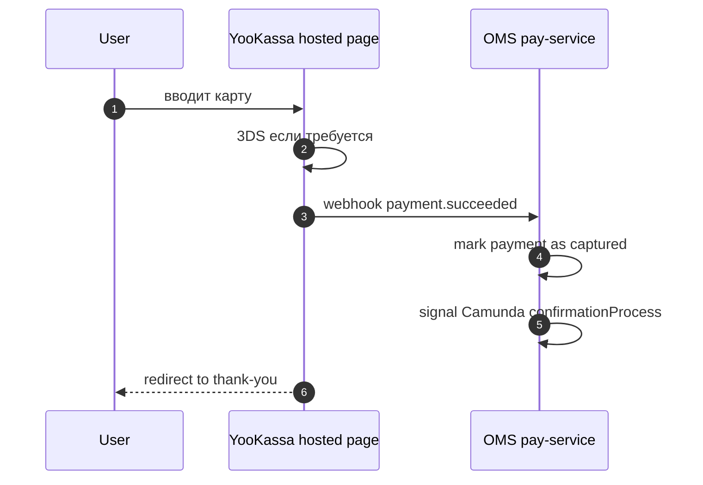

# 05 — Payment

**Value Stream:** VS-4 (Order to Cash) — часть «оплата»  
**Главные системы:** Integration → OMS `core/pay-service` → YooKassa / СБП / Подели / ATOL  
**Источники:**
- [`source/integration-processes.md`](source/integration-processes.md) разделы BP-INT-06, 07, 14, 17
- [`source/oms-processes.md`](source/oms-processes.md) BP-OMS-06, BP-OMS-07
- Confluence: раздел 8 (`source/confluence-findings.md`)

---

## Цель

Получить деньги от клиента, корректно их провести в OMS, обеспечить фискализацию (ATOL), поддержать рефанды.

---

## Перечень процессов

| ID | Название | Триггер | Owner |
|---|---|---|---|
| BP-PAY-01 | Payment link / token creation | Order create response | Integration + OMS pay-service |
| BP-PAY-02 | YooKassa flow | Клиент платит картой/Apple Pay/SBP | OMS pay-service → YooKassa |
| BP-PAY-03 | СБП (Система Быстрых Платежей) | Клиент выбрал СБП | OMS pay-service |
| BP-PAY-04 | Подели (BNPL) | Клиент выбрал «Подели» | Integration → Подели |
| BP-PAY-05 | Hold then capture (двухфазный) | После confirmationProcess | OMS pay-service |
| BP-PAY-06 | Postpaid / cash on delivery | Клиент выбрал «оплата при получении» | (нет онлайн-платежа) |
| BP-PAY-07 | Gift certificate purchase | Покупка сертификата | Integration BP-INT-17 |
| BP-PAY-08 | Refund | Отмена/возврат | OMS pay-service |
| BP-PAY-09 | ATOL фискализация (батч cron) | Cron | Integration BP-INT-14 |
| BP-OMS-06 | paymentProcess.bpmn (2175 строк) | Стартует из confirmationProcess | OMS Camunda |
| BP-OMS-07 | paymentFinalizationProcess.bpmn | После всех частичных операций | OMS Camunda |

---

## Способы оплаты — обзор

| Способ | Кто проводит | Статус |
|---|---|---|
| Банковская карта | YooKassa | основной |
| Apple Pay / Google Pay | YooKassa (через карту) | основной |
| СБП (Система Быстрых Платежей) | YooKassa | работает |
| СберPay | Sber acquiring | используется в BPMN (см. ниже) |
| Подели (BNPL — 4 платежа) | Подели | работает |
| Оплата при получении (cash) | не онлайн-платёж | используется для самовывоза/курьерской |
| Подарочный сертификат (как payment) | OMS pay-service | работает |

> На стороне OMS BPMN `paymentProcess.bpmn` упоминается **Sber acquiring** в hold-then-capture. На фронте платежи проводятся через YooKassa. Open question: как сосуществуют YooKassa и Sber на одном заказе? — см. [`source/oms-processes.md`](source/oms-processes.md) BP-OMS-06.

---

## BP-PAY-01 — Payment link / token creation

После успешного `/order/create` (см. `04-checkout-order-creation.md`) Integration:

1. Если выбран **онлайн-метод** — Integration синхронно зовёт OMS `pay-service`, получает URL/токен → возвращает фронту.
2. Если **cash / postpaid** — paymentUrl = null, фронт сразу показывает «спасибо».
3. Фронт редиректит клиента на платёжную страницу.

**Файл:** см. BP-INT-06 в `source/integration-processes.md`.

---

## BP-PAY-02 — YooKassa flow

### Quirks

- **Lock-in на YooKassa** — нет fallback провайдера. Падение YooKassa = blocked checkout для онлайн-методов.
- Webhook OMS должен быть idempotent (YooKassa может ретраить).

---

## BP-PAY-03 — СБП

Через тот же YooKassa-канал (QR-код). UX: вместо карты клиент сканирует QR → платит из приложения банка → webhook. На стороне Integration СБП-логика частично закомментирована (см. `source/integration-processes.md` quirks).

---

## BP-PAY-04 — Подели (BNPL)

**Quote** уже получен в pre-checkout (см. `03-browse-cart-precheckout.md` BP-CHK-PRE-04).

### Шаги при checkout

1. Клиент подтверждает Подели как способ.
2. Integration шлёт в Подели API «зафиксируй сделку».
3. Подели проверяет скоринг ещё раз → одобряет/отказывает.
4. Если одобрено — заказ создаётся, Подели берёт на себя расчёт с клиентом, Gloria Jeans получает деньги.

---

## BP-PAY-05 — Hold then capture (двухфазный)

**Сценарий:** карта блокируется при создании заказа, реальный capture — после фактической отгрузки.

### BPMN

- `paymentProcess.bpmn` — содержит ветку с **hold** на старте и **capture** после dispatch.
- Используется для Sber acquiring (явный hold/capture).
- YooKassa flow обычно one-shot capture, но для отдельных методов умеет hold.

### Зачем

- Снимаем деньги, только если реально отгрузили. При отмене — release hold (без operations refund).

### Quirks

- Точная карта «какой метод → hold/capture» — нужно сверять с конфигом OMS. Open question.

---

## BP-PAY-06 — Postpaid / Cash on delivery

Никаких онлайн-операций. На стороне OMS — `payment.method = CASH`, capture делает курьер/ПВЗ при выдаче (через POS-терминал) → отчёт уходит в OMS и далее в фискализацию.

---

## BP-PAY-07 — Покупка подарочного сертификата

**Особый случай** — клиент покупает не товар, а сертификат.

### Шаги

1. UI → Integration `POST /gift-certificate/purchase` (BP-INT-17).
2. Integration создаёт заказ-обёртку с одним «item» = сертификат.
3. Оплата через стандартный flow (YooKassa).
4. После успеха — Integration через BP-INT-18 рендерит «thank you» страницу с кодом сертификата.
5. Email с кодом + PDF — через OMS notifications (BP-OMS-09).

### Связано

- BP-OMS-14 «Resend gift certificate» — повторная отправка сертификата (см. `07-post-order-and-comms.md`).

---

## BP-PAY-08 — Refund

**Триггер:** отмена заказа (BP-OMS-08 в `07-post-order-and-comms.md`) или возврат (BP-RET-* там же).

### Шаги

1. OMS `cancellationProcess` или `returnsProcess` стартует refund.
2. `pay-service` зовёт YooKassa/Sber API `refund`.
3. Webhook → подтверждение.
4. BPMN `paymentFinalizationProcess` финализирует баланс.

### Quirks

- Частичные рефанды (по item) — поддерживаются BPMN, но UX непрозрачный.
- Compensation flow для лояльности — отдельная цепочка (BP-INT-16 «Loyalty return»).

---

## BP-PAY-09 — ATOL фискализация (батч cron)

**Сервис:** Integration cron-task `BP-INT-14`.

### Шаги

1. Cron собирает заказы за период.
2. Формирует чеки в формате ATOL.
3. Отгружает в ATOL Online → ОФД → налоговая.

### Quirks

- Это **батч**, не real-time. Закон требует чек в течение 5 минут от оплаты — на самом деле фискализация одна из самых критичных проверок. **Open question:** real-time fiscalization есть отдельно или только этот батч?

---

## BP-OMS-06 — paymentProcess.bpmn (2175 строк)

Подробности и точная state-machine — [`source/oms-processes.md`](source/oms-processes.md) Appendix A.

Краткий обзор:
- Старт — из confirmationProcess.
- Ветки: card / cash / certificate / Sber / SBP.
- Состояния: pending → hold → captured | failed | refunded.

---

## BP-OMS-07 — paymentFinalizationProcess.bpmn

Запускается **после всех частичных операций** (доплата, refund) → закрывает финансовый цикл заказа. Триггерит экспорт в DWH/1C (см. `08-master-data-sync.md`).

---

## Сводные quirks

1. **Vendor lock-in на YooKassa**.
2. **Sber и YooKassa в одном BPMN** — карта взаимодействия неясна, open question.
3. **СБП на Integration частично закомментирован** — но в проде работает через YooKassa.
4. **ATOL — батч, не real-time**.
5. **Refund для лояльности** — отдельный pipeline (BP-INT-16), не auto-coupled с PAY-08.
6. **Hold/capture mapping per method** — нет канонической документации.

---

## Confluence

| Тема | Confluence |
|---|---|
| Способы оплаты, обзор | OMS-* серия |
| Подели (BNPL) | `60695639` подразделы |
| ЮKassa интеграция | поиск по `payment`, `ЮKassa` |
| ATOL / фискализация | внутренние страницы (Финансы / OPSLOG) |

См. также [`source/confluence-findings.md`](source/confluence-findings.md) раздел 8.

---

**Дата создания:** 2026-05-16  
**Поддерживается:** команда payments + OMS
