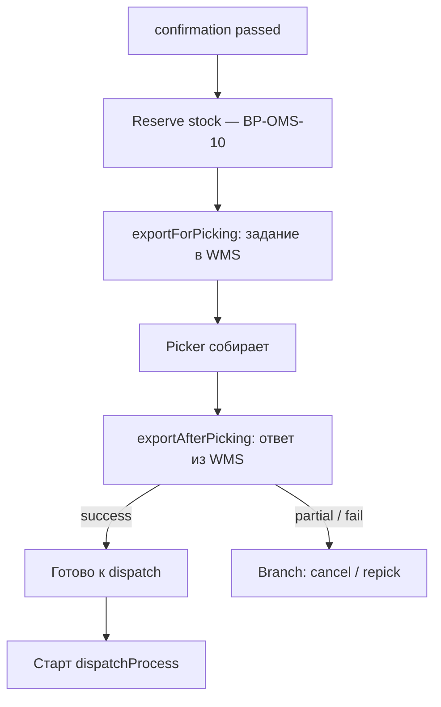

# 06 — Fulfillment & Delivery

**Value Stream:** VS-5 (Order to Delivery)  
**Главные системы:** OMS (`core/Order`, `core/Stock`, `core/Delivery`, camunda-worker, 17 carrier-connectors + Go logistics)  
**Источник:** [`source/oms-processes.md`](source/oms-processes.md) разделы BP-OMS-03..05, 10, 12, 15  
**Confluence:** OMS-* + раздел 7 в `source/confluence-findings.md`

---

## Цель

После подтверждения заказа в Camunda (см. `04-checkout-order-creation.md` BP-OMS-02) — собрать, упаковать, передать перевозчику, дождаться получения клиентом.

---

## Перечень процессов

| ID | Название | BPMN | Owner |
|---|---|---|---|
| BP-OMS-10 | Stock reservation / mutation | (HTTP + Kafka, без BPMN) | core/Stock |
| BP-OMS-03 | Picking / fulfilment | `pickingProcess.bpmn` (1598 строк) + `exportForPicking.bpmn` + `exportAfterPicking.bpmn` | OMS |
| BP-OMS-04 | Dispatch — handover to carrier | `dispatchProcess.bpmn` (1028 строк) | OMS |
| BP-OMS-05 | Carrier registry / courier call | `carrierRegistryProcess.bpmn` | OMS |
| BP-OMS-12 | Carrier registration deep dive (waybill / tracking) | per carrier | OMS connectors |
| BP-OMS-15 | Release process | `releaseProcess.bpmn` | OMS |
| BP-DEL-01 | Tracking number propagation | — | OMS + Integration |
| BP-DEL-02 | Delivery completion (получено) | webhook от carrier | OMS |

---

## High-level state machine (заказ → доставка)

```
       confirmationProcess
              │
              ▼ confirmed + stock reserved
       ┌─────────────────┐
       │ pickingProcess  │ ─ picker собирает → пакует → готов к отгрузке
       └────────┬────────┘
                ▼
       ┌─────────────────┐
       │ dispatchProcess │ ─ передача карьеру (waybill, label)
       └────────┬────────┘
                ▼
       ┌─────────────────────┐
       │ carrier in transit  │ ─ tracking updates через webhook
       └────────┬────────────┘
                ▼
       ┌─────────────────┐
       │ delivered       │ ─ carrier подтвердил выдачу
       └─────────────────┘
```

Подробная state-machine — [`source/oms-processes.md`](source/oms-processes.md) «Order status state machine».

---

## BP-OMS-10 — Stock reservation / mutation

**Сервис:** `core/Stock` (с двойным хранилищем Mongo + Postgres — quirk).

### Шаги

1. Из confirmationProcess external-task → `reserveStock`.
2. `Stock` ищет складские группы, у которых хватает остатка на все позиции.
3. Создаёт `Reservation` запись с TTL.
4. По завершении picking — `Reservation` → `Consumption` (списание).
5. При отмене (BP-OMS-08 в `07-post-order-and-comms.md`) — `release Reservation`.

### Sources of truth

- 1C/Retail — мастер по физическим остаткам (см. `08-master-data-sync.md`).
- OMS Stock — оперативные резервы.
- ENSI offers — представление для витрины.

### Quirks

- **Dual store Mongo + Postgres** в Stock — миграция или артефакт легаси (см. quirk в `source/oms-processes.md`).
- Kafka topic `stock-events` имеет `autoStartup=false` — реальное событие не уходит, только если кто-то включил.
- При overselling (race condition) — заказ создаётся, потом fails на picking → cancellationProcess.

---

## BP-OMS-03 — Picking / fulfilment

**BPMN:** `pickingProcess.bpmn` (1598 строк) + helpers:
- `exportForPicking.bpmn` — выгрузка заданий в WMS,
- `exportAfterPicking.bpmn` — приём результатов от WMS.

### Шаги



### Что значит «picking»

- Курьерская доставка / самовывоз — товар собирают на складе-источнике.
- Магазин-как-склад (Click & Collect) — товар берут с полки магазина.
- Pickup в ПВЗ — выезжает на этап dispatch (везут в ПВЗ через carrier).

### Quirks

- WMS — внешняя система (не входит в наш monorepo).
- Несколько брендов / типов складов — handlers захардкожены per-brand.

---

## BP-OMS-04 — Dispatch — handover to carrier

**BPMN:** `dispatchProcess.bpmn` (1028 строк).

### Шаги

1. Собранный пакет имеет статус **ready-to-ship**.
2. Из `dispatchProcess` external-task — зовёт **carrier-coннектор** (см. BP-OMS-12).
3. Carrier API:
   - Регистрирует отгрузку, выдаёт **waybill / shipment ID**.
   - Печатает label (этикетку).
   - Резервирует pickup-window (для courier pickup) или окно сдачи (для дроп-офф).
4. Waybill пробрасывается обратно в `Order.shipping`.
5. Заказ переходит в **handed-over**.

---

## BP-OMS-05 — Carrier registry / courier call

**BPMN:** `carrierRegistryProcess.bpmn`.

Подпроцесс dispatchProcess: централизует «выбрать конкретного carrier и вызвать его»; обрабатывает retry, разбор ошибок.

---

## BP-OMS-12 — Carrier registration deep dive (17 коннекторов)

### Подключённые перевозчики

| Carrier | Connector / SDK | Что делает |
|---|---|---|
| **CDEK** | `core/Delivery` + `cdek-api-sdk` | курьерская, ПВЗ, расчёт тарифов |
| **5post** | `core/5post-connector` | сеть ПВЗ |
| **Russian Post** | `core/Delivery` + `russian-post-api-sdk` (пустой!) | курьерская, отделения |
| **Yandex** | OMS connector | курьерская + same-day |
| **Yandex-NDD** | OMS connector → точка `.tst.yandex.net` (quirk!) | next-day delivery |
| **DPD** | OMS connector | курьерская/ПВЗ |
| **IML**, ещё ≈11 других | OMS connectors | разные тарифы |

(полный список — `source/oms-processes.md` BP-OMS-12)

### Что делает коннектор

1. **Регистрация отгрузки** (POST /shipment, формат у каждого свой).
2. **Получение tracking number / waybill PDF**.
3. **Подписка на webhook'и** статусов.
4. **Расчёт тарифа** (используется в pre-checkout, BP-OMS-Settings ↔ Delivery).
5. **Cancellation** в случае отмены.

### Quirks

- **`russian-post-api-sdk` репозиторий ПУСТОЙ** — SDK по факту inline в `core/Delivery`. Open question.
- **Yandex-NDD коннектор в проде указывает на `.tst.yandex.net`** — настоящий test endpoint! Ticket нужно поднимать. Critical quirk.
- Каждый carrier имеет уникальный формат адреса, что приводит к **address normalization** перед каждым вызовом.

---

## BP-OMS-15 — Release process

**BPMN:** `releaseProcess.bpmn`.

### Назначение

Финальное освобождение всех ресурсов, связанных с заказом:
- закрытие резерва (если ещё активен),
- освобождение pickup-точки,
- финализация financial state (через `paymentFinalizationProcess`),
- архивация.

Стартует после успешной доставки **или** после полной отмены/возврата.

---

## BP-DEL-01 — Tracking number propagation

Tracking number, полученный в dispatchProcess, должен дойти **до клиента**.

### Маршрут

1. OMS пишет `trackingNumber` в Order.
2. OMS notification (BP-OMS-09 в `07-post-order-and-comms.md`) — отправляет SMS/email с номером и ссылкой.
3. Интерфейс «История заказов» (ENSI BFF → OMS) — показывает номер и активный статус.

---

## BP-DEL-02 — Delivery completion

**Триггер:** webhook от carrier (или scheduled job, опрашивающий tracking API).

### Шаги

1. Carrier шлёт webhook `status=delivered`.
2. OMS обновляет Order.status.
3. Финализирует payment capture (если был hold).
4. Стартует releaseProcess.
5. Триггерит «спасибо за заказ» / opportunity для отзыва.

---

## Cross-cutting: Camunda и external tasks

`camunda-worker` — пул воркеров, обрабатывающих **external task topics** (40+ топиков). Контракт BPMN ↔ Java handler — case-sensitive topic name.

Полная карта 40+ топиков — [`source/oms-processes.md`](source/oms-processes.md) «External task topics».

---

## Cross-cutting: ENSI logistics-Go (вспомогательный)

Заметим — в `platform/starfish24/core/go/logistics/` живёт **Go-сервис**, который занимается расчётом маршрутов / тарифов. Он отдельный «остров» от Java OMS и имеет собственный `.claude/` + 7 агентов. Используется как **support** для основных Delivery-flow.

---

## Системные quirks (доменные)

1. **`russian-post-api-sdk` репозиторий ПУСТОЙ** — потенциальная мина.
2. **Yandex-NDD на test endpoint в проде** — нужно срочно проверить.
3. **`stock-events` autoStartup=false** — Kafka не работает по умолчанию.
4. **Dual store Mongo+Postgres в Stock** — нужна декомпозиция.
5. **Per-brand хардкод** в picking handlers.
6. **`cancellationStage` attribute pattern** — кейс-чувствительный механизм маркировки этапа отмены, легко сломать.
7. **17 carriers**, нет единого тест-стенда, регрессии возможны.

---

## Confluence

| Тема | Confluence |
|---|---|
| OMS-* доставка | главная страница раздела 7 (см. confluence-findings) |
| CDEK | подраздел |
| 5POST | подраздел |
| Почта России | подраздел |
| BPMN-схемы (PNG) | `130128632` |

См. также [`source/confluence-findings.md`](source/confluence-findings.md) раздел 7.

---

## Связанные документы

- [`07-post-order-and-comms.md`](07-post-order-and-comms.md) — статусы, уведомления, отмены, возвраты.
- [`08-master-data-sync.md`](08-master-data-sync.md) — стоки, цены, business-units, DWH.

---

**Дата создания:** 2026-05-16  
**Поддерживается:** команда OMS + logistics
