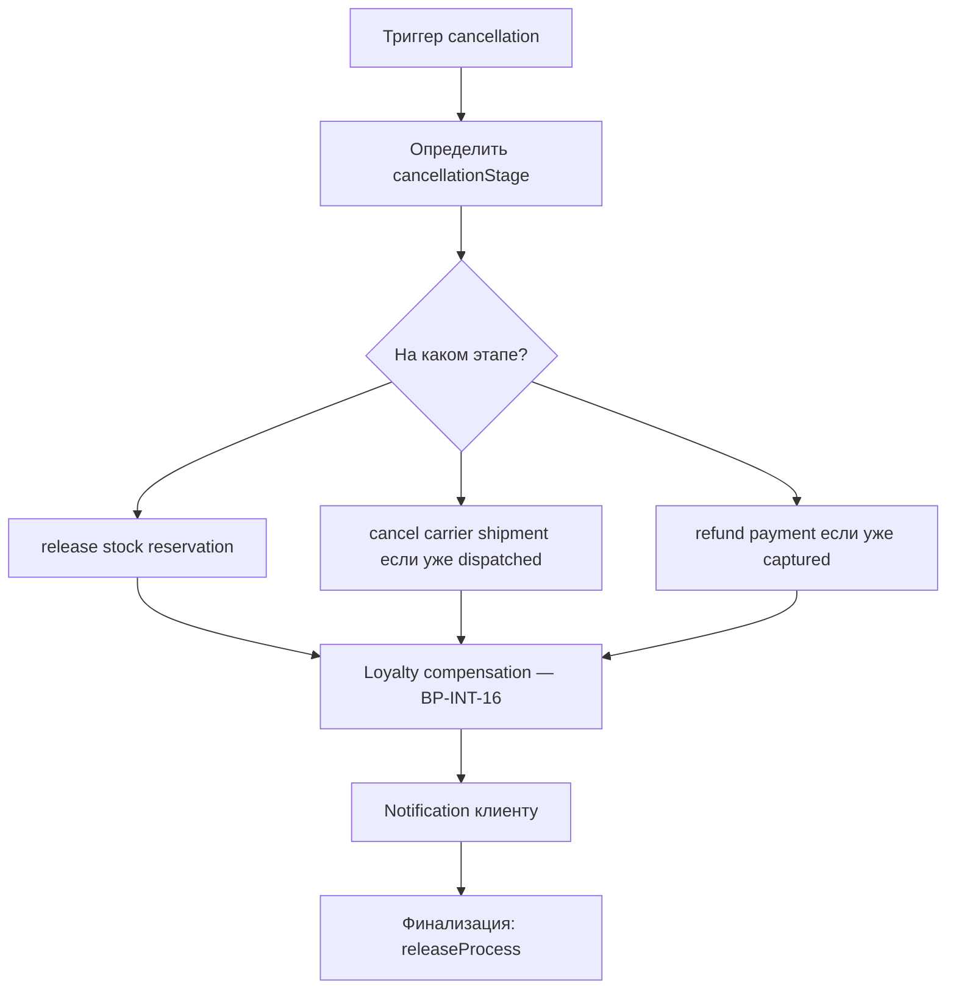
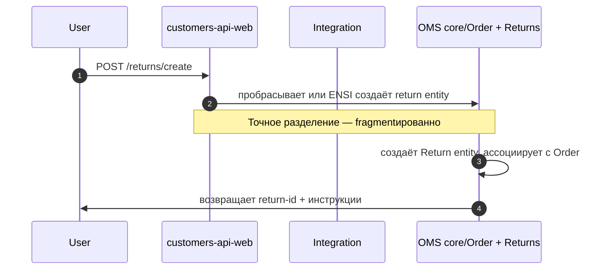

# 07 — Post-purchase: Status, Notifications, Cancellations, Returns

**Value Stream:** VS-6 (Post-purchase)  
**Главные системы:** OMS Camunda (cancellation, notifications, voximplant, resendCertificate) + Integration (status sync, returns initiation, loyalty return) + ENSI (history readback)  
**Источники:**
- [`source/oms-processes.md`](source/oms-processes.md) BP-OMS-08, 09, 13, 14
- [`source/integration-processes.md`](source/integration-processes.md) BP-INT-08, 09, 10, 16, 35, 36
- Confluence: разделы 10, 12 в `source/confluence-findings.md`

---

## Цель

Всё, что происходит **после оплаты до закрытия лояльности**:
- статусы заказа уходят клиенту и в backoffice,
- уведомления (SMS, email, push),
- отмена,
- возврат,
- лояльность (бонусы возвращаются при возврате),
- saвыдача подарочного сертификата.

---

## Перечень процессов

| ID | Название | BPMN / Trigger | Owner |
|---|---|---|---|
| BP-OMS-09 | Customer notifications (SMS/email) | `notifications.bpmn` | OMS + Cloud-Message-Gateway |
| BP-OMS-13 | Voximplant — outbound call | `voximplant.bpmn` | OMS + Voximplant |
| BP-OMS-14 | Resend gift certificate | `resendCertificateNotification.bpmn` | OMS |
| BP-OMS-08 | Cancellation | `cancellationProcess.bpmn` (2952 строк — крупнейший) | OMS |
| BP-STAT-01 | Order status readback (client) | UI → ENSI BFF → OMS | ENSI customers-api-web |
| BP-INT-09 | Order status update (ARM / 1C → OMS) | Sync HTTP | Integration |
| BP-INT-10 | Order status cron sync (OMS → DWH) | Cron | Integration |
| BP-INT-30 | Order status — Kafka daemon (OTS → OMS) | Kafka consumer | Integration |
| BP-INT-31 | Order message — Kafka daemon | Kafka consumer | Integration |
| BP-RET-01 | Returns initiation | UI (или контакт-центр) | Integration + ENSI + OMS |
| BP-RET-02 | Returns processing | OMS BPMN (фрагментировано) | OMS |
| BP-INT-16 | Loyalty return (compensation) | После refund | Integration |

---

## BP-OMS-09 — Customer notifications

**BPMN:** `notifications.bpmn`. Использует **Cloud-Message-Gateway** (отдельный OMS-сервис).

### Каналы

| Канал | Используется для | Поставщик |
|---|---|---|
| SMS | критичные статусы (создан, оплачен, готов к выдаче, выдан) | Devino (или аналог) |
| Email | детальное письмо «спасибо», статусные апдейты, сертификат | SMTP/Mailgun |
| Push (mobile) | то же, что SMS, для пользователей с приложением | Firebase |

### Trigger points в BPMN

- confirmationProcess → «заказ принят»
- paymentProcess → «оплачен» / «отказ»
- pickingProcess → «собран» (опционально)
- dispatchProcess → «передан в доставку», tracking-номер
- carrier webhook → «прибыл в ПВЗ», «доставлен»
- cancellationProcess → «отменён»

### Шаблоны

В Confluence — серия **OMS-7..OMS-8** с шаблонами email/SMS (страницы `63453929` / `63453931`). Шаблоны хранятся в OMS DB и редактируются через админку OMS.

---

## BP-OMS-13 — Voximplant — outbound call

**BPMN:** `voximplant.bpmn`.

### Сценарии

- Подтверждение заказа звонком (если онлайн-оплата не прошла + сумма крупная).
- Уточнение деталей доставки (адрес не распознан, телефон не отвечает).
- Звонок-напоминание.

### Quirks

- Voximplant — внешний robocall-провайдер.
- Не для всех сценариев включён — настройки в конфиге OMS.

---

## BP-OMS-14 — Resend gift certificate

**BPMN:** `resendCertificateNotification.bpmn`.

Клиент потерял письмо с сертификатом → саппорт/админ запускает резенд → BPMN заново шлёт email с PDF и кодом.

---

## BP-OMS-08 — Cancellation

**BPMN:** `cancellationProcess.bpmn` — **2952 строки, самый большой**.

### Триггеры отмены

1. **Auto-cancel по timeout** — confirmationProcess не получил оплату за 24h.
2. **Клиент через UI** — кнопка «Отменить» (доступна на определённых статусах).
3. **Контакт-центр через ARM/админку OMS** — оператор отменяет.
4. **OMS внутренний** — picking failed (out of stock), carrier отказал.

### Шаги (общая канва)

### Сущность `cancellationStage`

Атрибут в Camunda variables — маркирует, до какого этапа дошёл заказ перед отменой; от него зависит набор compensation-ов. Critical: case-sensitive значение.

### Quirks

- 2952 строк — большое поле для багов.
- При отмене после dispatch — нужно физически возвращать товар (BP-RET-*).

---

## BP-STAT-01 — Order status readback (client)

**Маршрут:** UI → ENSI `customers-api-web` → **OMS напрямую** (не через Integration).

### Шаги

1. Клиент открывает «Мои заказы» / «Детали заказа».
2. ENSI BFF делает запрос к OMS API `/order/{id}` или `/customer/{id}/orders`.
3. OMS возвращает текущий статус + историю переходов.
4. UI рендерит.

### Quirks

- **Bypass Integration**: history read-path обходит Integration ↓ напрямую в OMS — quirk, см. BP-INT-35 в `source/integration-processes.md`.
- Кэширования нет — каждый refresh = запрос в OMS.

---

## BP-INT-09 — Order status update (ARM / 1C → OMS)

**Endpoint:** Integration принимает sync HTTP от ARM/1C → пробрасывает в OMS.

### Зачем

- Когда складовщик/оператор в **1C** или **ARM** меняет статус (например, «выдан в магазине») — это попадает в OMS через Integration.

### Quirks

- Несколько версий: v1 и v2 endpoint живы одновременно.
- Sync HTTP — если OMS даун, ARM получает 500.

---

## BP-INT-10 — Order status cron sync (OMS → DWH)

Cron `BP-INT-10` периодически опрашивает OMS на изменённые статусы → льёт в DWH (аналитическое хранилище).

### Сходное

- **BP-INT-11** — full order export (полная синхронизация).
- **BP-INT-12** — recon (сверка) ecom vs cbr таблиц DWH.

См. `08-master-data-sync.md`.

---

## BP-INT-30 / BP-INT-31 — Kafka daemons

Persistent Kafka consumers, постоянно крутятся в `integration-cron` deploy:

- **BP-INT-30** `Order status — OTS → OMS`: внешняя OTS (Order Tracking System) пишет статусы магазина → daemon забирает → пишет в OMS.
- **BP-INT-31** `Order message`: отдельный канал текстовых сообщений по заказу (комментарии оператора, …) → пишутся в OMS.

---

## BP-RET-01 — Returns initiation

**Каналы:**
- UI клиента — «Создать возврат» в личном кабинете.
- Контакт-центр / магазин — оператор оформляет возврат.

### Маршрут

### Quirks

- **Returns ownership размыто** — фрагменты живут в OMS, ENSI, Integration. Confluence упоминает их в OMNIES + OPSLOG + RTL спейсах. **Open question:** нужна канонизация.

---

## BP-RET-02 — Returns processing

После создания return:
1. Клиент привозит товар (или вызывает курьера).
2. Магазин/склад принимает.
3. OMS меняет статус возврата → запускает **refund** (см. BP-PAY-08 в `05-payment.md`).
4. **Compensation в лояльности** — BP-INT-16.

### Quirks

- Нет единого BPMN на «return process». Скорее всего реализован комбинацией внешних задач + ручных шагов оператора.

---

## BP-INT-16 — Loyalty return (compensation)

**Триггер:** возврат успешно проведён, refund сделан.

### Шаги

1. Integration зовёт 1С Loyalty API: «верни бонусы по этому заказу».
2. 1С пересчитывает баланс клиента.
3. Уведомление клиенту.

### Quirks

- Compensation idempotency требует особого внимания: ошибочный повтор может удвоить возврат бонусов.

---

## Системные quirks (доменные)

1. **Returns owner размыт** — нужна канонизация процесса.
2. **History readback обходит Integration** — потенциальная архитектурная ошибка / open question.
3. **cancellationProcess 2952 строки** — huge surface for bugs.
4. **`cancellationStage` case-sensitive** — лёгкая поломка.
5. **Voximplant включён не для всех сценариев** — несимметричное UX.
6. **Templates SMS/email** в OMS DB — версионирование сложное.
7. **Loyalty compensation idempotency** — критично.

---

## Confluence

| Тема | Confluence |
|---|---|
| Notifications / шаблоны | `63453929`, `63453931` |
| OMS статусная схема | `60693138` |
| Возвраты | разрозненно в OMNIES + OPSLOG + RTL |

См. также [`source/confluence-findings.md`](source/confluence-findings.md) разделы 10, 12.

---

**Дата создания:** 2026-05-16  
**Поддерживается:** команды OMS + клиентского сервиса + лояльности
