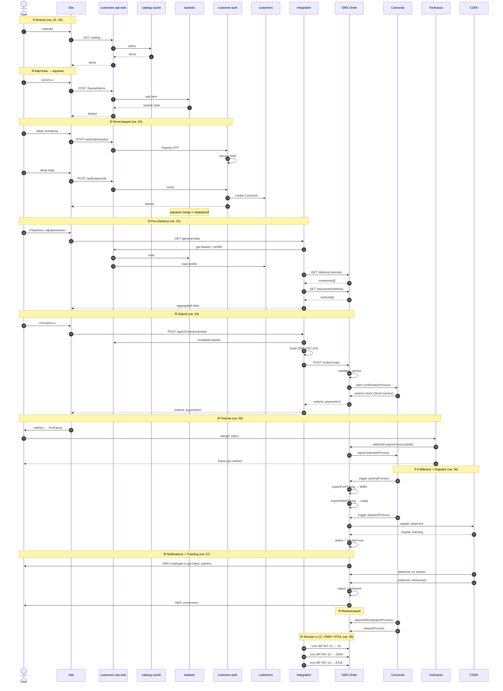

# E2E Happy Path — «Купить футболку курьерской доставкой»

**Назначение:** показать **сквозной** путь данных по всем 5 системам на одном примере. Это **не** замена детальных L1-файлов; это **карта-навигатор**: для каждого шага есть ссылка, где смотреть подробности.

**Сценарий:** анонимный пользователь заходит на сайт, ищет футболку, добавляет в корзину, регистрируется, оформляет курьерскую доставку с оплатой картой, получает товар.

---

## Главные участники

```
User → Site (Angular) → ENSI customers-api-web → ENSI core
                       ↘ Integration → OMS → Camunda
                                              → Carrier (CDEK)
                                              → YooKassa
```

---

## Сквозная sequence-диаграмма



---

## Пошаговая разбивка с ссылками

### ① Browse

- Анонимный посетитель → главная страница.
- Site → BFF → catalog-cache.
- См. [`01-product-content-lifecycle.md`](01-product-content-lifecycle.md) BP-CAT-06, [`03-browse-cart-precheckout.md`](03-browse-cart-precheckout.md) BP-BFF-01.

### ② Карточка → корзина

- Добавление товара создаёт корзину с TTL 24h.
- Корзина живёт в `baskets`.
- См. [`03-browse-cart-precheckout.md`](03-browse-cart-precheckout.md) BP-BSK-01.

### ③ Регистрация (SMS OTP)

- Пользователь вводит телефон → Devino SMS → ввод кода → создаётся `Customer`.
- Корзина анонимной сессии **мерджится** с серверной.
- См. [`02-customer-lifecycle.md`](02-customer-lifecycle.md) BP-CUS-01.

### ④ Pre-checkout (general-data + delivery quote)

- Site/Mobile запрашивает у Integration `general-data` — он агрегирует basket + addresses + intervals + payment methods.
- Integration зовёт OMS Settings (`/delivery/intervals`) → получает `inventories[]` со списком интервалов.
- ⚠️ Здесь работает «interval-id rolling hash» (см. ниже).
- См. [`03-browse-cart-precheckout.md`](03-browse-cart-precheckout.md) BP-CHK-PRE-01, BP-CHK-PRE-02, и [`../research/2026-05-16-checkout-flow.md`](../research/2026-05-16-checkout-flow.md).

### ⑤ Submit (POST /order/create)

- Integration валидирует, строит OMS Order DTO (V4 путь), вызывает OMS `/order/create`.
- OMS персистит, стартует `confirmationProcess.bpmn`.
- Стартует резервирование стока.
- См. [`04-checkout-order-creation.md`](04-checkout-order-creation.md) BP-CHK-01..04, BP-OMS-01, BP-OMS-02.

### ⑥ Платёж

- YooKassa hosted page → webhook к OMS pay-service.
- OMS signal'ит Camunda → confirmationProcess продолжается.
- См. [`05-payment.md`](05-payment.md) BP-PAY-01, BP-PAY-02, BP-OMS-06.

### ⑦ Fulfillment + Dispatch

- `pickingProcess` → WMS собирает.
- `dispatchProcess` → CDEK API регистрирует shipment, возвращает waybill.
- См. [`06-fulfillment-and-delivery.md`](06-fulfillment-and-delivery.md) BP-OMS-03, BP-OMS-04, BP-OMS-12.

### ⑧ Notifications + Tracking

- На каждом ключевом статусе — SMS и email через `notifications.bpmn`.
- CDEK шлёт webhook'и со статусами «in transit» / «delivered».
- См. [`07-post-order-and-comms.md`](07-post-order-and-comms.md) BP-OMS-09, BP-DEL-01..02.

### ⑨ Финализация

- `paymentFinalizationProcess` + `releaseProcess`.
- См. [`06-fulfillment-and-delivery.md`](06-fulfillment-and-delivery.md) BP-OMS-15, [`05-payment.md`](05-payment.md) BP-OMS-07.

### ⑩ Master-data export

- DWH / 1C / ATOL получают заказ через cron-задачи Integration.
- См. [`08-master-data-sync.md`](08-master-data-sync.md) BP-INT-10, 11, 13, 14.

---

## Точки наибольшего риска (по этому сценарию)

| Точка | Риск | Подробнее |
|---|---|---|
| ④ Pre-checkout | Stale interval-id (non-idempotent hash) | [`../research/2026-05-16-checkout-flow.md`](../research/2026-05-16-checkout-flow.md) |
| ⑤ Submit | 4 версии endpoint'а; не идемпотентный submit (двойной POST = двойной заказ) | `04-checkout-order-creation.md` |
| ⑥ Платёж | Lock-in на YooKassa; webhook idempotency | `05-payment.md` |
| ⑦ Dispatch | `russian-post-api-sdk` пустой; Yandex-NDD на test endpoint | `06-fulfillment-and-delivery.md` |
| ⑧ Notifications | Voximplant включён не для всех сценариев | `07-post-order-and-comms.md` |
| ⑩ Master-data | Несколько источников правды по стокам; recon шумит | `08-master-data-sync.md` |

---

## Если что-то пошло не так — где ловить

### Submit не прошёл

1. Site/Mobile логи (на клиенте).
2. Integration logs — `logs_search_message` через gj-buddy MCP (`mcp__gj-buddy__logs_*`).
3. OMS Order — `core/Order` логи + Camunda Cockpit (для incidents).

### Платёж завис

1. YooKassa dashboard.
2. OMS `pay-service` логи.
3. Camunda Cockpit — paymentProcess в инцидентах.

### Stock reservation failed

1. OMS `core/Stock` логи.
2. Recon (BP-INT-12) — расхождения 1C-Retail vs OMS.
3. Confluence: «overselling» страницы.

### Заказ не уехал к carrier

1. OMS `core/Delivery` логи.
2. dispatchProcess в Camunda Cockpit.
3. Per-carrier connector логи (CDEK / 5post / RPost).

---

## Альтернативные счастливые пути

| Сценарий | Отличия | См. |
|---|---|---|
| Самовывоз ПВЗ (CDEK PVZ) | На ④ выбирается `pickup_in_store`; на ⑦ dispatch везёт в ПВЗ; ⑧ — уведомление «прибыл в ПВЗ»; client сам забирает | `06-` BP-OMS-12 |
| Click & Collect (магазин GJ) | Picking на полке магазина; dispatch нулевой; SMS «готов к выдаче» | `06-` |
| Оплата при получении (cash) | ⑥ skipped — paymentUrl=null; oплата при выдаче через POS терминал; ATOL фискализация постфактум | `05-` BP-PAY-06 |
| Подели (BNPL) | ⑥ — Подели взимает рассрочкой, GJ получает деньги сразу | `05-` BP-PAY-04 |
| Покупка сертификата | Нет picking, нет dispatch; вместо tracking — email с кодом | `05-` BP-PAY-07 + `07-` BP-OMS-14 |

---

## Альтернативные **несчастливые** пути

- **Отмена клиентом** — BP-OMS-08 (`07-post-order-and-comms.md`).
- **Auto-cancel по timeout** (не оплачено за 24h) — confirmationProcess timer → cancellationProcess.
- **Out of stock на picking** — repick / cancel.
- **Carrier отказ** — cancel или замена carrier.
- **Fraud rejected** — на этапе ⑤ submit.
- **Возврат** — BP-RET-01, BP-RET-02 (`07-`).

---

**Дата создания:** 2026-05-16
