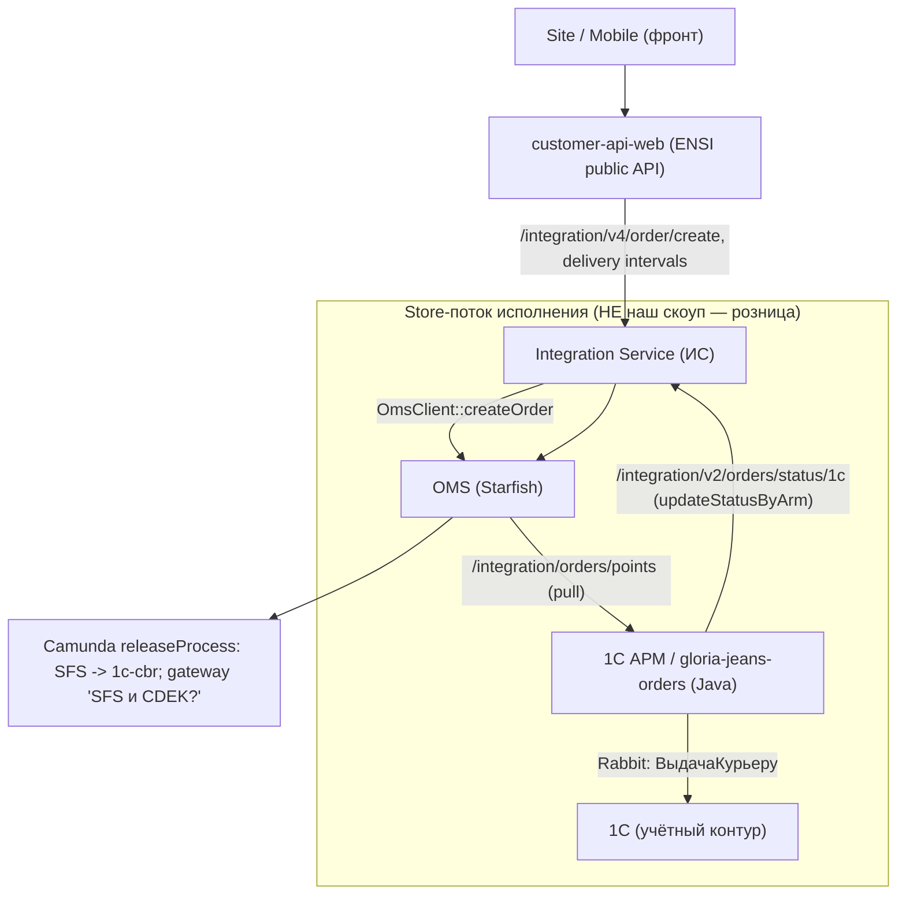

# Яндекс.Экспресс SFS в екоме: расследование и план доработок

Дата: 2026-06-25 (переписано после уточнения скоупа)

> ⚠️ **Это ранняя версия.** Актуальное детальное исследование и оценка для руководства вынесены в отдельный пакет [`yandex-express/`](yandex-express/README.md) (one-pager — [`yandex-express/ONE-PAGER.md`](yandex-express/ONE-PAGER.md)). Развилка с отдельным carrier (`yandexExpress`, Вариант B) здесь — **устарела**: в целевой схеме carrier остаётся `yandexNextDayDelivery`, новый — только тип доставки `SFS_YANDEX`.

## Цель

Сделать экспресс‑доставку Яндексом в екоме по флоу **SFS** (доставка из магазина курьером) — **аналогично существующему SFS CDEK**, с возможностью переключения CDEK ↔ Яндекс.Экспресс. Затронуть только ecom‑контур:

- `customer-api-web` — вывести на фронт ещё одну кнопку «Экспресс‑доставка»;
- Integration Service (ИС) — маппинг carrier/тип доставки + создание заказа;
- OMS — carrier‑конфиг и BPMN (команда OMS сообщила, что готова).

## Важные уточнения по скоупу (вводная заказчика, принято за факт)

- **Ecom‑задачи в Jira по этой теме — мёртвые.** `OPSOMN-107` «Подключение новых служб доставки (ECOM)» (Приостановлено), `OPSOMN-418` «Экспресс доставка. Яндекс.Доставка» (Новый), `OPSOMN-178` (Отмена), серия КСЭ `OPSOMN-1174/1231/582/963`. Со стороны екома **не прорабатывались**. На них не опираемся.
- **Розница уже сделала тестово КСЕ и Яндекс.Экспресс SFS** (ARM/1С). Это их контур, мы туда не лезем. (В DEVRTL001 видны соответствующие задачи: `DEVRTL001-8080/8251/8252` «Новая ТК + вкладыш КСЭ», `DEVRTL001-8081` «Экспресс доставка», `DEVRTL001-8188/8276/8300` «Сборка/выдача SfS».)
- **OTS не участвует в SFS.** OTS — складская система: ТК интегрируются с ним только в потоках заказов **со склада**; OTS шлёт остатки и статусы в OMS. В потоке **из магазина** (SFS) остатки/статусы шлёт магазинный контур (1С АРМ / Java Gloria Retail).

Подтверждение «OTS не в SFS» по коду — `releaseProcess.bpmn`:
- ветка `${fulfillmentType == 'sfs'}` → «Выгрузка заказа в **1С ЦБР**» (`destination=1c-cbr`);
- «Выгрузка заказа в **OTS**» (`destination=ots`) — только в ветке `C&C` (`deliveryTypeId == 'pickupinstore'`), т.е. со склада/самовывоз с допоставкой.

## Корректная архитектура ecom‑потока (SFS)



Ключевой вывод: со стороны екома путь — **фронт → customer-api-web → Integration → OMS**. Исполнение в магазине (сборка, выдача курьеру, статусы назад) делает розница; нам нужно лишь, чтобы заказ дошёл до OMS как `SFS + <express carrier>` и корректно отобразился на фронте.

## Что уже есть в коде (точки опоры)

### customer-api-web — «экспресс» уже частично заложен

- `app/Domain/Orders/Data/Enums/DeliveryType.php`
  - уже есть `EXPRESS = 'express'` («Экспресс‑доставка»), плюс `DELIVERY = 'delivery'` («Доставка курьером»), `PICKUP`, `RESERVE_IN_STORE`, `PICKUP_IN_STORE`.
  - `toClientResponse()` **не обрабатывает** `EXPRESS`/`COURIER`/`AB_TEST`/`ONLINE` (есть запись в `phpstan-baseline.neon`) — потенциальная доработка названия для фронта.
- `app/Domain/Orders/Data/Checkout/CommonDeliveryData.php`
  - `EXPRESS_CARRIER_ID = 'gjexpress'`;
  - `isExpressDelivery() => $this->carrierId === 'gjexpress'`;
  - `carrierId` берётся из `DeliveryInterval`, который приходит из Integration.
- `app/Domain/Orders/Actions/GetDeliveryDataV2Action.php`
  - уже делает `partition(fn($d) => $d->isExpressDelivery())` и возвращает `DeliveryData::fromRequest($formattedMethods, $courierDelivery, $expressDelivery)` — **express уже отделяется в отдельный блок ответа**;
  - интервалы доставки берёт из `omsClient->getDeliveryIntervalsV2()`.
- `app/Domain/Orders/Client/OmsClient.php` — несмотря на имя, это **клиент Integration** (`RestClient`): `/integration/v4/order/create`, `/integration/order/list/full`, delivery intervals и т.д.

Вывод: «кнопка экспресс‑доставки» в customer-api-web детектится по `carrierId === 'gjexpress'`. Если Integration вернёт интервал с этим carrier — express‑блок уже отрисуется. Это определяет развилку (см. ниже).

### Integration — carrier/тип доставки SFS

- `app/Service/Consts/Enums/Delivery/Oms/CarrierIdEnum.php`
  - `GLORIAJEANS_EXPRESS = 'gjexpress'`, `YANDEX = 'yandexNextDayDelivery'`, плюс CDEK/DPD/PICKPOINT/RUSSIANPOST/SBERLOGISTIC/FIVEPOST/HERMES.
- `app/Service/Consts/Enums/Delivery/GloriaJeans/DeliveryTypeCodeEnum.php`
  - `SFS_CDEK = 111`, `SFS_PICKPOINT = 112`, `SFS_RUSSIANPOST = 113`, `SFS_GLORIAJEANS_EXPRESS = 114`, `YANDEX = 10`.
- `app/Service/UserApi/Services/V2/Contracts/DeliveryTypeCodeMapByRulesContract.php`
  - есть `DELIVERY + SFS + CDEK -> SFS_CDEK`;
  - есть `DELIVERY + SFS + GLORIAJEANS_EXPRESS -> SFS_GLORIAJEANS_EXPRESS`;
  - **нет `DELIVERY + SFS + YANDEX`** — главный разрыв в маппинге.
- `app/Service/Consts/Maps/Delivery/Arm/DeliveryGoodIdMap.php`
  - `YANDEX => 'UPR010640F0001'`, `GLORIAJEANS => 'UPR003997F0001'` — good_id строки доставки уже заведены (в т.ч. для Яндекса).
- Создание заказа: `customer-api-web → /integration/v4/order/create → OmsClient::createOrder($order)`.

### OMS — BPMN уже знает carrierId

- `platform/starfish24/awg/bpmn-process/process/gloriajeans/releaseProcess.bpmn`
  - gateway **«SFS и CDEK?»**: `${fulfillmentType == 'sfs' && carrierId == 'cdek'}` → всем товарам `COMPLETED` (семантика «курьер забрал»); для прочих SFS этот авто‑шаг пропускается;
  - SFS экспортируется в `1c-cbr` (не OTS).
- Внешний экспорт управляется настройкой `export_type` → `http://{clientServiceName}/order/export` (`Order/.../OrderExternalExportServiceImpl.java`, `ClientServiceImpl.java`).

### Store‑поток (исходный вопрос расследования — ответ)

- **Статусы из магазина в OMS:** 1С АРМ / `platform/arm/gloria-jeans-orders` (Java, `OmsService`) → Integration `POST /integration/v2/orders/status/1c` (`OrderActionController@updateStatusByArm` → `updateStatusByArmV2`) → OMS.
- **Заказы в магазин (pull):** OMS/Integration `POST /integration/orders/points` (`OrderQueryController@getOrdersByShopId`, presenter `Order1CAPMPresenter`) → ARM scheduled job.
- **Остатки магазина:** отдельный контур; в Integration `UserApi` route `/stock` закомментирован — store‑сток идёт не через этот эндпоинт (нужно уточнять отдельно при необходимости, для текущей задачи Яндекс.Экспресс не блокирует).

> **РЕШЕНИЕ: выбран Вариант B** — отдельный carrier id `yandexExpress` + новый delivery code + правила, протянутые до OMS. Детальный план по файлам — в разделе «Реализация (Вариант B)» ниже.

## Ключевая развилка дизайна (зафиксировано: Вариант B)

Как выводить Яндекс.Экспресс SFS на фронт:

**Вариант A (рекомендуется) — переиспользовать существующий express‑канал.**
Integration для express‑тарифа возвращает интервалы с `carrierId = 'gjexpress'`, customer-api-web уже кладёт их в express‑блок (`isExpressDelivery`). Переключение фактического перевозчика (CDEK vs Яндекс) живёт «под капотом» в Integration→OMS через carrier‑конфиг/фичефлаг. Плюс: минимум изменений на фронте/в customer-api-web. Минус: `gjexpress` перестаёт означать «GJ‑курьер» и становится обобщённым «экспресс».

**Вариант B — отдельный carrier id для Яндекс.Экспресс** (например `yandexExpress`).
Тогда в customer-api-web `isExpressDelivery()` нужно расширить (`in_array($carrierId, ['gjexpress','yandexExpress'])`), завести новый `CarrierIdEnum` + `DeliveryTypeCodeEnum::SFS_YANDEX_EXPRESS` + правило, и протянуть до OMS. Плюс: явное разделение и честная переключаемость. Минус: больше изменений во всех трёх системах.

> Решение по A/B определяет объём правок. По формулировке «ещё 1 кнопка экспресс‑доставка» + «переключать CDEK↔Яндекс» — A проще и быстрее; B чище для долгого сосуществования нескольких экспресс‑ТК.

## План доработок ecom (по системам)

### 1. OMS (команда сообщила, что готова — подтвердить)

- carrier‑конфиг для Яндекс.Экспресс SFS (id перевозчика, согласовать строку: `cdek`‑аналог).
- gateway «SFS и CDEK?» в `releaseProcess.bpmn`: расширить условие, чтобы авто‑`COMPLETED` отрабатывал и для нового express‑carrier (иначе SFS Яндекс не будет авто‑завершаться как CDEK). Либо обобщить до `fulfillmentType == 'sfs'`.
- подтвердить, что для SFS Яндекс экспорт остаётся `1c-cbr` (без OTS) и статусная модель совпадает с CDEK.
- согласовать **точную строку carrierId**, которую OMS ждёт/возвращает (критично для маппинга в Integration и для BPMN‑условия).

### 2. Integration Service (ИС)

- (Вариант B) добавить `CarrierIdEnum::YANDEX_EXPRESS` и `DeliveryTypeCodeEnum::SFS_YANDEX_EXPRESS`; (Вариант A — переиспользовать `gjexpress`/`SFS_GLORIAJEANS_EXPRESS=114`).
- добавить правило в `DeliveryTypeCodeMapByRulesContract`: `DELIVERY + SFS + <YANDEX_EXPRESS|GLORIAJEANS_EXPRESS> -> <код>` (сейчас `DELIVERY+SFS+YANDEX` отсутствует).
- убедиться, что delivery intervals/available delivery для express‑тарифа отдают корректный `carrierId` (тот, по которому customer-api-web детектит express).
- проверить `DeliveryGoodIdMap` (для Яндекса good_id `UPR010640F0001` уже есть) и строку доставки в заказе.
- order create `/integration/v4/order/create`: убедиться, что carrier/fulfillment корректно уходят в OMS (`fulfillmentType=sfs`, нужный carrierId).
- ⚠️ Риск: `CarrierIdEnum::YANDEX = 'yandexNextDayDelivery'` — это **складской** next‑day Яндекс (`FULFILLMENT + YANDEX -> 10`), а в OMS logistics `yandexnextdaydelivery` явно исключён из express‑классификации. Для SFS Express его «в лоб» переиспользовать нельзя — нужен отдельный express‑carrier id.

### 3. customer-api-web

- (Вариант A) при `carrierId === 'gjexpress'` express уже работает — изменений минимум; проверить полный путь V2/V3/Mob.
- (Вариант B) расширить `CommonDeliveryData::isExpressDelivery()` и `EXPRESS_CARRIER_ID` под новый carrier id.
- дописать `DeliveryType::toClientResponse()` для `EXPRESS` (название кнопки «Экспресс‑доставка {ТК}») — сейчас match не покрывает EXPRESS (phpstan‑baseline).
- проверить ресурсы ответа: `Checkout/DeliveryMethodResource`, express‑блок в `DeliveryDataResponse` (V2/V3/MobileV1) — что фронт получает express как отдельный метод.

## Открытые вопросы

### К OMS
- Точная строка `carrierId` для Яндекс.Экспресс SFS (чтобы совпало в Integration‑маппинге и BPMN‑условии)?
- Расширяете gateway «SFS и CDEK?» сами или это на нашей стороне (через переданный carrierId)?
- Подтверждаете: SFS Яндекс — экспорт `1c-cbr`, без OTS, статусная модель = CDEK?

### Внутри екома (решить нам)
- Вариант A vs B (переиспользовать `gjexpress` express‑канал или завести отдельный `yandexExpress`).
- Нужен ли фичефлаг/настройка для переключения CDEK↔Яндекс на уровне города/магазина/тарифа.

## Команды для следующей сессии (ecom‑контур)

```bash
cd $WORKSPACE
./scripts/sync-platform-repos.sh ensi
./scripts/sync-platform-repos.sh integration

# Полный путь express/SFS в customer-api-web
rg -n "isExpressDelivery|EXPRESS_CARRIER_ID|gjexpress|DeliveryType::|expressDelivery" \
  platform/ensi/apps/customers-api-web/app

# Маппинг SFS/carrier в Integration
rg -n "SFS_|GLORIAJEANS_EXPRESS|yandexNextDayDelivery|DeliveryTypeCodeMapByRules" \
  platform/integration/integration/www/app/Service

# carrierId в BPMN OMS
rg -n "carrierId|fulfillmentType|sfs" \
  platform/starfish24/awg/bpmn-process/process/gloriajeans/releaseProcess.bpmn
```

## Реализация (Вариант B) — детальный план по файлам

Новые сущности (значения согласовать с OMS/1С — см. «нужно от OMS»):
- carrier id: `yandexExpress` (строка должна совпасть с тем, что отдаёт/ждёт OMS);
- delivery type code: `SFS_YANDEX_EXPRESS = 115` (следующий свободный после 114; подтвердить нумерацию 1С/OMS);
- имя для фронта: `'Экспресс-доставка Яндекс'`;
- barcode: `''` (как у `SFS_GLORIAJEANS_EXPRESS`).

### A. Integration Service (ИС) — `platform/integration/integration/www`

1. `app/Service/Consts/Enums/Delivery/Oms/CarrierIdEnum.php`
   - добавить `public const YANDEX_EXPRESS = 'yandexExpress';`
2. `app/Service/Consts/Enums/Delivery/GloriaJeans/DeliveryTypeCodeEnum.php`
   - добавить `public const SFS_YANDEX_EXPRESS = 115;`
3. `app/Service/Consts/Enums/Delivery/GloriaJeans/DeliveryTypeCodeNameEnum.php`
   - добавить `public const SFS_YANDEX_EXPRESS = 'Экспресс-доставка Яндекс';`
4. `app/Service/Consts/Contracts/Maps/Delivery/GloriaJeans/DeliveryTypeCodeMapByRulesContract.php`
   - добавить правило (рядом с `SFS_GLORIAJEANS_EXPRESS`, до default): `DELIVERY + SFS + YANDEX_EXPRESS` → `delivery_type_code = SFS_YANDEX_EXPRESS`, `barcode = ''`.
5. `app/Service/Consts/Contracts/Maps/Delivery/GloriaJeans/DeliveryTypeCodeNameMapByRulesContract.php`
   - добавить аналогичное правило → `delivery_type_name = SFS_YANDEX_EXPRESS`.
6. `app/Service/UserApi/Services/V1/Order/OrderService.php` (хардкод‑резолвер, ~строка 728)
   - в SFS‑ветке добавить `elseif ($carrierId === CarrierIdEnum::YANDEX_EXPRESS) { return DeliveryTypeCodeEnum::SFS_YANDEX_EXPRESS; }`.
7. `app/Service/UserApi/Mutators/V1/Order/OrderExportCbrMutator.php` (экспорт SFS → 1c‑cbr, ~строка 145)
   - добавить такую же ветку `YANDEX_EXPRESS → SFS_YANDEX_EXPRESS`.
8. `app/Service/Consts/Contracts/Maps/Delivery/Cbr/DeliveryTypeCodeMapByRulesContract.php` (~строка 117)
   - добавить правило `SFS + YANDEX_EXPRESS → SFS_YANDEX_EXPRESS` (для корректного экспорта в 1С‑ЦБР).
9. (опц.) `CarrierBarcodeEnum.php` — barcode для новой ТК, если 1С требует; иначе `''`.
10. Проверить order‑create `POST /integration/v4/order/create`: carrier/fulfillment без потерь уходят в OMS (`fulfillmentType=sfs`, `carrierId=yandexExpress`).

### B. customer-api-web — `platform/ensi/apps/customers-api-web`

1. `app/Domain/Orders/Data/Checkout/CommonDeliveryData.php`
   - расширить детектор express: ввести список express‑carrier'ов и проверять `in_array($this->carrierId, ['gjexpress','yandexExpress'])` в `isExpressDelivery()` (либо добавить `YANDEX_EXPRESS_CARRIER_ID`).
2. `app/Domain/Orders/Data/Enums/DeliveryType.php`
   - дополнить `toClientResponse()` обработкой `EXPRESS` (название кнопки «Экспресс‑доставка»), закрыть phpstan‑baseline.
3. Проверить, что express‑блок (`expressDelivery` из `GetDeliveryDataV2Action`/`DeliveryData::fromRequest`) рендерится в ресурсах ответа `Checkout/DeliveryDataResponse` для V2/V3/MobileV1 — фронт получит экспресс как отдельный метод/кнопку.
4. Регенерация клиентов не требуется (carrierId — строковое поле интервала, приходит из Integration/OMS).

### C. OMS (подтвердить у команды — сообщали, что готовы)

1. carrier‑конфиг Яндекс.Экспресс SFS со строкой `carrierId = yandexExpress` (должна совпасть с Integration).
2. `releaseProcess.bpmn` gateway «SFS и CDEK?» (`${fulfillmentType=='sfs' && carrierId=='cdek'}`): расширить под express‑carrier или обобщить до `fulfillmentType=='sfs'`, иначе SFS Яндекс не получит авто‑`COMPLETED`.
3. Подтвердить: SFS Яндекс — экспорт `1c-cbr`, без OTS; delivery intervals для express‑тарифа OMS отдаёт с `carrierId=yandexExpress` (это и зажигает кнопку на фронте).
4. Статусная модель SFS Яндекс = CDEK (приходит из магазинного контура через `/integration/v2/orders/status/1c`).

### Порядок внедрения

1. Согласовать с OMS строку `carrierId` и номер `delivery_type_code` (блокер для остального).
2. OMS: carrier‑конфиг + BPMN gateway + express‑интервалы.
3. Integration: enums + правила + V1/CBR резолверы (A1–A10).
4. customer-api-web: express‑детектор + название кнопки (B1–B3).
5. E2E‑проверка: чекаут SFS Яндекс рядом с CDEK, переключение, заказ доходит до OMS как `SFS + yandexExpress`, дальше магазинный флоу как у CDEK.

## Нужно от OMS (блокеры)

- Точная строка `carrierId` для Яндекс.Экспресс SFS.
- Номер `delivery_type_code` (нумерация 1С/OMS; предложение — 115).
- Кто расширяет gateway «SFS и CDEK?» — OMS или мы передаём готовый carrierId.
- Подтверждение, что OMS отдаёт express‑интервалы с этим carrier (иначе кнопка не появится).
