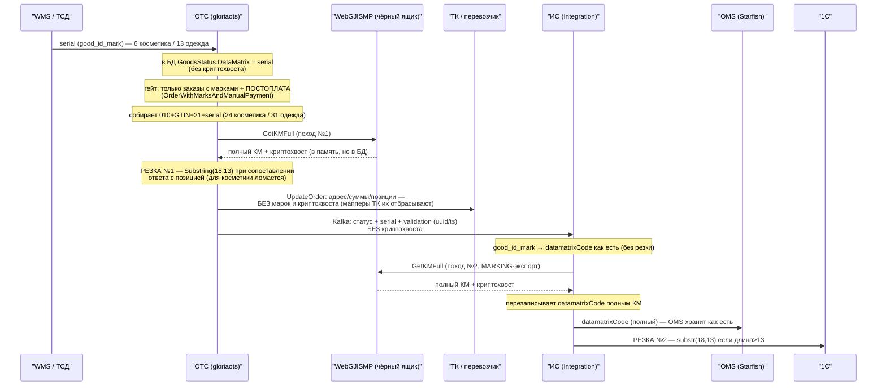

# Маркировка косметики в e-com: процесс и доработки (ОТС → ИС → OMS)

> **Задача:** OPSOMN001-247 «Запуск beauty в e-com GJ» (Confluence `165406763`).
> **Ревизия 2026-07-06:** исправлен шаг 5 и вывод о потребителе криптохвоста похода №1 — **в ТК марки/криптохвост НЕ передаются** (carrier-мапперы CDEK/5Post/Почта/Яндекс/DPD полей марки не отправляют). Криптохвост похода №1 внешнего потребителя не имеет → приоритет резки №1 понижен. Также уточнён гейт похода №1 (только заказы с марками + постоплата). Детали — `research/2026-07-03-arm-store-marking-process.md` §3.7.
> **Наша зона:** **ОТС (gloriaots) → ИС (Integration) → OMS (Starfish)**. Здесь — как код маркировки (КМ) проходит по цепочке и что доработать под косметику.
> **Не наша зона:** **WebGJISMP и команда маркировки** — чёрный ящик; их репозиторий склонирован только для сверки, доработки по нему мы не выписываем. **Разрешительный режим (ТС ПИОТ, `inst`/`version`)** — отдельная последующая задача (`research/2026-06-19-rr-tspot-inst-ver-dorabotki.md`), не объединяется с запуском косметики.
> **Допущение:** криптохвост для косметики **нужен** (иначе большая часть доработок ниже отпадает — см. §6).
> **Источники:** локальный код `platform/gloriaots`, `platform/integration`, `platform/starfish24` + Confluence OPSOMN001-247.

---

## 1. Термины

| Термин | Что это | Где код |
|---|---|---|
| **ОТС** | `gloriaots` (.NET Order Transport System) — **отдельная система, не часть OMS** | `platform/gloriaots/gloriaots` |
| **ИС** | Интеграционный сервис (`avg-integration-service`) | `platform/integration/integration` |
| **OMS** | Starfish (Java) | `platform/starfish24/core/*` (`Order`, `pay-service`) |
| **WebGJISMP** | Сервис марок (чёрный ящик команды маркировки; выдаёт криптохвост, ведёт статусы марок). **Косметику уже умеет** (формат ISMP5 для товарной группы chemistry) | `platform/marks/WebGJISMP` — вне нашей зоны доработок |

**Связность:** OMS с ОТС общается **через ИС** (напрямую не ходят). ОТС публикует статус заказа с маркой в Kafka → ИС потребляет → пробрасывает в OMS.

---

## 2. Три представления одной марки (не путать)

| Представление | Что это | Длина: одежда / косметика | Кто это делает |
|---|---|---|---|
| **serial** | то, что **приходит** в ОТС (`good_id_mark`) | **13** / **6** | присылает WMS |
| **полный КМ** | serial, обёрнутый как `010+GTIN+21+serial` (+ криптохвост) | **31** / **24** | **собираем сами** (ОТС и ИС), чтобы спросить WebGJISMP |
| **1С-формат** | serial, добитый до 13 буквами Z (`serial6+ZZZZZZZ`) | всегда **13** | делает **сама 1С**, не мы |

Ключевое: **24 и 31 — это не вход, а то, что мы собираем** для запроса в WebGJISMP. В нашу зону **приходит serial** (сегодня 13, для косметики 6).

---

## 3. Сквозной процесс (as-is по коду, косметика serial=6)

### Пошагово

1. **WMS → ОТС.** Приходит **serial** (`good_id_mark`) — 6 у косметики / 13 у одежды. В БД `GoodsStatus.DataMatrix` хранится **только serial, без криптохвоста**. Резки нет.
2. **ОТС собирает код.** `MarkUtils.BuildKmCode(serial, gtin)` = `010+GTIN+21+serial` (24 косметика / 31 одежда). Это сборка (префикс), **не резка**.
3. **ОТС → WebGJISMP (поход №1).** Выполняется **только для заказов с марками И постоплатой**: гейт `OrderWithMarksAndManualPayment` — `clnt_pay_sum > 0 && clnt_paid_sum == 0` (`OrderToPickup.cs:53-59,174-181`); для предоплаченных заказов ОТС на ORDER_PICKUP «Nothing to do». Дальше `BuildParamsWithMarksAndCrypto` → `WebGjIsmpClient.GetKmList` (`POST /api/KM/GetKMFull?from=OTS`). Получает **полный КМ с криптохвостом** и пишет его в `good_id_mark_cryptotail` **в памяти** (в БД не сохраняется).
4. **ОТС разбирает ответ — РЕЗКА №1.** Чтобы сопоставить вернувшийся код с позицией, извлекает serial из **ответа**: `WebGjIsmpResponse.GetMarkSerial() = km.Substring(18, 13)` → **хардкод 13**; сравнивает с `good_id_mark` (`OrderToPickup.cs:153`). Для косметики `Substring(18,13)` = `serial6 + мусор` ≠ `6` → **не сопоставилось → криптохвост не привязался** (тихо, per-item `continue`, без ошибки). ❌
5. **ОТС → ТК: обновление заказа БЕЗ марок** *(исправлено в ревизии 2026-07-06; ранее ошибочно «криптохвост для накладной ТК»)*. `tkOrderManager.UpdateOrder(newOrderParams)` (`OrderToPickup.cs:63`, `tkOrderManager` = `IShipmentServiceFacade`) обновляет заказ у перевозчика (адрес/суммы/позиции — для COD), но **carrier-мапперы поля марки не отправляют**: CDEK `MapPackageItem` (`CDEKMappings.cs:226-250`), 5Post `ToUpdateCargoesParams` (`FivePostMappings.cs:118-144`), Почта `EditPackage`→`ToRPostPackage` (без goods), Яндекс/DPD — марок в API-клиентах нет. Криптохвост остаётся во **внутренних** параметрах/результатах ОТС (`good_id_mark_cryptotail` в `OTSModels`) — **внешнего потребителя у похода №1 не найдено**. Причина на уровне бизнеса: **ТК не являются участниками оборота ЧЗ и коды маркировки не принимают** (со слов бизнеса 2026-07-06) — выбытие всегда на стороне GJ (`2026-07-03-arm-store-marking-process.md` §3.7).
6. **ОТС → Kafka → ИС.** Уведомление строится из **`ctx.OtsOrderParams` (исходные)** — `OTSOrderResultBuilder.Create(ctx.OtsOrderParams)` (`:69`) → `StarfishOrderStatusNotifier` → `Sender`. В Kafka уходит **serial (`good_id_mark`) + validation (`good_mark_validation_uuid/timestamp`), но НЕ криптохвост** (`GoodReachingService.cs:17-23` — в `GoodsV2` только `good_id_mark`; поля криптохвоста нет).
7. **ИС принимает статус.** `TransferService.transferOtsOrderStatus` кладёт `good_id_mark` в `datamatrixCode` **как есть, без резки** (`:2108-2110`); криптохвоста в сообщении ОТС и нет.
8. **ИС → WebGJISMP (поход №2).** На MARKING-экспорте `OrderService.fillCryptoDatamatrixCodes` снова собирает `010+GTIN+21+serial` → `getKMFull` (`:4961-4996`) → **перезаписывает `datamatrixCode` полным КМ** для OMS.
9. **ИС → OMS.** Отдаёт `datamatrixCode` (полный КМ). OMS **хранит как есть** (`Item.datamatrixCode`), в WebGJISMP не ходит, не режет.
10. **ИС → 1С — РЕЗКА №2.** `AbstractOrderExport1CMutator:1165`: `if strlen(datamatrixCode) > 13 → substr(18, 13)`. Код длинный → режет **хардкодом 13** → для косметики `serial6 + мусор`. ❌

> **Два `GetKMFull` (уточнено 2026-07-06):**
> - **поход №1 (ОТС)** — криптохвост **никуда внешне не уходит**: в ТК не передаётся (шаг 5), в Kafka не кладётся (шаг 6), в БД не сохраняется. Похоже на исторический/недоделанный код (возможно, задумывался для ТК). Работает только как побочная **валидация марок в WebGJISMP** для COD-заказов (ошибка WebGJISMP → exception → заказ не уйдёт дальше);
> - **поход №2 (ИС)** — **единственный реальный потребитель**: криптохвост для **OMS** (шаг 8) и далее для финального чека (OMS `paymentFinalizationProcess` → marking-экспорт → `RECEIPT_CREATE` YooKassa, см. `research/2026-07-03-arm-store-marking-process.md` §3.6).
> ОТС в Kafka криптохвост **не передаёт**, поэтому ИС считает его сам. Кандидат на упрощение: убрать/переосмыслить поход №1.

---

## 4. Дискриминатор «одежда vs косметика» на позиции

**Явного типа марки (товарной группы) на позиции сейчас НЕТ:**
- Источник справочника товаров для ОТС — **GJ WebApi** (`ApiGW` = `rnd-webapi-bal.gloria.aaanet.ru`, эндпоинт `api/Hybris/skuByBarcode`), не ИС и не WebGJISMP.
- В пейлоаде `SkuDTO` от WebApi есть только `mark_type` — прокомментирован как **«Признак маркировки» (флаг 0/1)**, а НЕ тип марки. Товарной группы (chemistry), `КодТипаМарки` (1522), `tnved`, `cisType` в пейлоаде **нет** (`ApiGWCore/Models/SkuRoot.cs`). В ОТС он маппится в `Good.MarkTypeCode` как `IsMarkable.ToString()` (`GoodDTOMapper.cs:21,42`) — одежда и косметика обе `"1"`.
- **ИС:** в потоках марки/экспорта на позиции нет ни `mark_type`, ни `product_group`, ни `markable`.

**Источник признака различается по системам:**

| Система | Источник справочника | Что доступно | Признак ТГ есть? |
|---|---|---|---|
| **ОТС** | GJ WebApi (`api/Hybris/skuByBarcode`) | только `mark_type` = «Признак маркировки» (0/1) | ❌ нет (только флаг) |
| **ИС / ENSI** | **PIM / Catalog** (`CatalogClient` `GET /product`) | `markable`, `categoryName` (уже синкается в OMS через `pullProductCustomAttributes`), + запланированные beauty-атрибуты/`mark_type` | ✅ есть / планируется |

**Отсюда — как отличать косметику на каждой точке резки:**

- **Резка №1 (ОТС) — структурно по `GS`/длине.** У ОТС признака ТГ нет (WebApi отдаёт только флаг). serial = часть КМ между `21` и первым `GS`; в ответе WebGJISMP уже есть `km_without_tail` (= km до первого `GS` = `010+GTIN+21+serial`), откуда serial = всё после позиции 18, длина сама 6 или 13. **Длина serial и есть признак** (6 → косметика, 13 → одежда) — не костыль, длина интринсик к формату марки ЧЗ. Явный тип для ОТС потребовал бы расширения WebApi (upstream, отдельно).
- **Резка №2 (ИС → 1С) — по признаку из PIM/Catalog.** У ИС признак доступен из каталога: `markable` (маркируется/нет, OPSOMN-11783, IS-CAT-02/03) и `categoryName` (уже прокидывается, `TransferService:508-542`); товарную группу для «косметика vs одежда» можно взять из категории/`mark_type` каталога (либо добавить явный признак в синк — укладывается в плановые PIM/ИС-доработки). Т.е. на стороне ИС можно ветвить **«правильно» по каталожному признаку**, а не только по длине.

Итог: для запуска резку №1 (ОТС) чиним структурно (длина/`GS`); резку №2 (ИС) — по признаку из PIM/Catalog (markable + товарная группа), что аккуратнее и в рамках плановых доработок ENSI.

---

## 5. Доработки под косметику: что / где / зачем

| # | Система | Что сделать | Где (файл/точка) | Зачем |
|---|---|---|---|---|
| 1 | **ОТС (`gloriaots`)** | **Резка №1:** заменить хардкод `Substring(18, 13)` на структурный разбор serial (по `km_without_tail` / до `GS`), длина сама 6/13. **Приоритет понижен (ревизия 2026-07-06):** криптохвост похода №1 внешне никуда не уходит (в ТК марки не передаются, §3 шаг 5) — несопоставление тихо оставляет `cryptotail=null` без внешнего эффекта. Фиксить как гигиену/вместе с решением судьбы похода №1; **блокером для запуска не является**. ⚠️ Проверить отдельно: не падает ли `GetMarkSerial` на коротком `km` косметики (`Substring(18,13)` при длине < 31 бросит exception → сломает ORDER_PICKUP для COD) | `WebGjIsmpResponse.cs:51-54` (`GetMarkSerial`) + сопоставление `OrderToPickup.cs:153`; гейт `OrderToPickup.cs:53-59,174-181` | serial из ответа WebGJISMP = 13 (`serial6+мусор`) ≠ пришедшему 6 → криптохвост не привяжется. Зона влияния — только внутренние параметры ОТС; НЕ ТК и НЕ фискалка OMS (у OMS свой криптохвост через ИС, поход №2) |
| 2 | **ИС (`Integration`)** | **Резка №2:** заменить `substr(18, 13)` при выгрузке в 1С на корректный разбор serial — **по признаку из PIM/Catalog** (`markable` / товарная группа; `categoryName` уже синкается) либо структурно по длине | `AbstractOrderExport1CMutator.php:1165`; источник признака — `CatalogClient` / `pullProductCustomAttributes` | для косметики (полный КМ) «одёжный» рез 13 кладёт `serial6+мусор` в `serial_number` 1С. На стороне ИС признак ТГ доступен из каталога (в рамках плановых PIM-доработок) |
| 3 | **OMS (`Starfish`)** | **Доработок нет.** Хранит `datamatrixCode` (строка) как есть; поля марки/валидации уже заведены | `Order/.../entities/Item.java:61-79`, `ItemConverter.java` | в WebGJISMP не ходит, не режет; финальный чек с маркой — `paymentFinalizationProcess.bpmn`: marking-экспорт в ИС → `RECEIPT_CREATE` (YooKassa); Сбер-путь с тегом 1162 (`pay-service/OnlinePaymentServiceImpl.java:304-319`) — не основной (см. `2026-07-03-arm-store-marking-process.md` §3.6) |
| 4 | **WMS → ОТС** (контракт, **не наша разработка**) | Убедиться, что для косметики в ОТС приходит **чистый serial 6** (не 24, не 13-с-Z) | вход `good_id_mark` ← `DataMatrix` статуса WMS | ОТС/ИС собирают `010+GTIN+21+serial`; иной формат ломает склейку |
| — | **Проверка (не бага)** | Два `GetKMFull` — **уточнено:** реальный потребитель криптохвоста только **поход №2 (ИС→OMS→чек)**. Поход №1 (ОТС, только COD) внешнего потребителя не имеет — кандидат на удаление/переосмысление вместо починки резки №1 | `OrderToPickup.cs:61-63` + `fillCryptoDatamatrixCodes` (OMS) | упрощение, не блокер |

**Суть:** обе доработки (1 и 2) — это **снятие «одёжного» хардкода 13**, но приоритет разный: **№2 (ИС→1С) — обязательная**, №1 (ОТС) — гигиена/после решения судьбы похода №1 (плюс проверка на exception при коротком `km`). OMS не трогаем.

### 5.1. Варианты решения по каждой резке (простое / правильное)

#### Резка №1 — ОТС (сопоставление ответа WebGJISMP с позицией)
Где: `WebGjIsmpResponse.cs` (`GetMarkSerial → Substring(18,13)`) + `OrderToPickup.cs:150-159` (матч `km.mark_serial == good.good_id_mark`).

> **Ревизия 2026-07-06 — приоритет понижен:** результат сопоставления (криптохвост) внешне никуда не уходит (ни в ТК, ни в Kafka, ни в БД — §3 шаги 5–6). Прежде чем чинить матчинг, решить судьбу похода №1 целиком (возможно, удалить). Единственный реальный риск — **exception в `GetMarkSerial` на коротком `km`** (< 31 символа) для COD-заказов с косметикой: тогда упадёт весь ORDER_PICKUP-хендлер, это надо проверить/закрыть в любом случае.

- **Простое (структурно, в зоне ОТС):**
  - вариант: сопоставлять по **чистому коду целиком** — `response.km_without_tail == BuildKmCode(good.good_id_mark, good.good_id)` (сравниваем весь `010+GTIN+21+serial`, длина не важна); либо извлекать serial как «всё после позиции 18 в `km_without_tail`» (до `GS`), длина сама 6/13.
  - ✅ только ОТС, без внешних зависимостей, работает для любой длины, тип марки не нужен.
  - ⚠️ неявно — опирается на структуру КМ (позиция 18 = после `010+GTIN+21`).
- **Правильное (форматно-осознанно по ТГ):** знать ожидаемую длину serial по товарной группе (как WebGJISMP: chemistry→ISMP5). Но у ОТС нет ТГ (WebApi отдаёт только флаг) → требует расширения WebApi `skuByBarcode` + проброс в `SkuDTO`/`Good`.
  - ✅ явная семантика.
  - ⚠️ upstream (WebApi + 1С), вне зоны ОТС; для *сопоставления ответа* — избыточно (код самодостаточен, в нём есть `GS`).
  - **Рекомендация:** для резки №1 достаточно **простого** — сопоставление по коду/`GS` надёжно; «правильное» здесь оверкилл.

#### Резка №2 — ИС (выгрузка `serial_number` в 1С)
Где: `AbstractOrderExport1CMutator.php:1165` (`if strlen>13 → substr(18,13)`).

- **Простое (структурно, по длине/`GS`):** вместо `substr(18,13)` извлекать serial по структуре — чистый КМ до первого `GS`, serial = всё после позиции 18 (длина 6/13). (Добивание до 13 буквами Z — по договорённости; обычно делает сама 1С.)
  - ✅ только ИС, минимально, без зависимостей от каталога.
  - ⚠️ неявно; аккуратно с `GS`/криптохвостом; «косметика/одежда» определяется постфактум по длине.
- **Правильное (по признаку из PIM/Catalog):** ветвить по товарной группе / `markable` из каталога (`categoryName` уже синкается `TransferService:508-542`; при необходимости добавить `product_group`/`mark_type` в синк — плановые PIM/ИС-доработки). Если ТГ = chemistry → serial-6-логика.
  - ✅ явная семантика, соответствует плановым доработкам ENSI, надёжно.
  - ⚠️ нужен признак ТГ на позиции в момент выгрузки (частично есть `categoryName`/`markable`; возможно, дотянуть `product_group`).
  - **Рекомендация:** на стороне ИС **правильное достижимо** (PIM — мастер, доработки запланированы). Для быстрого запуска допустимо простое, целевое — по каталожному признаку.

---

## 6. Открытые вопросы (не наша зона)

1. **Нужен ли криптохвост косметике (пока выглядит, что нужен, ТС ПИОТ пока не внедрен)**
   - Если **нужен** (текущее допущение) → делаем доработку 2 (резка №2); по резке №1 — см. пункт 3.
   - Если **не нужен** → ОТС/ИС не ходят в WebGJISMP за криптохвостом для косметики, serial 6 просто течёт `6 → 6` через ОТС → ИС → OMS; резки не задействуются, доработки 1 и 2 почти отпадают.
2. **Формат `serial_number` в 1С для косметики** — 6 или добитый до 13 буквами Z. Добивание Z обычно делает сама 1С; согласовать, чтобы резка №2 отдавала то, что 1С ждёт.
3. **Судьба похода №1 (ОТС → WebGJISMP)** — криптохвост из него внешне не используется (ревизия 2026-07-06): удалить поход целиком, оставить как валидацию марок для COD, или таки довезти криптохвост до потребителя? Решение определяет объём доработки 1.

---

## 7. Ссылки

- **Код (ОТС):** `gloriaots/src/GloriaOTS.ApplicationCore/Utils/MarkUtils.cs`, `.../Handlers/Handlers/ORDER_TO_PICKING/OrderToPickup.cs` (гейт `:53-59,174-181`, крипто `:130-164`), `.../ApiClients/WebGjIsmp/{WebGjIsmpClient,Models/WebGjIsmpResponse}.cs`, `.../ApiClients/ApiGWCore/ApiGw/GoodDTOMapper.cs`, `.../Web/Services/OrdersFrontService.cs`, `.../OrderStatusNotifiers/Starfish/Sender.cs`, `.../OrderStatusNotifiers/Services/GoodReachingService.cs:17-23` (Kafka без криптохвоста); **ТК-мапперы без марок:** `.../Services/ShipmentServiceFacade.cs:179-210`, `.../ApiClients/CDEKApiClient/CDEKMappings.cs:226-250`, `.../ApiClients/FivePostApiClient/FivePostMappings.cs:118-144`, `.../ApiClients/RussianPostApiClient/RussianPostMappings.cs:83-193`.
- **Код (ИС):** `.../Exchange/Services/V1/Common/TransferService.php`, `.../UserApi/Services/V1/Order/OrderService.php` (`fillCryptoDatamatrixCodes`), `.../UserApi/Mutators/V1/Order/AbstractOrderExport1CMutator.php`.
- **Код (OMS):** `starfish24/core/Order/.../entities/Item.java`, `.../services/converter/ItemConverter.java`, `starfish24/core/pay-service/.../OnlinePaymentServiceImpl.java`.
- **Confluence:** корень `165406763`; ТЗ `165408124` (маркировка), `165408218` (OMS), `165408217` (ИС), `165397174` (косметика в складских системах, OPSLOG).
- **Карта процессов маркировки:** `architecture/2026-06-03-marking-process-map.md`.
