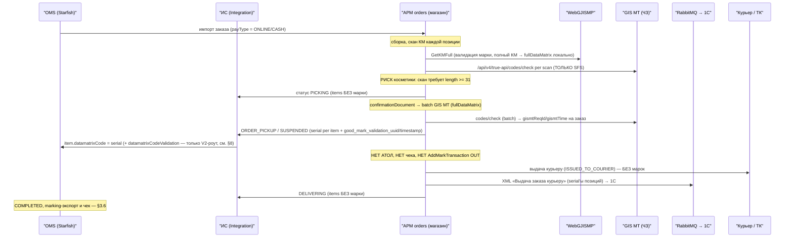
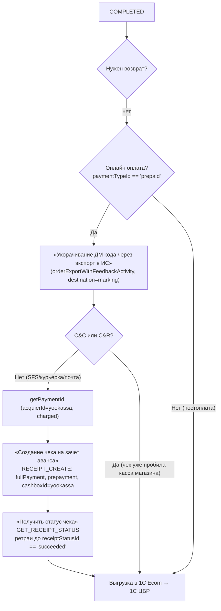

# Маркировка в контуре АРМ (магазин): процесс и SFS-оплата/фискализация

> **Задача:** запуск продажи маркированной косметики в e-com GJ (Confluence `165406763`). Компаньон к документам по складу.
> **Наша зона здесь:** **АРМ** — магазинный контур исполнения (`platform/arm/**`, Java Spring Boot, multi-repo).
> **Особый фокус (по запросу):** **SFS (Ship-From-Store)** с точки зрения **онлайн-оплаты vs постоплаты**, что происходит с **маркой, чеком, АТОЛ Онлайн**.
> **Ревизия 2026-07-06:** перепроверено по коду. Исправлены: статусы, на которых уходит serial (только ORDER_PICKUP/SUSPENDED/COMPLETED, не PICKING/DELIVERING); маршрут АРМ→**ИС**→OMS (не напрямую в OMS); онлайн-чек — **YooKassa RECEIPT_CREATE в BPMN**, а не Сбер; постоплата — без чека OMS вовсе; добавлено: марки в ТК **не передаются**, марки уходят в 1С документом «Выдача заказа курьеру» (RabbitMQ).
> **Смежные документы:**
> - Склад/ОТС→ИС→OMS: `research/2026-07-01-beauty-marking-process.md`
> - Марка → выгрузка 1С + искусственный код: `research/2026-07-03-beauty-mark-1c-export-artificial-code.md`
> - Чек OMS (тег 1162 = passthrough): там же, §про pay-service.
>
> **Метод:** факты по локальному коду (`rg --no-ignore-vcs`), якоря `path:line`. Уровни уверенности помечены явно.

---

## 1. Термины и репозитории АРМ

| Термин | Что это | Репозиторий |
|---|---|---|
| **АРМ** | Магазинные рабочие места и сервисы: касса, приёмка, сток, исполнение заказов | `platform/arm/*` |
| **Касса (POS)** | Продажа + выдача интернет-заказов на кассе | `gloria-jeans-cashier`, `gloria-jeans-pos-ui` |
| **ККМ/АТОЛ (физич.)** | Драйвер физической фискальной кассы в магазине (LIBFPTR) | `gloria-jeans-device/KKMService` |
| **Orders** | Исполнение e-com заказов из магазина (SFS, C&C) | `gloria-jeans-orders` |
| **WebGJISMP** | Сервис марок (чёрный ящик команды маркировки) | внешний (`global.mark_settings.ServerUrl`) |
| **GIS MT / ЧЗ** | Честный Знак True API (прямой) | внешний (`global.crpt_url`) |
| **ТС ПИОТ** | Локальный прокси ЧЗ на кассе (разрешительный режим) | внешний (`global.ts_piot.url`) |

**Что делает магазин с маркированным товаром — 4 сценария:**
1. **Собственная продажа на кассе** (розница) — §5.
2. **Приёмка** маркированного товара — §6.
3. **Сток / вывод в брак** — §6.
4. **Исполнение e-com заказа из магазина** — **SFS** (курьер) и **C&C / самовывоз** (COLLECT/CR) — §3–4.

**Ключевое разделение каналов e-com исполнения (важно для оплаты/чека):**

| Канал | Что это | Кто пробивает чек | Марка в чек |
|---|---|---|---|
| **SFS** (Ship-From-Store) | магазин собирает → отдаёт **курьеру** → доставка клиенту | онлайн: **OMS → YooKassa** (чек «зачёт аванса», §3.6); постоплата: **чек ТК на POS курьера, без нашей марки** | не через ARM KKT; полный КМ подтягивает OMS через ИС |
| **C&C / COLLECT / CR** | клиент **забирает в магазине**, платит на кассе | **касса магазина (АТОЛ)** | тег КМ через ARM KKT |

---

## 2. Как АРМ узнаёт способ оплаты

Единственное поле оплаты на заказе — `OrderDocument.payType` (нет `isPaid`/`paymentStatus`):

| Значение | Смысл | Источник |
|---|---|---|
| `ONLINE_PAYMENT` («Предоплата») | оплачено онлайн до сборки | OMS `ResponseOrder.paymentType` → `DocumentMapper.java:77` |
| `CASH_PAYMENT` («ПриПолучении») | постоплата при получении | там же |

Enum: `PaymentType.java:3-5`, `OrderPaymentType.java:3-5`. Маппинг в 1С — `DocumentMapper.java:115-117`.

**Внутри АРМ `payType` почти не ветвит логику** — влияет только на документ выдачи курьеру (`OrderCourierIssueMapper.java:38`: `ONLINE_PAYMENT`→`paidByCard=sum`, иначе `0`) и на 1С-маппинг. **На работу с маркой в АРМ `payType` не влияет вообще.** Различие онлайн/постоплата возникает дальше — в OMS `paymentFinalizationProcess` (§3.6).

**Куда АРМ шлёт статусы (уточнение ревизии):** `orders.oms.url` указывает **на Интеграцию (ИС), не на OMS**. `OmsService.sentOrdersToOms` шлёт XML на `POST {orders.oms.url}/integration/orders/status/1c` (`OmsService.java:140`) — это **V1-роут ИС** (`api.php:21` → `V1 OrderActionController@updateStatusByArm`). Тестовый конфиг подтверждает host ИС (`int-*.nip.io`). Дальше ИС сама ходит в OMS: `mark` (serial) с позиции → `item.datamatrixCode` (`V1/OrderService.php:2307`).

---

## 3. SFS — процесс с точки зрения оплаты и фискализации

> **Главный вывод:** в коде `platform/arm` **SFS не проходит через кассовый/фискальный контур**. Касса (`gloria-jeans-cashier` → `KKMService`) обслуживает только **CR/COLLECT** (везде фильтр `List.of(ShippingType.CR, ShippingType.COLLECT)` — `OrdersService.java:4526-4527`, `searchCrOrCollectOrder`). SFS = **сборка + валидация ЧЗ + передача курьеру + выгрузка марок в 1С**; **оплата и чек — вне ARM** (онлайн — OMS/YooKassa §3.6, постоплата — POS курьера/ТК §3.3).

### 3.1. Что магазин делает при SFS (одинаково для онлайн и постоплаты)

**Что уходит наружу от АРМ:**
- **serial** марки (не полный КМ): `MarkServiceOrders.getMarkValue → ScannedMark.getScannedMark()` (`MarkServiceOrders.java:740-758`) — **только на статусах `ORDER_PICKUP` / `SUSPENDED` / `COMPLETED`** (EnumSet в `getMarkValue`). На `PICKING`, `DELIVERING`, `CANCELLED` items уходят **без марки** (`OrdersService.java:2719-2806`: для этих статусов `getMarkValue` возвращает null). Для SFS фактически serial уезжает один раз — на завершении сборки (ORDER_PICKUP/SUSPENDED, `OrdersService.java:1110-1123`);
- **`gismtReqId` / `gismtTime`** на уровне заказа → XML-поля `good_mark_validation_uuid` / `good_mark_validation_timestamp` (`OrdersService.java:1003-1006`; `RequestOrderMapper.java:41-45`, `RequestOrder.java:23-27`);
- **serial'ы в 1С**: при выдаче курьеру создаётся `OrderCourierIssue` с `marks` = serial'ы через `;` (`OrderCourierIssueProductMapper.java:42-55`), XML «Выдача заказа курьеру» уходит в RabbitMQ exchange **`all.retail.fct.documents`** (headers `type=ShipFromStore`, `documentHeader=Выдача заказа курьеру`) — потребитель 1С (`RabbitService.java:57-113,189`, `ExportScheduledJob.java:56-61`, `RabbitMQConfig.java:17`);
- полный КМ (`fullDataMatrix`) остаётся **локально в АРМ** (`OrdersService.java:514`), наружу не идёт — полный КМ для чека OMS получает сам через ИС (§3.6);
- **курьеру/ТК марки НЕ передаются** — курьер получает заказы + печатный реестр (`createReceiptIssuingOrders`), никакого API-обмена с ТК из АРМ нет (см. §3.7).

**Валидация ЧЗ при SFS-сборке:** WebGJISMP `GetKMFull` (`MarkServiceOrders.java:449-451`, через `validate()` на каждый скан) **+ прямой GIS MT** `codes/check`: per-scan под guard `ShippingType.SFS` (`OrdersService.java:443-447`) и batch по всем маркам заказа при завершении сборки (`OrdersService.java:955-1015` — тоже только SFS). Успешный batch пишет `gismtReqId/gismtTime` на заказ. **ТС ПИОТ и АТОЛ `beginMarkingCodeValidation` при SFS НЕ вызываются** (они только в кассе).

### 3.2. (A) SFS + ОНЛАЙН-оплата — кто пробивает чек

**Не касса магазина.** В `platform/arm` для SFS вызова KKM/АТОЛ нет:
- `createReceiptAndJournal` (`OrdersService.java:1557-1604`) — создаёт «ЧекККМ» в 1С, но **нигде не вызывается**;
- проверка «чек уже пробит» при выдаче курьеру **закомментирована** (`OrdersService.java:1380-1381`, `//todo ReceiptByDocBasis`).

**Чек формирует OMS через YooKassa** (исправлено в ревизии, было «Сбер»): в GJ `paymentFinalizationProcess.bpmn` на выкупе (COMPLETED) чек «зачёт аванса» создаётся событием `RECEIPT_CREATE` с **`cashboxId=yookassa`**, `accountingType=fullPayment`, `paymentMethod=prepayment`; статус чека опрашивается `GET_RECEIPT_STATUS` до `succeeded`, и только после этого заказ выгружается в 1С Ecom/ЦБР. Подробный разбор ветки — §3.6. **Уверенность: confirmed** (BPMN GJ).

Что тогда остальные пути:
- **Сбер-эквайринг в `pay-service`** (тег 1162 = `Hex(item.datamatrixCode)`, `OnlinePaymentServiceImpl.java:304-319`, `SberClientImpl.java:285-301`) — существует, но это ветка **acquierChargeRequest/hold-capture для acquirer=sber**; чековый (кассовый) контур GJ в BPMN везде явно `yookassa` (`acquierId=yookassa` в `getPaymentId`, `cashboxId=yookassa` во всех `RECEIPT_CREATE`). Сбер-путь — не основной для GJ. **Уверенность: high-confidence.**
- **АТОЛ Онлайн (облачный) в ИС** — `ExportOrderListForAtol` + `AtolOrderMutator` (`mark_code.ean13 = item.datamatrixCode`, `AtolOrderMutator.php:109-112`) — это **чек коррекции** (`sell_correction`, фикс. даты 2023-08…2023-12), исторический backfill, **не живой per-order путь**. **Уверенность: confirmed.**

### 3.3. (B) SFS + ПОСТОПЛАТА — кто пробивает чек

**Не касса магазина и не OMS.** Оплата при получении происходит **у курьера / вне ARM**; в ARM лишь фиксируется `OrderCourierIssue.paymentType=CASH_PAYMENT`, `paidByCard=0` (`OrderCourierIssueMapper.java:38-39`).

По BPMN (`paymentFinalizationProcess.bpmn`): гейт «Онлайн оплата?» (`paymentTypeId == 'prepaid'`) для постоплаты уходит в ветку «Нет» → **сразу выгрузка заказа в 1С Ecom → 1С ЦБР, без marking-экспорта и без `RECEIPT_CREATE`**. Т.е. **OMS для постоплаты чек не создаёт вовсе**. Деньги принимает курьер/ТК на своём POS (ТК как платёжный агент пробивает свой чек — **без нашей марки**, потому что марки в ТК не передаются, §3.7). Данные для 1С-контура при этом есть: serial уезжает в 1С в выгрузке заказа (`<serial_number>`) и в документе «Выдача заказа курьеру». **Уверенность: BPMN/код — confirmed.**

> ⚠️ **Конфликт с ТЗ по механизму выбытия (уточнено 2026-07-06).** Beauty-ТЗ `165408124` п.5.2 / SYS-MRK-05: «Курьерская доставка — марка выбывает по **документу перемещения, независимо от типа оплаты**». Это **противоречит as-is коду для онлайн-оплаты**: OMS уже пробивает финальный чек fullPayment (YooKassa) **с полным КМ** (§3.6) — т.е. для prepaid-курьерки выбытие фактически идёт чековым каналом (ККТ → ОФД → ЧЗ), который с **01.07.2026 обязателен** для розничной продажи (таблица сроков в том же ТЗ). Устно (обсуждение 2026-07-03) формулировка «независимо от типа оплаты» также опровергнута. Рабочая гипотеза: **онлайн — выбытие через чек; документ перемещения — только для COD** (где чека OMS нет). Формулировку п.5.2 в ТЗ нужно актуализировать; двойное выбытие (чек + документ) для prepaid — риск ошибки ЧЗ. Открытый вопрос §8 п.3.

### 3.4. Что с маркой различается A vs B

**В АРМ — ничего.** Обе ветки проходят одинаковую сборочную валидацию (WebGJISMP + GIS MT per scan + batch), одинаково шлют serial + gismtReqId/time через ИС и одинаково выгружают serial'ы в 1С при выдаче курьеру. `payType` на работу с маркой в АРМ не влияет. Вывод марки из оборота (`AddMarkTransaction` OUT) при SFS в ARM **не вызывается** (это касса/COLLECT).

**Дальше по цепочке (OMS) — различие есть:**

| | (A) Онлайн (prepaid) | (B) Постоплата |
|---|---|---|
| marking-экспорт в ИС (полный КМ из WebGJISMP → OMS) | **да**, перед чеком | **нет** |
| Чек OMS (YooKassa `RECEIPT_CREATE` fullPayment) | **да** (кроме C&C/C&R) | **нет** |
| Марка в чеке | полный КМ (+ uuid/timestamp РР) | чек ТК — без марки |
| Выбытие из оборота | **через чек** (YooKassa→ОФД→ЧЗ) | чекового канала нет → документ 1С (см. конфликт с ТЗ в §3.3) |

### 3.5. Статусы SFS (A и B одинаково)

| Шаг | ARM статус | OMS StatusCode | Марка в статусе | Оплата/чек |
|---|---|---|---|---|
| Импорт | NEW | — | — | payType из OMS |
| 1-й скан марки | NEW→… | **PICKING** | items **без марки** (GIS MT per scan — только локальная валидация) | — |
| Завершение сборки | READY_FOR_DELIVERY | **ORDER_PICKUP** / SUSPENDED | **serial per item** + gismtReqId/time (batch GIS MT) | — |
| Выдача курьеру | ISSUED_TO_COURIER | **DELIVERING** | items **без марки**; serial'ы → 1С (ВыдачаКурьеру) | paymentType в CourierIssue |
| COMPLETED | **нет job для SFS** | вне ARM | полный КМ подтянет OMS через ИС (§3.6) | чек — §3.6 |

Якоря: PICKING `OrdersService.java:517-523`; ORDER_PICKUP/SUSPENDED `:1108-1125`; DELIVERING `:1532-1538`; марки по статусам `MarkServiceOrders.java:740-758` + `OrdersService.java:2719-2806`; COMPLETED только CR/COLLECT `:3004-3007,4597-4614`.

### 3.6. Финализация в OMS: где марка попадает в чек (ветка по типу оплаты)

GJ `paymentFinalizationProcess.bpmn` (стартует по финальности статуса, для выкупа `statusId == 'COMPLETED'`):

- **«Укорачивание ДМ кода через экспорт в ИС»** (имя таска историческое и вводит в заблуждение): ИС `V1 OrderService` на `ExportDestinationEnum::MARKING` (`:1202-1211`) вызывает `fillCryptoDatamatrixCodes` (`:4939-5100`): собирает `010+barcode+21+serial` из `item.datamatrixCode`, ходит в WebGJISMP `GetKMFull` и **перезаписывает `item.datamatrixCode` в OMS полным КМ с криптохвостом**. Т.е. до этого шага OMS хранит serial от АРМ, после — полный КМ.
- Чек «зачёт аванса» (fullPayment) формируется **после** обогащения → марка в чеке = полный КМ. Атрибуты РР (`uuid`/`timestamp` → `payment_subject_industry_details`, Confluence `130145593`) берутся из `item.datamatrixCodeValidation` (см. §8 про V1/V2 роут ИС).
- Чек **аванса** (fullPrepayment) создаётся раньше, в `paymentProcess.bpmn` при оплате («Создание чека аванса», тоже `cashboxId=yookassa`) — марка там не нужна.
- Обработчик `RECEIPT_CREATE`/`GET_RECEIPT_STATUS` — delegate `${sendEvent}` (внутренний event-механизм OMS); Java-обработчика в локальных клонах (camunda-worker/Order/pay-service) нет — чеки уходят в кассу YooKassa, дальше ОФД (вывод из оборота по чеку).
- В camunda-worker есть готовый гейт `datamatrixCodeValidation` (`DatamatrixCodeValidationActivity.java:28-63`: ставит переменные `hasMarkableItems`, `allMarkableItemsHaveDMCode`, `hasDMCodesValidationParams` по `product.markable`), но **в GJ BPMN он пока не используется** (ни в одном процессе `gloriajeans/` топика нет) — кандидат на включение в рамках beauty.

### 3.7. Марки в ТК не передаются (проверено)

Утверждение бизнеса «мы в транспортную компанию марки не передаём» **подтверждается кодом** по обоим контурам:

- **АРМ (SFS):** при выдаче курьеру наружу уходят только OMS-статус DELIVERING (без марок) и XML в RabbitMQ для 1С; API-интеграции с ТК в `platform/arm` нет вообще.
- **ОТС (склад, для сравнения):** исходящие пейлоады всех перевозчиков полей марки **не содержат**: CDEK `MapPackageItem` (`CDEKMappings.cs:226-250` — name/ware_key/cost), 5Post `ToUpdateCargoesParams` (`FivePostMappings.cs:118-144`), Почта России `EditPackage`→`ToRPostPackage` (без goods; есть неиспользуемый `ToRPostUpdatePackage` с `code=good_id_mark`), Яндекс/DPD — марок в API-клиентах нет. Криптохвост из похода ОТС→WebGJISMP (`OrderToPickup.BuildParamsWithMarksAndCrypto`) пишется в `good_id_mark_cryptotail` **внутренних** параметров/результатов ОТС и в ТК не уезжает.
- ⚠️ Это уточняет формулировку «криптохвост → накладная/отгрузка ТК» из `research/2026-07-01-beauty-marking-process.md` (шаг 5): криптохвост обогащает `newOrderParams`, которые идут в `tkOrderManager.UpdateOrder`, но carrier-мапперы это поле отбрасывают — до API ТК марка не доходит.

---

## 4. Для контраста: C&C / COLLECT / CR (самовывоз) — здесь работает касса магазина

При самовывозе клиент платит **на кассе магазина**, и именно тут задействован **АТОЛ + чек с маркой**:

| Случай | Кто/как пробивает | Якорь |
|---|---|---|
| **Онлайн (предоплата)** | магазин, АТОЛ, `PaymentMethod.PREPAID` → `LIBFPTR_PT_PREPAID` (экран оплаты пропускается) | `InternetOrderSaleRightScreen.tsx:101`, `KKMService.java:509-511`, `OrderFiscalReceiptRightScreen.tsx:157-158` |
| **Постоплата** | магазин, АТОЛ, после cash/card/СБП | `PaymentCashRightScreen.tsx:562-567`, `KKMService.java:496-506` |

Марка в чек COLLECT/CR идёт через кассовый путь (см. §5, тот же KKM). **Нюанс:** для COLLECT вызов `marksTransaction` (`AddMarkTransaction`) **закомментирован** (`OrdersService.java:2645-2652`) — потенциальный gap вывода из оборота при самовывозе (не косметика-специфичный).

---

## 5. Продажа на кассе (собственная розница) — эталон работы АРМ с маркой

Именно тут АРМ — полноценный участник маркировки (для сравнения с SFS, где ничего этого нет):

1. **Скан + нормализация.** `CashierService.checkMarks`: при `length >= 31` — `BarcodeHelper.clearDatamatrix` (замена литерала `0029` на `GS \u001D`) (`CashierService.java:570-583`; `MarkFormatParser.java:5-15`).
2. **Двухконтурная валидация** (`MarkService.checkMark`):
   - **WebGJISMP** `GET /api/KM/GetKMFull?km=` — бизнес-проверка (`MarkService.java:389-402`);
   - **ТС ПИОТ** `POST /api/v3/codes/check` — марка в **Base64 UTF-8** (полный КМ с криптохвостом), возвращает `cis`, `reqId`, `reqTimestamp` (`MarkService.java:748-769`).
   - (прямой GIS MT `checkMarkOnGisMt` реализован, но из публичного `checkMark` не вызывается — `MarkService.java:548-556`.)
3. **Сохранение** в `CashBoxScannedMarks`: `dataMatrix`, `fullMark`, `gismtReqId`, `gismtTimeStamp`, `inst`, `version` (`CashierService.java:402-424`).
4. **Фискальный чек (АТОЛ, физич.)** — `KKMService`: `LIBFPTR_PARAM_MARKING_CODE = mark.getFullMark()` (полный КМ), `MARKING_CODE_STATUS=2`, онлайн-валидация `beginMarkingCodeValidation`/`acceptMarkingCode`, теги 1260–1265 (`KKMService.java:374-441`). Тег 1162 в Java не именуется — КМ уходит через `LIBFPTR_PARAM_MARKING_CODE`.
5. **Вывод из оборота** после оплаты: `sellMarks` → WebGJISMP `POST /api/AddMarkTransaction` (`OUT`/`NOACTION`) (`MarkService.java:251-280`, `SellMarksMapper.java:8-23`).

Формат КМ по коду: порог DataMatrix `>= 31`; база 31 символ (prefix); криптохвост после 31-го, разделитель `0029`→GS; GTIN `substring(3,16)`.

---

## 6. Приёмка и сток (кратко)

- **Приёмка** (`gloria-jeans-receiving`): для маркированного товара требуется DataMatrix `length > 31` (`ReceivingService.java:491-507`); валидация WebGJISMP `GetKMFull` (`MarksServiceReceiving.java:458-507`); пост-проверка ЧЗ через WebGJISMP `POST /api/ISMPInfo/GetKMByList` (`:899-914`); УПД/ЭДО через `SBIS/AddDoc`; статус проблемной марки — `MarkStatusModel` (`gloria-jeans-core`).
- **Сток / вывод в брак** (`gloria-jeans-stock`): скан `length >= 31` (`TransferringStockToDefectService.java:279-286`), валидация `GetKMFull`; локальная `TransferringStockToDefectScannedMark`.

Маркируемость в АРМ — флаг `isMark` из справочника 1С (`onec-db-mapper/BaseCatalog.isMark`), без ветвления по товарной группе.

---

## 7. Косметика-риски в АРМ (хардкод длины КМ)

Тот же класс проблемы, что в ОТС/ИС: логика завязана на **одёжный** КМ (serial 13 → полный КМ 31). У косметики serial 6 → полный КМ **~24 < 31**, поэтому пороги `>= 31` **отвергают марку косметики как обычный штрихкод**.

`010 + GTIN(14) + 21 + serial` → одежда `2+14+2+13 = 31`; косметика `2+14+2+6 = 24`. Отсюда «31» и позиция «18».

| Зона | Хардкод | path:line | Эффект на косметике |
|---|---|---|---|
| **SFS/COLLECT сборка** | скан требует `length >= 31`, иначе «сканируйте марку» | `OrdersService.java:413-423`, поиск EAN `:373` | КМ ~24 **отвергается** на сборке — **блокер** |
| **Извлечение serial (общий helper)** | `BarcodeHelper.getMarkFromDatamatrix` = `substring(18,31)`; EAN = `substring(3,16)`; `clearDatamatrix` = `substring(0,31)` | `gloria-jeans-core/.../BarcodeHelper.java:28-44` | на КМ 24 символа `substring(18,31)` → **StringIndexOutOfBounds** (сейчас недостижимо из-за порога `>=31`, но чинить надо вместе с порогом) |
| **Касса (скан)** | `dataMatrix.length() >= 31`, иначе `dataMatrix` не пишется в `CashBoxScannedMarks` | `CashierService.java:407-410,575-580,654-658` | марка может не попасть в чек/AddMarkTransaction |
| **POS UI** | `cleanBarcode.length >= 31` для datamatrix | `OrderScanProductsRightScreen.tsx:152-153` | короткий КМ → неверный EAN |
| **Нормализация КМ** | `MarkFormatParser`/`MarkFormatHelper` `substring(0,31)` | `MarkFormatParser.java:8-12`, `MarkFormatHelper.ts:4-8` | при `length<=31` возвращает as-is — **OK** для косметики |
| **KKM тег КМ** | `mark.getFullMark()` без проверки длины | `KKMService.java:402` | **OK**, если fullMark дошёл |

**Сквозная картина по всем контурам:**

| Система | Хардкод | Ломается на косметике |
|---|---|---|
| ОТС | `Substring(18,13)` | резка №1 — криптохвост не привязывается к позиции (остаётся во внутренних параметрах ОТС; в ТК марки не передаются, §3.7) |
| ИС | `substr(18,13)` (1С-экспорт) + сборка `010+barcode+21+serial` в `fillCryptoDatamatrixCodes` | резка №2 (1С serial_number); marking-экспорт для OMS соберёт код с serial 6 — проверить приём WebGJISMP |
| **АРМ** | пороги `>= 31` при скане (сборка/касса) + `substring(18,31)` в `BarcodeHelper` | распознавание марки косметики |
| OMS | — | безопасен (passthrough; `AcceptanceServiceImpl` имеет regex `21(?<serial>.{13})`, но он настраиваемый через `settings`) |

---

## 8. Выводы и открытые вопросы

**Выводы (по коду):**
- **SFS не фискализируется в АРМ** ни при онлайн, ни при постоплате. АРМ делает сборку + валидацию ЧЗ (WebGJISMP + прямой GIS MT, только SFS) + передаёт serial/gismtReqId **через ИС** в OMS + выгружает serial'ы в 1С документом «Выдача заказа курьеру» (RabbitMQ `all.retail.fct.documents`).
- **Онлайн-чек SFS** формирует **OMS через YooKassa**: `paymentFinalizationProcess.bpmn` → marking-экспорт в ИС (полный КМ из WebGJISMP перезаписывает `item.datamatrixCode`) → `RECEIPT_CREATE` (fullPayment, `cashboxId=yookassa`) → `GET_RECEIPT_STATUS` → выгрузка 1С. Store ATOL не участвует; Сбер-путь в `pay-service` — не основной для GJ (BPMN везде yookassa).
- **Постоплата SFS**: OMS чек **не создаёт вовсе** (гейт «Онлайн оплата?» → Нет → сразу 1С). Деньги принимает курьер/ТК на своём POS (чек ТК — без нашей марки). Выбытие марки — 1С-контур (документ перемещения). ⚠️ Формулировка ТЗ `165408124` п.5.2 «документ перемещения **независимо от типа оплаты**» противоречит as-is коду для онлайн (там выбытие через чек YooKassa) и опровергнута устно — см. конфликт в §3.3.
- **Марки в ТК не передаются** — подтверждено и для АРМ (нет ТК-интеграции вовсе), и для ОТС (carrier-мапперы CDEK/5Post/Почта/Яндекс/DPD поля марки не отправляют, §3.7).
- **Касса и COLLECT/CR** (самовывоз) — вот где АРМ реально пробивает чек с маркой через физический АТОЛ + ТС ПИОТ + `AddMarkTransaction`.
- **Косметика:** доработки АРМ нужны в **сканирующей** логике (порог `>= 31` + `BarcodeHelper.substring(18,31)`), не в платёжной. `isMark=true` из 1С — обязательно.

**Открытые вопросы (подтвердить):**
1. **V1 vs V2 роут ИС для АРМ-статусов.** АРМ шлёт `good_mark_validation_uuid/timestamp` в XML (`RequestOrder.java:23-27`) на `POST /integration/orders/status/1c` — **V1**-роут, а V1-контроллер эти поля **дропает** (передаёт в сервис только order_id/status/items — `V1 OrderActionController:52-66`). Обрабатывает их только **V2** `/integration/v2/orders/status/1c` (`updateStatusByArmV2` → `item.datamatrixCodeValidation.uuid/dateTime`, `V2/OrderService.php:597-723,1124-1136`). Прод-значение `orders.oms.url` — в Vault; проверить, куда реально ходит АРМ (если V1 — uuid/timestamp РР для SFS до OMS не доезжают, и чек fullPayment остаётся без `payment_subject_industry_details`).
2. **Обработчик `RECEIPT_CREATE`/`GET_RECEIPT_STATUS`** (delegate `${sendEvent}`) — в каком сервисе живёт (не найден в локальных клонах Order/pay-service/camunda-worker) и как формирует `payment_subject_industry_details` из `datamatrixCodeValidation`.
3. **Механизм выбытия для курьерки — привести ТЗ и код к одной модели.** ТЗ `165408124` п.5.2/SYS-MRK-05: «документ перемещения независимо от типа оплаты» — противоречит as-is (онлайн-курьерка уже выбывает чеком YooKassa, обязательным с 01.07.2026) и опровергнуто устно (2026-07-03). Согласовать с командой маркировки/1С: (а) актуализировать п.5.2 (онлайн — чек, COD — документ); (б) для COD — какой документ 1С проводит выбытие и что триггер (выгрузка заказа / «Выдача заказа курьеру»); (в) убедиться, что для prepaid нет **двойного** выбытия (чек + документ).
4. **COLLECT `AddMarkTransaction` закомментирован** (`OrdersService.java:2645-2652`) — как выводится марка из оборота при самовывозе.
5. **Порог `>= 31` для косметики** — подтвердить на реальных КМ косметики ЧЗ (длина base < 31) и определить объём правок в `OrdersService`/`CashierService`/`BarcodeHelper`/POS UI.
6. **Гейт `datamatrixCodeValidation` в GJ BPMN не подключён** — включать ли его перед `RECEIPT_CREATE` в рамках beauty (переменные `allMarkableItemsHaveDMCode`/`hasDMCodesValidationParams` уже реализованы в camunda-worker).

---

## 9. Ссылки (код)

- **orders (SFS/COLLECT):** `gloria-jeans-orders/.../services/OrdersService.java` (`413-523`,`955-1125`,`1374-1604`,`2645-2836`,`3004-3007`,`4526-4614`), `MarkServiceOrders.java` (`449-451`,`740-758`,`1173-1186`), `OmsService.java` (`140`,`262-342`), `mapper/DocumentMapper.java:77,115-117`, `OrderCourierIssueMapper.java:38-40`, `OrderCourierIssueProductMapper.java:42-55`, `model/oms/request/RequestOrder.java:23-27`, `model/oms/mapper/{RequestOrderMapper,ItemMapper}.java`, `enums/PaymentType.java`, `OrderPaymentType.java`.
- **выдача курьеру → 1С (RabbitMQ):** `services/RabbitService.java` (`57-113`,`128-198`), `component/ExportScheduledJob.java:51-95`, `configuration/RabbitMQConfig.java:17` (`all.retail.fct.documents`), `dao/mapper/CourierIssueDocumentMapper.java:125`, `resources/courier_issue_template.xml`.
- **касса:** `gloria-jeans-cashier/.../services/{CashierService,MarkService}.java`, `dao/mapper/SellMarksMapper.java`.
- **устройство/ККМ:** `gloria-jeans-device/.../services/KKMService.java`, `onec/MarkFormatParser.java`; общий helper `gloria-jeans-core/.../v1/utils/BarcodeHelper.java:28-44`.
- **POS UI:** `gloria-jeans-pos-ui/.../{InternetOrderSaleRightScreen,PaymentCashRightScreen,OrderFiscalReceiptRightScreen,OrderScanProductsRightScreen}.tsx`, `MarkFormatHelper.ts`.
- **приёмка/сток:** `gloria-jeans-receiving/.../services/{ReceivingService,MarksServiceReceiving}.java`, `gloria-jeans-stock/.../service/TransferringStockToDefectService.java`, `gloria-jeans-core/.../v1/receiving/models/response/MarkStatusModel.java`.
- **1С-справочник:** `gloria-jeans-onec-db-mapper/.../{BaseCatalog,ProductInfo}.java`.
- **ИС (приём статусов АРМ + marking-экспорт):** `integration/www/app/Service/UserApi/routes/api.php:21,65`; V1 `Http/Controllers/V1/Order/OrderActionController.php:52-66`, `Services/V1/Order/OrderService.php` (`1202-1211` MARKING, `1900-2320` updateStatusByArm, `4939-5100` fillCryptoDatamatrixCodes); V2 `Services/V2/Order/OrderService.php` (`597-760` updateStatusByArmV2, `1031-1153` collectArmOrderItemUpdateData), `Http/Requests/V2/Order/Arm/UpdateOrderStatusRequest.php:33-60`.
- **OMS чек/финализация:** `starfish24/awg/bpmn-process/process/gloriajeans/paymentFinalizationProcess.bpmn` (гейты «Онлайн оплата?» `:38,283`, marking-экспорт `:345-353`, `RECEIPT_CREATE` `:95-146`, `GET_RECEIPT_STATUS` `:167-179`, «C&C или C&R?» `:436-442`), `paymentProcess.bpmn` (чек аванса `:572-595`), `camunda-worker/.../handlers/DatamatrixCodeValidationActivity.java:28-63`, `handlers/sber/AcquierChargeRequestHandler.java` (`:100` datamatrixCode в capture); Сбер-путь `core/pay-service/.../{OnlinePaymentServiceImpl,SberClientImpl}.java:285-319`.
- **ОТС → ТК (марок нет):** `gloriaots/src/GloriaOTS.Infrastructure/Services/ShipmentServiceFacade.cs:179-210`, `ApiClients/CDEKApiClient/CDEKMappings.cs:226-250`, `ApiClients/FivePostApiClient/FivePostMappings.cs:118-144`, `ApiClients/RussianPostApiClient/RussianPostMappings.cs:83-193`.
- **ИС АТОЛ Онлайн (correction):** `integration/.../Exchange/Console/Commands/V1/Order/ExportOrderListForAtol.php`, `.../Exchange/Mutators/V1/Order/AtolOrderMutator.php`.
- **конфиги марок АРМ:** `global.mark_settings.ServerUrl` (WebGJISMP), `global.crpt_url`+`global.gismt.api_key` (GIS MT), `global.ts_piot.url` (ТС ПИОТ), `orders.oms.url` (**фактически URL ИС**, значение в Vault — `gloria-jeans-ansible/DEPLOY/templates/*`).

## 10. Confluence / Jira

- Confluence: корень beauty `165406763`; ТЗ `165408124` (маркировка), `165408218` (OMS), `165408217` (ИС), `165397174` (косметика в складских системах, OPSLOG).
- Jira: `OPSOMN002-25` (ИС beauty), `OPSOMN002-18` (маркировка), `OPSLOG-3053/3054/3064/3111` (косметика в складских системах).
