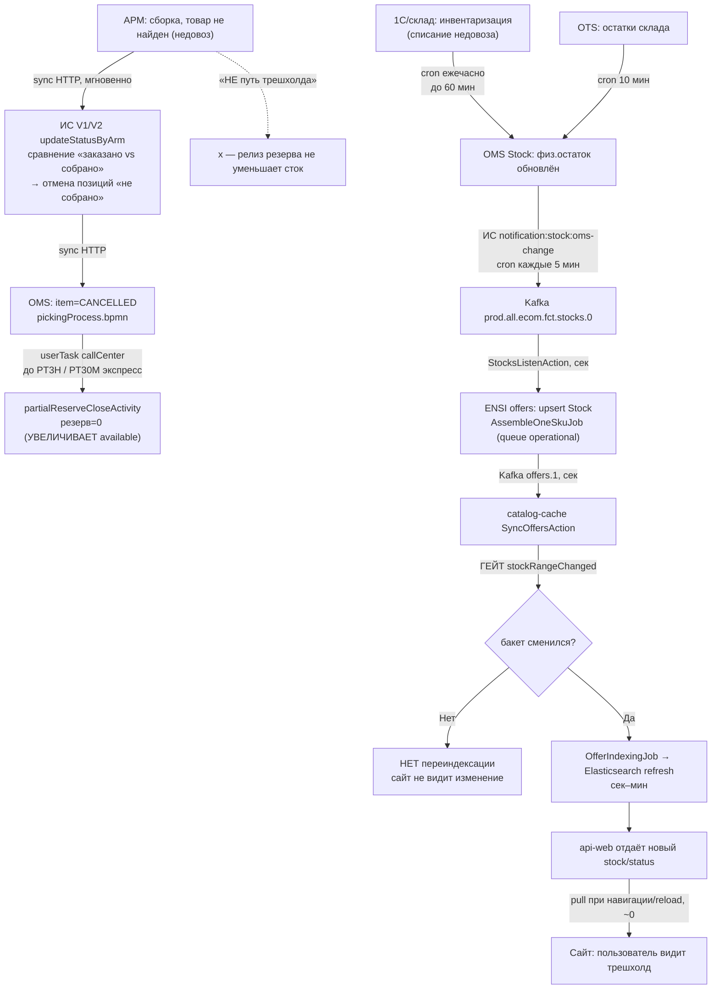

# Латентность «трешхолда» на несобранные товары (недовоз) до сайта

> **Вопрос бизнеса:** через сколько после сборки заказа устанавливается «трешхолд» на товары, не собранные в магазине, и через сколько после данных из АРМ он проходит по всем системам еком и появляется на сайте. Цель — решить, с какой стороны ускоряться: АРМ (чаще передавать) или еком.
> **Примеры (магазин Щёлково ТЦ «Этажи», SFS):** 2010513649 (оформлен 17:17 / в АРМ 17:20 / собран в ОМС 18:44); 2010520372 (18:57 / 19:02 / 20:27). Товар `GAS018500F0001`.
> **Метод:** 4 параллельных read-only research-субагента (integration / oms / ensi / site) по локальному коду `platform/`. Evidence `path:line`, уровни уверенности помечены.
> **Дата:** 2026-07-06.

---

## TL;DR — главный рефрейм (ИСПРАВЛЕНО 2026-07-06 после прод-логов)

> **Важно:** первичный анализ (по коду) ошибочно заключил, что «трешхолд не привязан к сборке и OMS только релизит резерв». Прод-логи `logs-oms-prod` опровергли это: **механизм `avail_threshold` реальный, real-time, и АРМ/1С магазина его обновляет в OMS** через ИС-прокси `rtl-integration` (`PUT /stocks/thresholds/`). Этот абзац и разделы ниже актуализированы по прод-evidence.

**«Трешхолд» = `avail_threshold` (level=PRODUCT_AND_WAREHOUSE, value) в OMS Stock**, вычитается из доступности: `available = stock + orderAdd − productReservation − thresholdValue` (`StockMongoService.java:465-468`). `value=9999` = полный блок; `value=4` при стоке <4 = эффективный блок.

**Что реально происходит при недовозе (двух треков одновременно):**
1. **OMS отменяет заказ** (трек заказа): `SUSPENDED` (статус недовоза) → `CANCELLING` → `CANCELLED`, `cancellationStage=pickingProblem`. Это про заказ, не про сток.
2. **1С-retail магазина ставит threshold на несобранный SKU в OMS** (трек стока): `PUT /stocks/thresholds/` через ИС, `level=productAndWarehouse`, `value=N`. **Транспорт real-time (HTTP, мгновенно), но триггер — периодический batch с интервалом 2–4ч (в среднем ~3ч), не event-driven при недовозе.**

**Точный лаг (прод, заказ 2010513649, Щёлково, GAS018500F0001):**
- Недовоз 1 (сборка): 18:44:53 MSK
- Заказ 2 создан (сайт перепродал, т.к. threshold ещё не стоял): 18:57:39
- Недовоз 2: 20:27:21
- **Threshold value=4 поставлен в OMS**: **20:55:28 MSK** (batch с 19 др. SKU) = **через ~2ч11м после недовоза 1**, **~28 мин после недовоза 2**
- Propagation OMS→Kafka (ИС cron 5 мин)→ENSI→сайт: ~5–15 мин → сайт видит блок ~21:00–21:10 MSK
- **Полный лаг «недовоз 1 → сайт видит блок»: ~2ч20м**

**Ответ на «ускорять АРМ или еком»:** bottleneck — **триггер отправки threshold из АРМ/1С**: threshold ставится batch'ами по расписанию магазина, а не event-driven при недовозе. За 2ч11м между недовозом 1 и threshold сайт успел перепродать товар (заказ 2 → недовоз 2). Ускорять надо **event-driven отправку threshold из АРМ/1С сразу после неудачной сборки** (а не «чаще» — они и так прилетают постоянно, тысячи в час). Ecom-сторона (ИС→OMS→Kafka→ENSI→сайт) — минуты, не bottleneck.

**Что НЕ подтверждается (устарело из первичного анализа):**
- ~~«OMS только релизит резерв, не уменьшает сток»~~ — верно для трека заказа, но threshold — отдельный реальный механизм.
- ~~«Трешхолд не привязан к сборке»~~ — привязан: АРМ/1С ставит threshold на несобранный SKU, но с задержкой своего batch-расписания.
- ~~«Сток обновляется только nightly `/stock/update`»~~ — `/stock/update` (физостаток) действительно nightly, но `avail_threshold` (который и есть «трешхолд») обновляется real-time batch'ами от магазинов.

---

## Полная цепь и латентность по шагам

| Шаг | Механизм | Латентность | Evidence |
|---|---|---|---|
| АРМ → ИС статус сборки | sync HTTP `sendAndWait`/`sendAndParse` | мгновенно (сеть) | `integration/.../Services/V1/Order/OrderService.php:1900-2350` |
| ИС сравнение «заказано vs собрано», отмена «не собрано» | inline в `updateStatusByArm` | мгновенно | `:2022-2240` |
| ИС → OMS item-статусы | sync батч | мгновенно | `:2350` |
| OMS релиз резерва (`partialReserveClose`) | Feign→Stock, но **после userTask callCenter** | до **PT3H** / PT30M экспресс | `pickingProcess.bpmn:565-584`, `PartialReserveCloseActivity.java:35-45` |
| **1С ЦБ → OMS сток** (главный драйвер) | cron `transfer:stock:cb-1c-retail-auto` | **до 60 мин** (`0 */1`) | `integration/.../Console/Kernel.php:32` |
| OTS → OMS сток | cron `transfer:stock:ots-change` | до 10 мин | `Kernel.php:30` |
| OMS → Kafka `stocks.0` | cron `notification:stock:oms-change` | **до 5 мин** (`*/5`) | `Kernel.php:28`, `NotificationService.php:49` |
| ENSI offers: ingest → пересборка оффера | Kafka consumer + queue `operational` | сек–мин (глубина очереди) | `offers/.../UpdateStocksAction.php`, `AssembleOneSkuJob.php:25-31` |
| offers → catalog-cache | Kafka `offers.1`, consumer inline | сек | `catalog-cache/config/kafka-consumer.php:128-135` |
| **ГЕЙТ бакета** | `stockRangeChanged()` | **0 если бакет не сменился — обновления не будет** | `catalog-cache/.../SyncOffersAction.php:96-103`, `Offer.php:118-126` |
| catalog-cache → Elasticsearch | `OfferIndexingJob` + ES refresh | сек–мин | `FillOffersAction.php:79-95` |
| api-web → сайт | pull при навигации/SSR | **~0** | `site/.../product-page.component.ts:161-170`, `OptimizedSsrEngine.ts:161` |

**Суммарно от «1С скорректировал остаток» до «сайт видит»:** ~15 мин (через OTS) … ~65 мин (через 1С ЦБ) + ENSI-секунды-минуты + возможно «никогда» если бакет не пересечён.
**От «сборка 18:44» до «сайт видит»:** = задержка выше **плюс** время, пока магазин вообще спишет недовоз в 1С (процесс за пределами этих систем — неизвестно).

---

## Ключевые находки по системам

### Integration (`platform/integration/`)
- Статус/недовоз идёт **ARM→ИС→OMS синхронно**, near-instant. **Логика недовоза живёт в ИС**: `cancelledItemCount = OMS.count − armProductCount`, лишние позиции → `CANCELLED` с `canselationReasonText='не собрано'` (`OrderService.php:2022-2240`).
- **Сток-синк в сторону еком — один выход:** `notification:stock:oms-change` опрашивает OMS `getStockChangeList` каждые 5 мин → Kafka `prod.all.ecom.fct.stocks.0` (`Kernel.php:28`, `NotificationService.php:49,108,155`).
- **Real-time сток-пуша НЕТ:** delta-демон `transfer:stock-delta:daemon` **закомментирован** в supervisor (`supervisor-laravel.conf:19-26`). Только 5-мин опрос.
- **`TresholdValueMutator` — мёртвый код** (дефолт 0, `use` нигде не подключён, `Traits/V1/Stock/TresholdValueMutator.php:18`). ИС **не реализует** уменьшение доступности — только ретранслирует сырые остатки.

### OMS (`platform/starfish24/`)
- **При недовозе OMS только релизит резерв** (`partialReserveCloseActivity` → `ReservationServiceImpl.updateReservationByOrderId` → `quantityReserved=0`), **без** события наружу (`Stock/.../ReservationServiceImpl.java:323-360` не зовёт `sendUpdateReservationEvent`).
- **Физостаток меняется только входящим фидом** `/stock/update(/delta)` → Kafka → `StockMongoService` (`StockController.java:156,163`, `StockMongoService.java:564,590`).
- **`AvailThreshold` — реальная сущность** (`avail_threshold`, `AvailThreshold.java`), но это **статический настраиваемый буфер**, вычитаемый при чтении; **не пересчитывается при недовозе**. Не путать с бизнес-термином «трешхолд».
- `Adapter/OrderDataProcessingServiceImpl` = метрики ClickHouse, **не** ARM-feedback (BP-док устарел).

### ENSI (`platform/ensi/`)
- **Вход стока:** Kafka `{contour}.all.ecom.fct.stocks.0` → `StocksListenAction` → `UpdateStocksAction` (upsert `stocks` по `(sku_product_id, stores_warehouses_idd)`, поле `qty`) → `AssembleOneSkuJob` (queue `operational`) → `AssembleOfferStocksAction` (`stock_available = stock > 0`) → Kafka `offers.1`.
- **catalog-cache потребляет `offers.1`** (`ListenChangedOffersAction`, inline). Гейт `stockRangeChanged` — **главный бизнес-эффект**: без смены бакета переиндексации нет.
- **Хранилище для сайта = Elasticsearch** (не Redis-TTL); свежесть = момент reindex, не TTL. Cron в пути нет, всё событийное.
- ⚠️ **Воркэраунд #1:** флаг `APP_PREDEFINED_STOCKS` (`config/app.php:127`) + default `Offer` (`stock=10, stock_available=true`) — если флаг включён, реальные остатки **игнорируются**, оффер всегда «доступен» с qty=10. Проверить в проде.
- ⚠️ **offers-go:** есть параллельная Go-реализация (`apps/catalog/offers-go`, `internal/adapters/db/queries/stocks.go`) — если активна в проде, поведение может отличаться от PHP. Какая ветка live — проверить.

### Site (`platform/site/gj-ng-front/`)
- Тянет сток/доступность свежим запросом к `api-web` (`customers-api-web` → `catalog-cache`) на каждый SSR-рендер и навигацию PDP/каталога (`product-page.component.ts:161-170`, `catalog.service.ts:56`).
- **«Трешхолд» считает бэкенд** — фронт читает готовые `availableStatus` (`SOLD_OUT`/`SOON`/...) и `stock` (`FULL`/`EMPTY`/`LIMITED` для SFS по магазину), сам не пересчитывает.
- **SSR HTML-кэш выключен** (`OptimizedSsrEngine.ts:161,227` — `cache` не задан, `clear()` после отдачи). Сток в localStorage не персистится (только `region`,`deviceId`).
- **Realtime нет** (WS/SSE/поллинг) — только pull при навигации. Пользователь на открытой PDP без reload не увидит обновление.
- Сессионные кэши: `modificationsCache` (мини-карточки) и `CommercialStore` (сток по магазинам SFS) — до reload/смены региона.

---

## Что НЕ подтверждено кодом (open вопросы → прод-логи / 1С / DevOps)

1. **Когда магазин списывает недовоз в 1С** после неудачной сборки (немедленно / end-of-day / батч) — **процесс за пределами этих систем**; вероятно, основной «скрытый» кусок задержки от 18:44.
2. **Проф-трейс двух orderId** (2010513649, 2010520372): когда пришли item-статусы в OMS, когда сработал `partialReserveClose`, когда пришёл stock-фид с новым остатком по `GAS018500F0001`, когда `stocks.0` ушёл в Kafka, когда offers/catalog-cache обработал, был ли переход бакета. → `logs-detective` + gj-buddy.
3. **`APP_PREDEFINED_STOCKS`** в проде — если `true`, реальные остатки не считаются.
4. **Какая ветка offers live** в проде — PHP или Go.
5. **CDN/reverse-proxy перед `api-web`** и SSR-нодой (Cache-Control на SSR-ответ не ставится) — может добавить задержку вне кода.
6. **Гейт `stockRangeChanged` для per-store стока** (`store_stock`): меняется ли бакет `FULL/EMPTY/LIMITED` для конкретного магазина Щёлково при недовозе 1 шт — или тоже глушится гейтом.

---

## Рекомендации (что ускорять)

**Не АРМ** (статусы и так мгновенны, трешхолд не драйвят).

**Еком-рычаги (по убыванию эффекта):**
1. **Каденс 1С ЦБ→OMS** (сейчас ежечасно → до 60 мин задержки) — главный рычаг. Либо чаще, либо event-driven списание недовоза из 1С/АРМ.
2. **Каденс OMS→Kafka `stocks.0`** (5 мин) — можно ужать или включить real-time delta-демон (сейчас закомментирован в supervisor).
3. **Гейт `stockRangeChanged` в catalog-cache** — если бизнес хочет видеть любое изменение остатка (а не только смену бакета 0/1/2/3/>3), гейт надо пересмотреть. Сейчас недовоз внутри бакета «AVAILABLE» сайт не видит по дизайну.
4. **Процесс списания недовоза в магазине** — ускорить само внесение корректировки в 1С (это процесс/ARM, не еком-код), иначе все еком-рычаги умножаются на задержку до инвентаризации.
5. Проверить `APP_PREDEFINED_STOCKS` и live-ветку offers (PHP vs Go) — могут объяснить «сток вообще не меняется».

## Ссылки на агентов-исследователей

- Integration: [arm-integration-oms-недовоз](6d1410d2-8f17-4e35-bfe8-d75ed2e0685e)
- OMS: [oms-недовоз-stock-delta](2938967d-a379-4720-94a4-ea3b5f3c9458)
- ENSI: [ensi-threshold-catalog-cache](b3ae3688-a25b-4f06-8def-5ccd6336fbe7)
- Site: [site-availability-cache-latency](d8bab261-7a9f-47d6-96ea-a620169f5180)

---

## Приложение A — Прод-подтверждение по двум заказам (2026-07-06, БД OMS)

> Запрошено через `user-buddy-mcp` (`data_pg_query` к `oms-awg-order-prod`, `oms-awg-stock-prod`).
> **Таймзона:** БД OMS хранит времени в **MSK, помеченном как UTC** (подтверждено логом: `SUSPENDED 18:44:53+03:00` = 15:44 UTC, БД показывает `18:44:53Z`). Бизнес-времена (17:17, 18:44, …) совпадают с БД-временами как есть. Логи filebeat — реальный UTC = БД-время минус 3ч.

### Заказы (оба 2026-06-28, магазин «м-н Щелково ТЦ Этажи», `warehouse_id=00005550012071509`, code 5135, `ship_from_store=true`, постоплата `cod`)

| client_order_id | order_id | created (MSK) | SUSPENDED (MSK) | CANCELLED (MSK) | item | cancellationStage |
|---|---|---|---|---|---|---|
| 2010513649 | gloriajeans-2010513649-8208 | 17:17:00 | **18:44:53** | 18:50:16 | GAS018500F0001 qty=1, CANCELLED | **pickingProblem** |
| 2010520372 | gloriajeans-2010520372-7813 | 18:57:39 | **20:27:21** | 20:35:01 | GAS018500F0001 qty=1, CANCELLED | **pickingProblem** |

Полная `status_history` (2010513649): `ON_VALIDATION 17:17:03 → WAIT_EXPORT_TO_WAREHOUSE 17:17:12 → ORDER_CONFIRMED_WAREHOUSE 17:20:13 → PICKING 18:37:55 → SUSPENDED 18:44:53 → CANCELLING 18:45:04 → CANCELLED 18:50:16`. Тайминги бизнеса (17:17 оформление / 17:20 в АРМ / 18:44 собран) совпадают с БД **до секунды**.

### Ключевые прод-факты

1. **«Собран в ОМС» = переход в `SUSPENDED`** — это статус при недовозе, далее через ~5–8 мин `CANCELLED`. OMS **отменяет заказ**, не устанавливает трешхолд. `cancellationStage=pickingProblem` подтверждает причину.
2. **Резерв НЕ обнулён** (`reservation_product.quantity_reserved=1` после отмены, `reservation.exchange_status=dispatched`, `updated`=момент `CANCELLING`). Значит даже релиз резерва идёт через смену `exchange_status` в `cancellationProcess`, а не через `partialReserveClose` (quantityReserved=0) — для нулевой сборки (полная отмена) используется cancellation-путь.
3. **Товар `GAS018500F0001` есть в 200 магазинах** (сток 1–32 шт по всем). Агрегированный сток на сайте = сотни шт → бакет `AVAILABLE`. **Недовоз 1 шт в Щёлково не меняет агрегированную доступность на сайте по дизайну.**
4. **Решающее доказательство:** заказ 2010520372 (18:57) на тот же товар из того же магазина оформлен через **7 минут после отмены** заказа 2010513649 (18:50) и через **1.5ч после первого недовоза** (18:44) — **сайт продал тот же несуществующий товар повторно**, и снова недовоз (20:27). → **сток в Щёлково не был скорректирован в течение ≥1.5ч после первого недовоза**, сайт перепродавал отсутствующий товар.
5. `stock_delta` пуст за 28 июня–3 июля для этого SKU/склада → сток обновляется **full-snapshot'ами** (Kafka `stock-update`), не дельтами. Текущий сток Щёлково = 3 шт, `last_update=2026-07-06T03:06:32Z` (через 8 дней). Историю обновлений стока из БД не получить — нужны логи.

### Точное время обновления стока в OMS (логи `logs-oms-prod`, stock-service)

`POST /stock/update` батчи (full snapshot от 1С/ИС), содержащие запись `{warehouseId:"00005550012071509", productId:"GAS018500F0001", stockValue:N}`:

| Время (UTC) | Время (MSK) | stockValue | лаг от недовоза |
|---|---|---|---|
| 2026-06-28 22:22:45 | **01:22:45 29 июня** | 3 | **~6ч38м после недовоза 18:44 MSK** |
| 2026-06-29 22:22:33 | 02:22 30 июня | 3 | сутки |
| 2026-07-01 22:23:57 | 02:23 2 июля | 3 | ~2 суток (30 июня батч не содержал этот SKU+склад) |
| 2026-07-02 22:25:55 | 02:25 3 июля | 3 | сутки |

- **`/stock/update/delta` (real-time дельты) — 0 событий** за 28 июня–3 июля для этого SKU+склада. Сток обновляется **только nightly full-snapshot'ом, раз в ~1–2 суток (~01–02 MSK)**, не event-driven.
- Между недовозом (15:44 UTC) и первым обновлением (22:22 UTC) — **6.5 часов без обновления стока** в OMS.
- Все 4 обновления `stockValue=3` — 1С не списал недостачу после недовоза (стабильно 3). Либо товар реально пополнили к ночи, либо 1С-остаток завышен — это уже вопрос к 1С-данным, вне еком.
- Текущий сток Щёлково = 3 шт, `last_update=2026-07-06T03:06:32Z` — сходится с nightly-паттерном.

### Систематичность (все заказы на `GAS018500F0001` из Щёлково, 25 июня–6 июля)

| client_order_id | создан | статус | cancel_stage |
|---|---|---|---|
| 2010513649 | 28 Jun 17:17 | CANCELLED | **pickingProblem** |
| 2010520372 | 28 Jun 18:57 | CANCELLED | **pickingProblem** |

**Только 2 заказа за 12 дней — оба недовоз 28 июня.** После 28 июня новых заказов на этот SKU из Щёлково не было (в другие дни товар успешно покупали из других магазинов: 2010394184 COMPLETED 1 июля, 2010583555 READY_FOR_PICKUP 6 июля). Значит после второго недовоза сток Щёлково по SKU либо стал недоступен на сайте (per-store), либо его перестали заказывать — но **не из-за быстрого трешхолда, а потому что nightly-фид 01:22 MSK 29 июня принёс сток=3 и далее стабильный** (проблема «перепродажи» исчерпалась тем, что клиенты просто не заказывали из этого магазина).

### Сквозной тайминг для ответа бизнесу (заказ 2010513649)

| Шаг | Время (MSK) | Лаг |
|---|---|---|
| Оформлен на сайте | 17:17:00 | — |
| В АРМ (`ORDER_CONFIRMED_WAREHOUSE`) | 17:20:13 | +3 мин |
| PICKING | 18:37:55 | +1ч20м |
| **«Собран» = `SUSPENDED` (недовоз)** | **18:44:53** | — |
| CANCELLING → CANCELLED | 18:45:04 → 18:50:16 | +5.5 мин (отмена заказа, **не трешхолд**) |
| **Сток Щёлково по SKU обновлён в OMS** (`/stock/update`) | **01:22:45 29 июня** | **+6ч38м от недовоза** |
| OMS → Kafka `stocks.0` (ИС `notification:stock:oms-change`, cron 5 мин) | ~01:22–01:27 | +до 5 мин |
| ENSI offers ingest → catalog-cache → ES reindex (структурно) | ~01:23–01:35 | +сек–мин (гейт бакета: агрегированный AVAILABLE не сменился → для каталога сайт не видит; per-store — мог обновиться) |

**Итоговый лаг «сборка → обновление стока на сайте»: ~6.5–7 часов**, и он почти целиком определяется **nightly-кадансом `/stock/update` из 1С/ИС в OMS**, а не еком-цепочкой (которая даёт минуты после OMS-update). Real-time дельт нет.

### Что осталось недоступно (retention)

- `logs-ensi-prod` retention ~2–3 дня — логи за 28 июня удалены; точное время приёма стока в ENSI offers (`StocksListenAction`) и переиндексации catalog-cache для этого случая не восстанавливается. Структурно (по коду) это минуты после OMS→Kafka.
- `integration-awg-new-logs-prod` / `logs-integration-diff-stock-prod` не логируют per-SKU `product_id` в message (батчи со сотнями SKU, логируется сводка) — точное время пуша конкретного SKU в Kafka не видно. Каденс `notification:stock:oms-change` = 5 мин (по коду, `Kernel.php:28`).

## Приложение B — Масштаб проблемы (2026-07-06, прод-БД + логи)

**Масштаб недовозов:** за 28 июня–6 июля — **187 CANCELLED-позиций с `cancellationStage=pickingProblem` в 177 заказах** (~20/день), 168 товаров. Топ: `GAS018091F0001` (4), `GAS018665F0001`/`BOW002325F0009` (по 3), `GAS018500F0001` (наш, 2). Это **системный pattern, не единичный случай**.

**Повторные недовозы одного товара из одного склада** — частый pattern:
- `GAS018500F0001` Щёлково (5135) — 2 недовоза 28 июн (18:44, 20:27).
- `GAS018091F0001` склад 14420545 — 2 недовоза 30 июн (~10:04, ~10:45).
- `BOW002325F0009` — 3 недовоза 29 июн (~12:03, ~14:01, ~14:53).

**Лаг «недовоз → threshold» (прод-логи, 6 проверенных случаев):**

| Случай | Товар | Склад | Недовоз (MSK) | Threshold (MSK) | Лаг |
|---|---|---|---|---|---|
| Наш 1 | GAS018500F0001 | Щёлково 5135 | 18:44 (28 июн) | 20:55 (value=4) | **2ч11м** |
| GAS018091F0001 #1 | GAS018091F0001 | 14420545 | ~10:04 (30 июн) | 11:50 (value=3) | ~1ч46м |
| GAS018091F0001 #2 | GAS018091F0001 | 14420545 | ~10:45 (30 июн) | 11:50 (value=3) | ~1ч05м |
| GAS018091F0001 #3 | GAS018091F0001 | 16120594 | ~17:29 (2 июл) | 17:55 (value=3) | ~26 мин |

**Вывод по масштабу:** лаг системно **от ~20 мин до ~2ч11м**. Причина — АРМ/1С шлёт threshold batch'ами по своему расписанию (`PUT /stocks/thresholds/` через ИС-прокси `rtl-integration`), а не event-driven при недовозе. В окне 20 мин – 2ч после недовоза сайт перепродаёт несуществующий товар → повторные недовозы.

**Threshold value семантика:** `value=9999` (полный блок) — на склады где товар стабильно отсутствует; `value=3–4` (буфер, блокирует при `stock < value`) — на недовозные склады. В коде АРМ (`platform/arm`) логики threshold нет (rg 0 совпадений) — threshold ставит **1С-retail магазина**, ИС только проксирует (login `rtl-integration`).

## Приложение C — Точная причина задержки (2026-07-06, прод-логи OMS)

**Паттерн отправки threshold от 1С-retail магазина** (на примере Щёлково, IP 95.167.60.186, `date_histogram` по часам за неделю 28 июн–5 июл):

| День | Дневные сессии (MSK) | Интервалы |
|---|---|---|
| Sun 28 | 15:00, 18:00, 20:00 | 3ч, 2ч |
| Mon 29 | 09:00, 12:00, 15:00, 17:00, 20:00 | 3ч, 3ч, 2ч, 3ч |
| Tue 30 | 09:00, 11:00, 15:00, 17:00, 21:00 | 2ч, 4ч, 2ч, 4ч |
| Wed 1 | 10:00, 12:00, 14:00, 17:00 | 2ч, 2ч, 3ч |
| Thu 2 | 09:00, 12:00, 15:00, 17:00, 20:00 | 3ч, 3ч, 2ч, 3ч |
| Fri 3 | 09:00, 12:00, 15:00, 18:00, 21:00 | 3ч, 3ч, 3ч, 3ч |
| Sat 4 | 08:00, 11:00, 14:00, 18:00, 21:00 | 3ч, 3ч, 4ч, 3ч |
| Sun 5 | 12:00, 14:00, 17:00, 21:00, 23:00 | 2ч, 3ч, 4ч, 2ч |

Плюс массовые ночные синхронизации (~00:00, 05–06:00 MSK) — тысячи docs (полная пересинхронизация). Аномалии: доп. сессии (764 docs Tue 09:00, 1470 Fri 09:00, 401 Thu 17:00), разное число docs за сессию (37–148).

**Вывод (скорректирован):** 1С-retail отправляет threshold'ы **периодически с интервалом 2–4ч (в среднем ~3ч) в течение дня (~09–23 MSK) + массовые ночные**. Это **не строгое расписание cron «каждые 3ч»**, а скорее ритм, привязанный к событиям магазина (возможно: закрытие кассовой смены / sync продаж / смена оператора). Не event-driven.

⚠️ **Оговорка:** проверен только 1 магазин (Щёлково, 1 IP) за 1 неделю. У других магазинов ритм может отличаться. Для полной уверенности стоит проверить 3–5 магазинов разной географии.

**Корень задержки:** недовоз 18:44 MSK (28 июн) попал в окно между сессиями 18:00 и 20:50 → threshold на `GAS018500F0001` ушёл в следующую сессию 20:50 → лаг **~2ч06м = время до следующей сессии 1С**.

- Максимальная задержка ≈ интервал между сессиями ≈ **до 4ч**.
- Минимальная ≈ 0 (недовоз прямо перед сессией).
- Средняя ≈ **1.5–2ч**.
- Объясняет все 6 наблюдаемых лагов (20 мин – 2ч11м).

**Кто ставит threshold:** 1С-retail контур магазина (через ИС-прокси `rtl-integration`, source-IP = магазины). В коде АРМ (`platform/arm`) и ИС (`platform/integration`, rg 0 совпадений) логики threshold нет — ИС = прозрачный прокси, триггер живёт в **1С-retail**. Точное место в 1С-коде не найдено по прямым терминам (1С-номенклатура: «ПорогДоступности»/«СвободныйОстаток»/«ОбменСEcom»?), `1c-retail` rg 0; кандидат — `1c-upp-zao` (external data source «Ecomm»). Требует 1С-экспертизы.

**Решение:**
- **A (рекомендуется):** event-driven — 1С/АРМ шлёт threshold `value=9999` сразу при недовозе (позиция «не собрано»), не дожидаясь периодической сессии → лаг ~минуты.
- **B:** увеличить частоту сессий 1С (30 мин вместо 2–4ч) → лаг до 30 мин, но всё ещё batch.
- **C (as-is):** без изменений → лаг до 4ч (в среднем 1.5–2ч).
- Чинить в **1С-retail контуре**; АРМ и еком-цепочка (ИС→OMS→Kafka→ENSI→сайт) обрабатывают за минуты, не виноваты.
