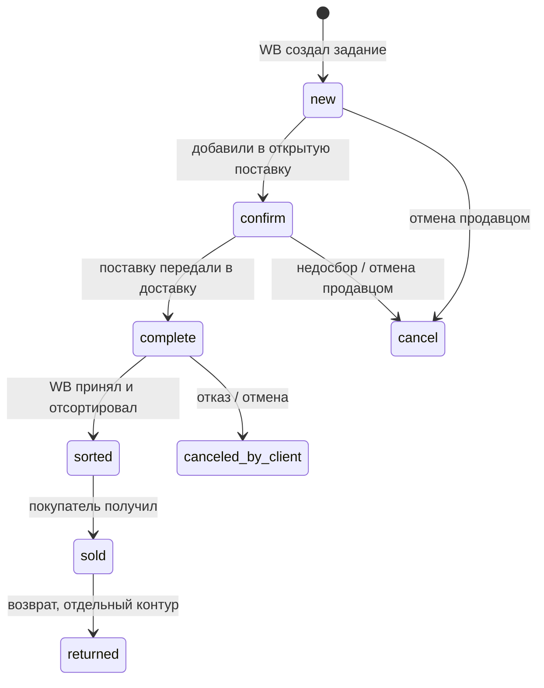
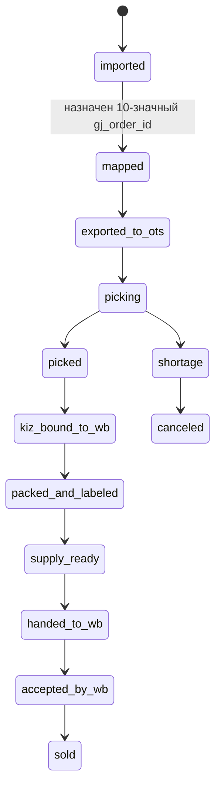
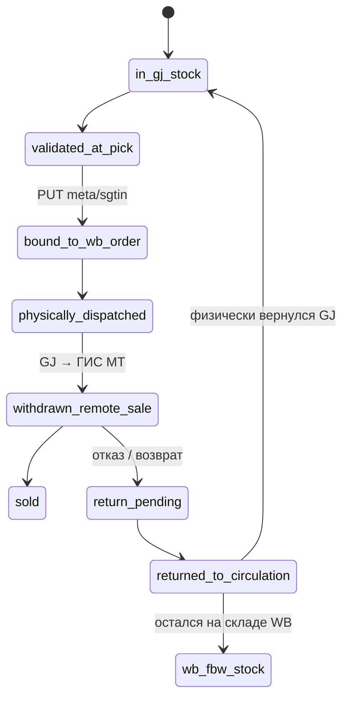

# Stage 15 — WB FBS Connector: складской процесс, роли и WB API

**Дата среза:** 2026-07-24  
**Статус:** target-flow draft  
**Сценарий:** FBS со склада GJ, отгрузка на склад или СЦ Wildberries  
**Граница:** без кода модуля Starfish; `WB FBS Connector` — условный новый
сервис, использующий существующий `OTS → WMS` контур  
**Уровни уверенности:** `confirmed`, `high`, `proxy`, `hypothesis`, `unknown`
в значениях из `00-PLAN.md`

> **Поправка 2026-07-24.** Этот документ остаётся источником по порядку WB API,
> sticker и supply lifecycle. Предположения о внутренних WMS-событиях
> `packed`, `technical-hold`, `supply-ready` и печати WB sticker не
> подтвердились. Актуальный fast-track и исправленный warehouse sequence
> находятся в
> [`stage-16-wb-fbs-fast-track-current-warehouse.md`](stage-16-wb-fbs-fast-track-current-warehouse.md).

## 0. Главная поправка к исходной последовательности

WB-поставка должна появиться **до физического завершения паллеты/коробов**.
Причина:

1. новое сборочное задание имеет `supplierStatus=new`;
2. добавление задания в поставку переводит его в `confirm`;
3. только в `confirm` можно привязать КИЗ через
   `PUT /api/v3/orders/{orderId}/meta/sgtin`;
4. стикер заказа доступен только в `confirm` или `complete`;
5. после физической готовности поставка закрывается вызовом
   `PATCH /api/v3/supplies/{supplyId}/deliver`;
6. только после этого доступен QR поставки.

Следовательно, в модели нужно различать:

- **логическую WB-поставку** — открытый контейнер сборочных заданий;
- **физическую поставку GJ** — готовые индивидуальные упаковки в
  транспортировочных коробах/на паллете;
- **рейс/машину** — водитель, автомобиль, пропуск и фактическая сдача.

## 1. Сквозная sequence-схема

```mermaid
sequenceDiagram
    autonumber
    participant WB as Wildberries API
    participant C as WB FBS Connector
    participant O as OTS
    participant W as WMS / ТСД
    participant M as WebGJISMP / ЧЗ
    actor S as Сотрудник склада
    participant D as Док / транспорт
    participant R as Склад или СЦ WB

    loop Получение и сверка заданий
        C->>WB: GET /api/v3/orders/new
        WB-->>C: assembly orders, requiredMeta, officeId, orderUid
        C->>C: idempotent upsert и mapping wb_order_id ↔ gj_order_id
        C->>WB: POST /api/v3/orders/status
        WB-->>C: supplierStatus + wbStatus
    end

    Note over C,WB: Заказ включён в складскую волну
    C->>WB: POST /api/v3/supplies
    WB-->>C: wb_supply_id
    C->>WB: PATCH /api/marketplace/v3/supplies/{supplyId}/orders
    WB-->>C: 204; order new → confirm

    par Заранее получить WB-стикер
        C->>WB: POST /api/v3/orders/stickers
        WB-->>C: sticker barcode + file
        C->>C: сохранить до печати
    and Создать складское задание
        C->>O: создать складской заказ<br/>gj_order_id + wb_order_id + SKU
        O->>W: reserve / ECOM task
        W-->>O: принято в работу
        O-->>C: ots_order_id / warehouse ack
    end

    S->>W: начать сборку, сканировать товар и DataMatrix
    W->>M: проверить полный КМ / КИЗ

    alt КИЗ невалиден или товар не соответствует заданию
        M-->>W: invalid
        W-->>S: пересканировать или заменить единицу того же SKU
    else КИЗ валиден
        M-->>W: valid + validation attributes
        W-->>O: picked item + полный КИЗ
        O-->>C: picked + КИЗ

        par Фоновая синхронизация КИЗ с WB
            C->>WB: PUT /api/v3/orders/{orderId}/meta/sgtin
            alt WB подтвердил КИЗ
                WB-->>C: 204
                C->>WB: POST /api/marketplace/v3/orders/meta
                WB-->>C: сохранённый sgtin
                C->>C: metadata-synced
            else Timeout или временная ошибка WB
                C->>C: retry; состояние kiz-sync-pending
            end
        and Упаковка без ожидания WB
            S->>W: печать внутренних форм и WB-стикера
            S->>S: наклеить WB-стикер и закрыть индивидуальную упаковку
            W-->>O: packed
            O-->>C: packed
        end

        C->>C: readiness barrier = packed AND metadata-synced

        alt packed + metadata-synced
            C-->>O: order-ready-for-supply
            O-->>W: разрешить консолидацию
            S->>D: положить упаковку в транспортировочный короб
        else packed + kiz-sync-pending
            O-->>W: technical-hold
            W-->>S: положить готовую упаковку в HOLD и собирать следующий заказ

            loop Фоновый retry без ожидания сотрудника
                C->>WB: PUT /api/v3/orders/{orderId}/meta/sgtin
                WB-->>C: 204
                C->>WB: POST /api/marketplace/v3/orders/meta
                WB-->>C: сохранённый sgtin
            end

            C->>C: metadata-synced
            C-->>O: release technical-hold
            O-->>W: order-ready-for-supply
            S->>D: перенести упаковку из HOLD в транспортировочный короб
        end
    end

    opt Подтверждённый недосбор
        W-->>O: shortage
        O-->>C: shortage
        C->>WB: PATCH /api/v3/orders/{orderId}/cancel
        WB-->>C: cancel; заказ удаляется из открытой поставки
    end

    Note over S,D: Все задания поставки имеют packed + metadata-synced
    W-->>O: supply-ready / dock-ready
    O-->>C: supply-ready
    C->>WB: PATCH /api/v3/supplies/{supplyId}/deliver
    WB-->>C: 204; confirm → complete
    C->>WB: GET /api/v3/supplies/{supplyId}/barcode
    WB-->>C: QR поставки

    opt Для выбранного склада нужен пропуск
        C->>WB: GET /api/v3/passes/offices
        C->>WB: POST /api/v3/passes
        WB-->>C: pass_id
    end

    D->>R: машина + поставка + QR каждой WB-поставки
    R->>R: скан QR поставки и стикеров заказов

    loop До финального состояния
        C->>WB: GET /api/v3/supplies/{supplyId}
        WB-->>C: scanDt / done
        C->>WB: POST /api/v3/orders/status
        WB-->>C: sorted / sold / canceled / return...
        C-->>O: нормализованный marketplace status
    end

    Note over D,M: Вывод КИЗ из оборота — отдельная операция GJ → ГИС МТ,<br/>не вызов metadata WB и не должен происходить в момент простого сканирования
```

## 2. Состояния трёх разных объектов

### 2.1. Сборочное задание WB



`new`, `confirm`, `complete`, `cancel` — `supplierStatus`, которым управляют
действия продавца. `waiting`, `sorted`, `sold`, `canceled*`,
`ready_for_pickup` и другие — `wbStatus`, которым управляет WB.

### 2.2. Внутренний заказ GJ



### 2.3. КИЗ



Критически важно: `bound_to_wb_order` не означает
`withdrawn_remote_sale`. Первый переход — metadata WB, второй — юридически
значимое действие GJ в ГИС МТ.

## 3. Роли и mastership

| Объект или действие | Владелец | Комментарий |
|---|---|---|
| `wb_order_id`, `orderUid`, `wbStatus` | WB | WB assembly order — внешняя первичная сущность |
| `gj_order_id` | WB FBS Connector / единый allocator GJ | 10-значный внутренний номер; конкретный диапазон требует отдельного ADR |
| Mapping `wb_order_id ↔ gj_order_id` | WB FBS Connector | уникальный и неизменяемый |
| `ots_order_id` | OTS | технический идентификатор записи OTS; не заменяет оба business ID |
| Физический резерв, pick, shortage | OTS/WMS | складской факт |
| Сканирование DataMatrix | WMS/ТСД | полный код без обрезки GS/crypto tail |
| Проверка КИЗ | WebGJISMP/ТС ПИОТ/ГИС МТ | exact current LC endpoint требует walkthrough |
| Привязка КИЗ к WB order | WB FBS Connector | `PUT .../meta/sgtin` |
| Юридический вывод/возврат КИЗ | GJ marking contour | не WB API; exact owner/event согласовать с Legal/Marking |
| WB-стикер заказа | WB FBS Connector | получить из WB, печатать на рабочем месте склада |
| Внутренние стикеры и 2 формы GJ | WMS/текущий workplace | точные формы и необходимость для FBS пока `unknown` |
| Открытая WB-поставка | WB FBS Connector | создаётся до сборки, закрывается после physical readiness |
| Физический транспортировочный короб/паллет | WMS/склад | для склада/СЦ не является отдельной API-сущностью WB |
| QR поставки | WB FBS Connector | доступен после `deliver` |
| Пропуск | WB FBS Connector + логистика | отдельная сущность по складу/водителю/машине; не содержит `supplyId` |
| Факт сдачи WB | WB scan + Connector reconciliation | `scanDt`, supply/order statuses |

## 4. WB API по моментам процесса

| Момент | Метод | Назначение | Критическое условие |
|---|---|---|---|
| Poll новых заданий | `GET /api/v3/orders/new` | получить все текущие `new` | idempotent upsert по `wb_order_id` |
| Reconciliation заданий | `GET /api/v3/orders` | восстановить данные за период | метод не возвращает актуальный статус |
| Poll статусов | `POST /api/v3/orders/status` | получить `supplierStatus + wbStatus` | до 1000 ID в запросе |
| Создание логической поставки | `POST /api/v3/supplies` | получить `WB-GI-*` | поставка ещё не физически закрыта |
| Включение в wave | `PATCH /api/marketplace/v3/supplies/{supplyId}/orders` | добавить до 100 заданий | переводит `new → confirm`; одна destination/cargo/cross-border group |
| Получить WB-стикеры | `POST /api/v3/orders/stickers` | получить файл и barcode | только `confirm`/`complete`, до 100 |
| Записать КИЗ | `PUT /api/v3/orders/{orderId}/meta/sgtin` | связать фактический КИЗ с заданием | только `confirm`, поле `sgtin` разрешено metadata |
| Проверить metadata | `POST /api/marketplace/v3/orders/meta` | прочитать сохранённый КИЗ | barrier перед консолидацией заказа в готовую поставку и `deliver`, но не перед печатью/индивидуальной упаковкой |
| Отменить недособранное | `PATCH /api/v3/orders/{orderId}/cancel` | отменить задание | удаляет привязку к открытой поставке |
| Закрыть поставку | `PATCH /api/v3/supplies/{supplyId}/deliver` | `confirm → complete` | после этого нельзя добавлять задания |
| Получить QR поставки | `GET /api/v3/supplies/{supplyId}/barcode` | QR для ворот склада/СЦ | только после `deliver` |
| Проверить приёмку | `GET /api/v3/supplies/{supplyId}` | `scanDt`, `done`, destination | не заменяет order-status reconciliation |
| Список складов с пропуском | `GET /api/v3/passes/offices` | получить актуальные `officeId` | список надо периодически обновлять |
| Создать пропуск | `POST /api/v3/passes` | водитель + машина + склад | по API действует 48 часов; не связан с supply |

Лимиты актуальной документации:

- orders/supplies/passes: 300 запросов в минуту на seller account;
- metadata: 1000 запросов в минуту;
- создание пропуска: не чаще одного запроса в 10 минут.

Не следует превращать эти значения в рабочую частоту polling без расчёта
seller-account cardinality, batch size, active-order volume и retry policy.

## 5. Физическая упаковка и QR

Для отгрузки на **склад или СЦ WB**:

- на каждую индивидуальную упаковку клеится WB-стикер заказа;
- индивидуальные упаковки складываются в чистый транспортировочный короб;
- на короб нельзя клеить случайные баркоды/стикеры товара;
- WB `trbx` API не нужен — он относится к отгрузке через ПВЗ;
- нужен один QR **на каждую логическую WB-поставку**, а не на каждую единицу;
- QR можно показать приёмщику с телефона либо распечатать и разместить на
  упаковке поставки;
- если на машине несколько WB-поставок, нужно предъявить QR каждой;
- если поставку физически везут несколькими машинами, безопасная модель —
  отдельная логическая поставка/QR на каждую машину.

Следовательно, утверждение «QR обязательно клеить на каждый короб» для
сценария склад/СЦ неверно. Это требование относится к грузоместам при
отгрузке в ПВЗ.

## 6. Где взаимодействуем с маркировкой

```text
DataMatrix на товаре
  → скан WMS/ТСД
  → проверка полного КМ в GJ marking contour
  → положительный результат pick
  → параллельно:
      A. OTS возвращает КИЗ в Connector
         → Connector PUT /meta/sgtin в WB
         → Connector перечитывает metadata
      B. сотрудник печатает WB-стикер и полностью упаковывает единицу
  → packed + metadata-synced разрешают перенести единицу
    из технического буфера в транспортировочный короб готовой поставки
  → физическая отгрузка
  → отдельный GJ-документ «Вывод из оборота / Дистанционная продажа»
```

Сотрудник не должен ждать WB API у рабочего стола. Практический UX:

1. Проверка марки в текущем GJ-контуре выполняется непосредственно при скане и
   определяет, можно ли принять эту единицу в pick.
2. После успешной проверки сотрудник печатает внутренние формы и WB-стикер,
   наклеивает его и полностью закрывает индивидуальную упаковку, пока Connector
   передаёт КИЗ в WB.
3. `metadata-synced` блокирует только перевод заказа в `ready-for-supply`,
   помещение в транспортировочный короб готовой поставки и закрытие поставки
   вызовом `PATCH .../deliver`.
4. При долгом timeout заказ переносится в отдельную техническую ячейку/буфер,
   а сотрудник продолжает следующий заказ.
5. Ошибка или timeout WB API не должны автоматически отменять заказ: Connector
   повторяет идемпотентную синхронизацию. Отмена допустима после подтверждённого
   shortage или операционного решения.

Open questions:

1. Какой exact event текущего WMS означает физический выход товара со склада:
   `packed`, `dock-ready`, `ORDER_PICKUP` или иной?
2. Какая система создаёт документ вывода из оборота для FBS:
   WMS/1С, OTS, Connector или отдельный marking worker?
3. Как Connector получает полный КИЗ: synchronous callback, OTS event или poll?
4. Какие validation attributes кроме самого КИЗ должны сохраняться для аудита?
5. Как физически организовать `technical-hold`, чтобы полностью упакованный
   заказ с ещё не подтверждённым `sgtin` не попал в транспортировочный короб
   готовой поставки?
6. Как выполняется возврат в оборот и переход возвращённого FBS-товара в FBW?

## 7. Минимальная модель данных Connector

| Поле | Назначение |
|---|---|
| `wb_order_id int64` | ID сборочного задания WB |
| `wb_order_uid` | grouping нескольких единиц заказа одного покупателя |
| `gj_order_id char(10)` | внутренний сквозной номер |
| `ots_order_id` | correlation с OTS |
| `warehouse_id` | склад исполнения GJ |
| `wb_destination_office_id` | точка сдачи WB |
| `wb_supply_id` | логическая поставка |
| `supplier_status` | `new/confirm/complete/cancel` |
| `wb_status` | downstream status WB |
| `gj_status` | внутренний детальный lifecycle |
| `sticker_barcode` | WB barcode индивидуальной упаковки |
| `sticker_file_ref` | защищённая ссылка/объект печати |
| `kiz_ref` | защищённая ссылка на КИЗ; не писать полный КИЗ в обычные логи |
| `kiz_validation_ref` | audit результата проверки |
| `metadata_synced_at` | barrier перед pack/close |
| `supply_closed_at` | момент `PATCH .../deliver` |
| `wb_accepted_at` | подтверждённый WB scan/status |

Все внешние команды должны иметь idempotency/replay semantics в локальной БД,
даже если конкретный WB endpoint не принимает пользовательский idempotency key.

## 8. Решения, которые ещё не подтверждены

- `1 WB assembly order = 1 внутренний GJ order` — целевое решение GJ, а не
  требование WB. WB гарантирует только одну единицу товара в assembly order и
  предоставляет `orderUid` для группировки.
- Точный 10-значный диапазон внутреннего номера не выбран.
- Конкретные две внутренние печатные формы и внутренний стикер могут оказаться
  лишними для WB FBS; это проверяется warehouse walkthrough.
- Exact GJ endpoint и момент юридического вывода КИЗ из оборота не установлен.
- Паллет/короб target packaging необходимо подтвердить для выбранного склада
  WB и конкретного `cargoType`.

## 9. Источники

- WB API FBS:
  `https://dev.wildberries.ru/docs/openapi/orders-fbs`
- WB API knowledge base — FBS orders:
  `https://dev.wildberries.ru/knowledge-base/articles/019d49a4-0771-7571-aea9-11d5b597f34c/zakazy-fbs`
- WB — маркировка товаров и поставок:
  `https://seller.wildberries.ru/instructions/ru/ru/material/items-and-shipment-labling-like-barcode-and-others`
- WB — упаковка и стикеры FBS:
  `https://seller.wildberries.ru/instructions/ru/ru/material/step-two-items-packing-and-labeling-in-fbs`
- WB — отгрузка FBS на склад/СЦ:
  `https://seller.wildberries.ru/instructions/ru/ru/material/step-three-fbs-shipment-delivery-to-warehose-or-sorting-centre`
- GJ marking process:
  `docs/architecture/2026-06-03-marking-process-map.md`
- GJ WB FBS external contours:
  `docs/research/marketplaces/stages/stage-13-wb-fbs-gj-external-contours.md`
