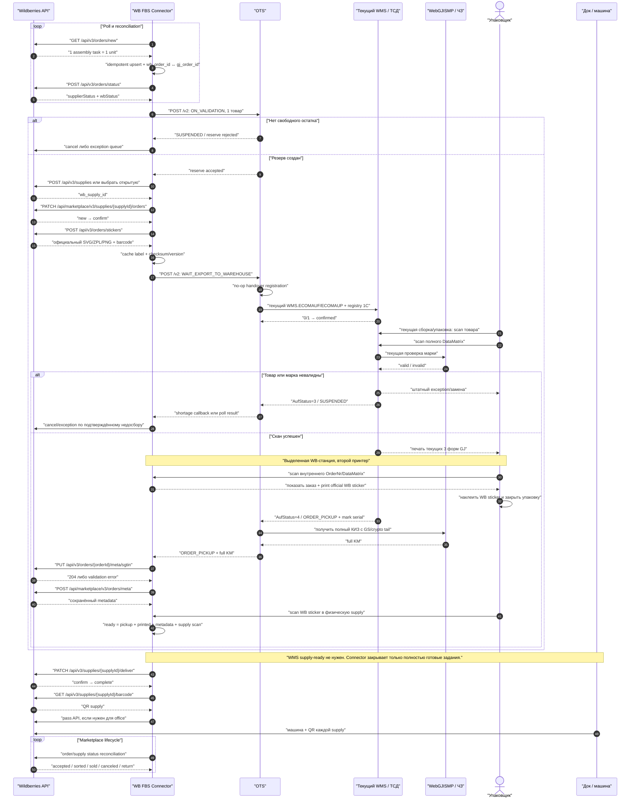

> **Дополнение 2026-07-27.** Механизм «статусы OTS → OMS» подтверждён кодом
> end-to-end. Цепочка из четырёх звеньев: OTS `OrderLaterNotificationService`
> (пропускает `SPL/Unknown/Hybris`, остальное отдаёт notifier'ам) →
> `StarfishOrderStatusNotifier` шлёт **только** `source=Starfish` в Kafka-топик
> `prod.all.ecom.fct.order-status.0` → daemon Integration
> `transfer:order-status:daemon` (`TransferService.transferOtsOrderStatus`)
> → OMS REST `POST /client/order/status/{clientOrderId}/{statusId}/update` →
> топик `settings` → Settings → BPM → `camunda-message` → Camunda BPMN
> (`pickingProcess`, `releaseProcess`, `dispatchProcess` и др. реально
> построены на этих статусах). Integration — обязательный мост: топик OTS
> больше никто не читает, фильтрации по source в Integration нет.
>
> Три следствия для `WB_FBS`:
>
> 1. `POST /v2` без поля source принудительно ставит `Starfish`
>    (`OrderController.cs:177`) — заказ без явного `WB_FBS` станет источником
>    статусов в OMS, где Integration получит 404 и зациклит retry.
> 2. Skip-лист `OrderLaterNotificationService.cs:50-57` надо расширить на
>    `WB_FBS`: иначе статусы нового source молча не уведомляются и
>    перечитываются бесконечно — накапливающийся backlog (ровно эта ситуация
>    сегодня у RSG).
> 3. Номер для WMS/1С: `GetPrefix()` (`OTSRequestParams.cs:50-62`) отдаёт
>    `0000337` всему, кроме Starfish/RSG — для `WB_FBS` нужна явная prefix
>    policy (см. §7).
>
> Вывод §5.2 уточняется: «статусы WB_FBS просто не должны покидать OTS» —
> это две точечные правки OTS (enum + skip-лист), а не «Integration вне
> контура» в целом: для обычного eCom Integration остаётся в критическом
> пути, для WB FBS он отсекается на стороне OTS.
>
> **Дополнение 2 (2026-07-27), создание заказа — Integration тоже в пути.**
> Цепочка «заказ → OTS» подтверждена кодом по звеньям: ENSI checkout →
> Integration UserApi (`/integration/v4/order/create`) → OMS → BPMN
> `exportForPicking.bpmn` (external task `orderExportWithFeedbackActivity`,
> `destination=ots`) → camunda-worker `OrderExportWithFeedbackHandler` →
> OMS Order `/order/export?destination=ots` → RestTemplate
> `http://integration-oms/order/export?destination=ots` → Integration
> `OrderActionController@export` → `OrderExportOtsMutator` →
> `OtsClient::createOrder` → POST в OTS. Прямого клиента OTS в OMS нет
> (ни Feign, ни URL). Фактический путь (`/` vs `/v2`) определяется
> деплой-значением `OTS_SERVICE_CLIENT_BASE_URL`, но косвенно доказано,
> что это `/v2` (source=Starfish): mutator шлёт `business_unit_id`
> (контракт v2), а Kafka-нотификатор статусов работает только для
> Starfish. Развязка по шагам: `ON_VALIDATION` и
> `WAIT_EXPORT_TO_WAREHOUSE` — не action types, а статусы одного флоу
> `ORDER_TO_CHECK`; второй шаг — повторный экспорт в тот же endpoint.
> Следствие для WB FBS: wbconnector становится **вторым прямым
> потребителем** OTS API (первый — Integration). Это легитимно, но
> означает, что контракт `ORDER_TO_CHECK` (mutator, обязательные поля
> `OtsRequiredFieldsEnum`, prefix `0000352`) надо воспроизвести в
> Go-адаптере, а не «переиспользовать вызов OMS» — его не существует.
>
> **Решение (2026-07-27): маршрут подтверждён — wbconnector → OTS
> напрямую.** Складское переиспользование обеспечивается не Integration, а
> самим OTS: телеграммы `WMS.ECOMAUF/ECOMAUP`, 1С registry, статусы
> `AufStatus`, `AUFSHPPAL` формируются внутри OTS и не зависят от
> вызывающего. Полный OMS-флоу отклонён: payment/уведомления/dispatch
> BPMN для WB FBS вредны и требуют параметризации. Вариант «через
> Integration `/order/export`» отклонён: Integration в критическом пути
> плюс OMS-образный payload без OMS. Integration остаётся эталоном
> контракта `ORDER_TO_CHECK` для Go-адаптера, но не звеном рантайма.

# Stage 16 — WB FBS fast-track через текущие OTS/WMS

**Дата среза:** 2026-07-24  
**Статус:** complete-for-current-pass  
**Покрытие:** локальный OTS `449a5142` (`staging`), WMS telegram contracts,
Confluence/Jira, официальные WB API и seller instructions; без live walkthrough
станции упаковки, production image OTS, кода WMS print procedure и реального
FBS-заказа выбранного кабинета  
**Ограничение проекта:** новый `WB FBS Connector` можно разработать быстро;
правки OTS допустимы; WMS желательно не менять, но допустима очень маленькая
правка в существующей точке печати  
**Уровни уверенности:** `confirmed`, `high`, `proxy`, `hypothesis`, `unknown`
в значениях из `00-PLAN.md`

> **Дополнение 2026-07-24.** Эта стадия описывает order-level fast-track до
> упаковки и WB supply lifecycle. Полная shipment-схема с 1С,
> `ОтборЛистПеремещ`, WMS-native owner gate, `PalNam`, `AUFSHPPAL`,
> `wms_shipment` и OTS `DELIVERING` вынесена в
> [Stage 17](stage-17-wb-fbs-1c-pallet-marking-gate.md). Раздел 3 нельзя
> использовать как полный процесс складской отгрузки без этого дополнения.

## 0. Решение

Самый короткий реалистичный путь:

```text
WB API
  ↕
WB FBS Connector + простое рабочее место печати/поставки
  ↕
небольшой WB_FBS adapter в OTS
  ↕
текущий WMS.ECOMAUF / WMS.ECOMAUP + текущая 1С registry
```

Для пилота не нужны:

- marketplace-модуль Starfish;
- OMS order;
- Integration в operational critical path;
- новый тип складского задания;
- новые WMS-статусы `packed`, `hold`, `supply-ready`;
- объект WB-поставки внутри WMS;
- передача финальных marketplace-статусов обратно в OTS.

Нужны:

1. Connector как master WB assembly order, sticker, metadata и supply lifecycle.
2. Тонкая адаптация OTS для источника `WB_FBS`, handover без внешней ТК,
   статусов и полного КИЗ.
3. Печать официального WB-стикера на **выделенных WB-станциях** с двумя
   принтерами через отдельный scan-print экран Connector (согласовано со
   складом 2026-07-25; ранее рассматривалась как baseline против tiny WMS
   hook — см. §4).
4. Текущий WMS без изменения physical pick/pack процесса.

Это не означает, что запуск состоит только из одного нового сервиса. В
критическом пути остаются точечные изменения OTS, настройка рабочего места,
приёмочный прогон 1С/WMS и операционный регламент поставки.

## 1. Поправки к Stage 15

Stage 15 корректно восстановил порядок WB API, но в sequence были
неподтверждённые внутренние состояния. Для fast-track их нельзя считать
существующими:

| Предыдущее допущение | Что подтверждено сейчас |
|---|---|
| WMS возвращает отдельный `packed` | Нет. WMS `AufStatus=4` становится OTS `ORDER_PICKUP`; отдельного `PACKED` нет |
| OTS может поставить WMS-заказ в `technical-hold` | Такой штатный статус/command в найденном контракте отсутствует |
| WMS формирует `supply-ready` | WB supply не существует в WMS; readiness считает Connector |
| OTS передаёт финальные WB-статусы в warehouse chain | Не требуется; после физического исполнения marketplace lifecycle остаётся в Connector |
| WMS печатает WB-стикер | OTS передаёт только `carrierBarcode1`; официальный SVG/ZPL/PNG WB не передаётся |
| Полный КИЗ уже доступен из обычного OTS status poll | GET возвращает `good_id_mark`, документированный как serial; crypto tail/GS не сохраняются в `GoodsStatus` |

Правильный барьер:

```text
WMS ORDER_PICKUP
  + официальный WB-стикер напечатан
  + полный КИЗ принят WB, если обязателен
  = Connector READY_FOR_SUPPLY
```

Это order-level состояние принадлежит Connector. Оно не разрешает складскую
отгрузку: переход права марки перед штатной отгрузкой отдельно проверяет сама
WMS через `GetCheckOrder`. Повторный scan DataMatrix/`PalNam` в Connector для
этого не нужен.

## 2. Что можно переиспользовать без изменения WMS

### 2.1. Двухшаговая передача в OTS

Текущий OMS flow уже разделён на два вызова:

1. `ON_VALIDATION` — OTS проверяет остаток и создаёт durable reserve.
2. `WAIT_EXPORT_TO_WAREHOUSE` — после подтверждения заказа запускается
   регистрация handover/перевозчика и передача в WMS.

Evidence:

- Confluence `63470495`, v76;
- Confluence `63470498`;
- `OrderController.cs:133-186`;
- `OnValidation.cs:63-73,125-156`;
- `WaitExportToWareHouse.cs:25-44`.

Для WB этот seam особенно удобен:

```text
получили assembly order
  → зарезервировали в OTS
  → добавили в WB supply, получили sticker
  → только затем отдали WMS на сборку
```

Если OTS не смог зарезервировать товар, заказ не надо запускать на склад:
Connector выполняет WB cancellation/exception flow.

### 2.2. Одна единица WB совпадает с одной строкой WMS

WB создаёт отдельное assembly task на каждую единицу товара. Текущий OTS
формирует `WMS.ECOMAUP` с `PosQty=1` на строку:

- WB: одно сборочное задание всегда содержит одну единицу;
- OTS: `TgwWmsMapping.cs:187-215`, `PosQty=1`.

Поэтому решение `1 WB assembly task = 1 GJ warehouse order` не требует от WMS
новой модели количества. Это всё ещё архитектурное решение GJ, а не
обязательное требование WB, но для fast-track оно минимизирует преобразования,
ошибки КИЗ и sticker matching.

### 2.3. Текущий WMS order contract

OTS уже передаёт:

- `OrderNr`, `OrderRefNr`, `OrderWwsBeleg`;
- `OrderType=ECOM`;
- `carrierID`, `carriername`, `carrierBarcode1`;
- customer/address fields;
- `OrderTargetTime`, вес и стоимость;
- по одной `WMS.ECOMAUP` на товар;
- footer `WMS.ECOMAUFANLABSCHL`.

Evidence:

- `WmsService.cs:104-165`;
- `TgwWmsService.cs:55-97`;
- `TgwWmsMapping.cs:103-215`;
- Confluence `108061252`, v16.

Параллельно OTS создаёт текущую registry в 1С через
`EcommOrder/CreateOrder`: `OneSService.cs:50-85`,
`OneS8ApiClient.cs:34-42`.

### 2.4. Реальные статусы WMS

| WMS `AufStatus` | OTS status | Использование в pilot |
|---|---|---|
| `0`, `1` | `ORDER_CONFIRMED_WAREHOUSE` | задание принято |
| `2` | `PICKING` | началась комплектация |
| `3` | `SUSPENDED` | shortage/проблема; для заказа с одной единицей — exception/cancel candidate |
| `4` | `ORDER_PICKUP` | заказ скомплектован; ближайший доступный сигнал physical readiness |

Evidence: `TgwWmsMapping.cs:217-240`,
`WmsService.cs:26-44`.

`WMS.AUFSHP` — отдельное событие фактической складской отгрузки, после которого
OTS начинает transport tracking. Оно может сохраняться для внутренней сверки,
но не заменяет WB supply acceptance.

### 2.5. Текущий процесс упаковки и печати

Историческая, но очень конкретная страница центрального склада описывает:

1. тележка после сборки приходит на станцию упаковки;
2. упаковщик сканирует ячейку и товары;
3. при необходимости сканирует марку;
4. после успешного скана товара и марки печатаются:
   лист возврата, накладная, этикетка на короб/пакет;
5. заказ упаковывается и подтверждается окончание упаковки.

Evidence: Confluence `44248846`, v11. Эквивалентные названия форм есть в
`44242771`. Страницы обновлялись в 2021 году, поэтому это `proxy`, пока
walkthrough не подтвердит текущую станцию.

Современная спецификация внутренних форм подтверждает, что eCom-этикетка
строится из `WMS.ECOMAUF`:

- `carriername`;
- `carrierBarcode1`;
- `OrderNr` как DataMatrix;
- ФИО/телефон/адрес/индекс/вес.

Evidence: Confluence `44240383`, v7.

Эта этикетка остаётся внутренней/транспортной формой GJ. Она не заменяет
официальный WB sticker.

## 3. Исправленный fast-track sequence



### Где сотрудник ждёт, а где не ждёт

Сотрудник ждёт только текущую локальную проверку товара/марки, которая и
сейчас определяет возможность продолжить упаковку.

Точная runtime-граница этой проверки — WMS, ТСД или отдельный marking service —
по доступным источникам не подтверждена. Участник `WebGJISMP / ЧЗ` на схеме
показывает логический marking-контур, а не доказанный прямой synchronous call
из WMS.

Сотрудник не должен ждать:

- записи КИЗ в WB;
- повторного чтения WB metadata;
- закрытия WB supply;
- создания пропуска.

Если WB metadata временно не синхронизировалась, упаковка уже может быть
закрыта. Она попадает в физическую exception/HOLD-зону поставки, но это
операционное состояние Connector, а не новый WMS-статус. Работник продолжает
следующий заказ.

## 4. Печать: решение принято в пользу companion print

> **Обновление 2026-07-25.** Со складом согласовано выделение **отдельных
> станций сборки под WB с двумя принтерами** — под нашу этикетку и под
> WB-стикер. Это переводит вариант §4.1 из «baseline-предложения» в
> согласованную операционную модель и снимает две его цены: соответствие
> «станция → принтер» становится статическим, а физическое разделение потоков
> убирает риск перепутать этикетки. Одновременно вариант §4.2 (`CarrierZPL`)
> выходит из критического пути: пропускать WB-стикер через WMS больше не нужно.
> Договорённость пока устная — статус `high`, до документа с ЛЦ, числом
> станций, моделями принтеров и сроками.

### 4.1. Согласованная модель — companion print без WMS-правки

На текущей packing station открыт очень простой экран Connector:

1. упаковщик сканирует текущий `OrderNr` DataMatrix или внутренний tracking
   barcode;
2. Connector находит `wb_order_id`;
3. показывает SKU/размер/цвет и supply для визуальной сверки;
4. отправляет cached official WB SVG/PNG в browser print либо ZPL в local
   print-agent;
5. пишет `printed_at`, station/user, printer, sticker version и reprint reason.

Плюсы:

- нулевая зависимость от release WMS;
- WB API не вызывается в момент печати — sticker уже cached;
- легко реализовать controlled reprint;
- можно начать с browser print и позже перейти на raw ZPL.

Цена:

- один дополнительный scan/action упаковщика;
- ~~нужен понятный station/printer setup~~ — закрыто выделенными станциями;
- ~~нужен физический SOP, чтобы не перепутать WB sticker~~ — закрыто
  физическим разделением потоков и вторым принтером.

Текущее WMS-событие не содержит station/printer ID, поэтому безопасный
auto-print только по `ORDER_PICKUP` невозможен без дополнительного mapping.
С выделенными станциями это перестаёт быть проблемой: mapping статический.

#### Что осталось определить по станции

1. ~~**Ключ скана.**~~ **Закрыто 2026-08-03:** сканируется наша этикетка, ключ —
   `gj_order_id`. Менять этикетку не потребуется: по трассировке прода WMS уже
   печатает наш номер как `shipment_barcode` (в `TgwCreateOrderEvent` заказа
   `2010843731` стоит `("shipmentBarcode": "2010843731")` = `order_id`).
   Разрешение `gj_order_id` → `wb_order_id` — на стороне Connector, реализовано
   в приёмнике скана.
2. ~~**Канал печати.**~~ **Закрыто 2026-08-03:** склад дорабатывает софт сканера
   на месте (сканеры докуплены), печать — **raw ZPL, 58×40**. Connector отдаёт
   в ответе на скан `format` и `payload` (base64) из кеша. Следствие: кеш
   стикеров должен держать именно ZPL, а не SVG, поэтому формат вынесен в
   конфигурацию (`WB_STICKER_FORMAT`/`WIDTH`/`HEIGHT`, по умолчанию `zplv` 58×40)
   и сверяется в момент скана — SVG на ZPL-принтере даёт пустую наклейку без
   какой-либо ошибки. Остаётся модель принтера и выбор `zplv` против `zplh`:
   это ориентация рендера на стороне WB, меняется настройкой без правки кода.
3. **Реальный размер и символы WB ZPL** выбранного кабинета остаются
   `unknown` и в песочнице не проверяются (методы стикеров отдают пустой
   `200`). Первая физическая печать — приёмочный тест на контролируемом
   production-заказе прямо на новой станции.
4. **Блокировка до включения в поставку.** Стикер доступен только в
   `confirm`/`complete`, поэтому экран станции обязан показывать явное
   состояние «печать недоступна: задание не включено в поставку», а Connector —
   гарантировать включение до того, как заказ дойдёт до станции.
5. **Полный КИЗ со станции.** Если выделенная станция сканирует DataMatrix под
   нашим контролем, полный КМ с GS-разделителями и криптохвостом оказывается у
   Connector в момент скана. Это потенциально выводит OTS-обогащение
   (`MP-WB-FBS-024`) из критического пути пилота. Условия: не писать полный код
   в обычные логи (`MP-WB-FBS-028`) и определить, как марка попадёт в WMS для её
   собственного `PKS`/`ECOMAUFSTAT` — раздвоением скана или вторым сканом.
6. **Пропускная способность.** При модели «одна единица = один заказ = одна
   упаковка» ёмкость станции считается в единицах, а не в заказах; нужны
   ожидаемые единицы в час и число станций для расчёта частоты поллера и
   предзагрузки стикеров.

### 4.2. Tiny WMS hook через `CarrierZPL` — вне критического пути

> **Статус после 2026-07-25:** не нужен для пилота. Выделенные станции с
> собственным принтером решают печать без правок WMS. Раздел сохранён как
> описание альтернативы, если однажды понадобится печать WB-стикера на общей
> станции; спайк по `CarrierZPL` из плана пилота снят.

В контракте и DTO уже существует поле:

```text
CarrierZPL string(8000) — строка для формирования транспортной этикетки
```

Но Confluence `108061252`, v16 прямо помечает его «Не используется».
`CreateOrderHeader` и `wmsinserter` DTO поле содержат, однако текущий
`TgwWmsMapping` его не заполняет, а consumer печати в доступном коде не найден.

Потенциальный seam:

```text
Connector заранее получает ZPL
  → OTS заполняет CarrierZPL
  → существующая WMS packing procedure
  → после штатной этикетки печатает второй raw ZPL job на тот же принтер
```

Это может оказаться маленькой правкой, но пока имеет статус `hypothesis`.
Однодневный spike должен проверить:

1. читает ли реальная WMS `CarrierZPL`;
2. где находится текущий print trigger;
3. можно ли напечатать второй job на том же принтере;
4. реальный размер WB ZPL;
5. ограничение `CarrierZPL <= 8000`;
6. размер всей `IFINDATEN`: в доступном `wmsinserter` она описана как
   `varchar(4000)`, что может быть более жёстким ограничением;
7. символ `|`: OTS telegram использует его как delimiter и не экранирует;
8. reprint и audit.

До успешного spike этот вариант нельзя ставить в critical path. Даже если
поле присутствует в DTO, это не доказывает поддержку WMS.

### 4.3. Допустимая граница маленькой WMS-правки

Если изменение WMS действительно укладывается в существующий print seam, оно
может войти в пилот. Его ответственность должна быть ограничена:

1. принять уже подготовленный official WB label либо его безопасный print
   payload;
2. после успешной локальной проверки товара/марки отправить второй print job на
   принтер текущей станции;
3. показать локальную ошибку печати и разрешить контролируемый reprint.

WMS не должен:

- обращаться к WB API;
- хранить WB token;
- создавать/закрывать supply;
- решать, принят ли КИЗ площадкой;
- ждать WB metadata readback;
- вести marketplace lifecycle.

Если для second-print понадобятся новая очередь печати, новая маршрутизация
принтеров, отдельный экран или новый status contract, это уже не «маленькая
правка». Тогда companion print остаётся fast-track baseline.

### 4.4. Что не подходит

`carrierBarcode1` нельзя считать WB sticker. Это только значение штрихкода,
которое текущий WMS помещает в собственную адресную этикетку. Официальный WB
sticker обязателен для приёмки и имеет предоставляемый WB layout.

## 5. Минимальные изменения OTS

### 5.1. Обязательные для production-like pilot

| Изменение | Зачем | Оценка размера |
|---|---|---|
| `OrderSource.WB_FBS` | не маскировать заказы под Starfish/Hybris/Unknown | маленькое |
| Prefix policy для `WB_FBS` | корректный `OrderWwsBeleg`/registry 1С | маленький код, но обязательное решение 1С |
| WB handover adapter без внешнего API | получить `SHIPMENT_BARCODE` и пройти текущий pipeline | маленькое |
| Разрешить подходящий `delivery.type` для handover | текущий `OWN=5 + type=1` падает в `OneSService.GetClientId` | маленькое |
| Callback/outbox OTS → Connector или надёжный polling | получить `PICKING/SUSPENDED/ORDER_PICKUP` | маленькое/среднее |
| Full-KM enrichment для `WB_FBS` | WB требует полный код с GS/crypto tail | среднее |
| Удалить/маскировать full-KM logging | current `OrderToPickup` пишет crypto tail в info-log | очень маленькое, обязательное |
| Idempotency по command/event | retry не должен создать второй reserve/order | среднее |
| WB-aware cancellation compensation | снять WMS/OTS reserve и не вызвать внешнюю ТК | среднее |

### 5.2. Почему нельзя просто отправить `source=Starfish`

Текущий notifier публикует статусы `source=Starfish` в существующий OMS flow:
`StarfishOrderStatusNotifier.cs:34-69`. Если OMS order не существует,
получатся ошибочные callbacks и операционный шум.

`source=Unknown` технически не уведомляется
(`OrderLaterNotificationService.cs:49-57`), но получает legacy prefix
`0000337` (`OTSRequestParams.cs:50-60`). Это пригодно для локального spike,
но не является безопасным production design: downstream может считать такой
заказ Hybris.

### 5.3. Самый короткий handover shim

Текущий `OWN=5` не ходит во внешнюю ТК и выдаёт синтетический external ID.
Это делает его подходящим техническим seam для пилота.

Проблема: current `OneSService.GetClientId` разрешает `transport_id=5` только
для `delivery.type=2` и требует `pointout_id`; при courier-like `type=1`
бросает `NotImplementedException` (`OneSService.cs:88-108`).

Минимальная OTS-правка может:

- для `source=WB_FBS + transport_id=5 + delivery.type=1` выбирать существующий
  eCom recipient данного ЛЦ;
- оставлять `ClickAndCollect=0`;
- не вызывать внешнюю ТК;
- использовать внутренний `gj_order_id` как shipment barcode либо сохранять
  WB sticker barcode отдельным tracking parameter;
- применять standard warehouse cancellation, а не семантику клиентского C&C.

Это наиболее короткий reuse, но в документации должно быть явно записано:
`OWN` здесь означает technical handover supply до WB, а не последнюю милю
покупателю.

Чище создать отдельный `WB_FBS_HANDOVER` transport ID/service. Но тогда нужно
доказать, что новый `id_transport` принимают 1С/WMS и настроить carrier row на
каждом ЛЦ. Это может занять дольше, чем код.

### 5.4. Полный КИЗ — реальная обязательная OTS-доработка

WMS/OTS status contract возвращает `good_id_mark`, документированный как
13-символьный serial (`63453034`, v54). Текущий OTS строит
`010{GTIN}21{serial}` и запрашивает полный КМ у WebGJISMP
(`/api/KM/GetKMFull?from=OTS`):

- `MarkUtils.cs:5-18`;
- `WebGjIsmpClient.cs:27-58`;
- `OrderToPickup.cs:130-163`.

Но enrichment выполняется только для маркированного заказа с manual/unpaid
payment (`OrderToPickup.cs:53-61,174-180`), а `GoodsStatus` хранит только
`DataMatrix` serial.

Для WB недостаточно самостоятельно восстановить первые 31 символ: свежая
инструкция WB требует полный КИЗ со скрытыми GS-разделителями и crypto tail.

Допустимые минимальные реализации:

1. `WB_FBS` notifier в OTS на `ORDER_PICKUP` вызывает существующий
   WebGJISMP client и отправляет Connector полный КМ;
2. новый internal OTS endpoint возвращает full KM по `gj_order_id`;
3. Connector получает разрешённый прямой доступ к WebGJISMP и повторяет
   существующий lookup.

Вариант 1 лучше переиспользует текущий доступ OTS и не дублирует marking
credential/config в новом сервисе.

Полный КИЗ нельзя писать в обычные application logs. Текущий
`OrderToPickup.cs:161` логирует `good_id_mark_cryptotail`; при расширении
enrichment на `WB_FBS` эту строку нужно удалить либо безопасно маскировать.

## 6. Что принадлежит Connector

### 6.1. Operational order

Минимальные таблицы/проекции:

| Объект | Ключевые данные |
|---|---|
| `wb_orders` | `wb_order_id`, `orderUid`, `rid`, SKU, `gj_order_id`, office/cargo/cross-border, statuses |
| `wb_order_events` | raw event/poll snapshots, hash, received/processed time |
| `warehouse_commands` | OTS command ID, request hash, state, retries |
| `stickers` | format, WB barcode, encrypted/object ref, checksum, version |
| `supplies` | `wb_supply_id`, grouping dimensions, state, QR/pass refs |
| `supply_orders` | logical membership + physical scan + readiness reasons |
| `marking` | protected full-KM ref, WB sync/validation state; no plain logs |
| `outbox` | retryable WB/OTS commands |
| `print_audit` | station, printer, user, sticker version, reprint reason |

Все команды должны быть idempotent локально, даже если WB endpoint не
принимает пользовательский idempotency key.

### 6.2. WB supply

Connector:

- группирует задания по WB-ограничениям:
  destination office, `cargoType`, cross-border type;
- создаёт/open supply;
- добавляет задание и переводит его `new → confirm`;
- заранее получает official sticker;
- хранит logical membership;
- подтверждает physical membership сканом WB sticker;
- не закрывает supply, пока все включённые задания не готовы;
- вызывает `deliver`;
- получает QR и при необходимости создаёт pass.

WMS не обязан знать `wb_supply_id`.

### 6.3. Остатки

Для custom Connector выгрузка FBS stock также становится его обязанностью.
Самый быстрый безопасный pilot:

```text
WB ATS = min(pilot_cap, max(0, OTS free stock - safety buffer))
```

С ограничениями:

- один seller;
- один ЛЦ;
- небольшой whitelist SKU;
- cap 1–2 единицы на SKU;
- консервативный safety buffer;
- немедленный OTS reserve после получения WB order;
- периодическая full reconciliation и ATS=0 при деградации.

Это не настоящий channel allocation. Между provisional reserve OMS и durable
reserve OTS остаётся race window. Поэтому широкое открытие всего каталога без
отдельного allocation bucket опасно.

Также нужно исключить FBS-заказы из legacy `api/WB/orders → ОбменWB`, иначе
возможен второй `РезервКлиента`: Confluence `44269101`, `165395786`.

## 7. Номер заказа

Если OMS не участвует, поле лучше называть `gj_order_id`, а не
`clientOrderId`: оно нужно OTS/WMS/1С как warehouse/accounting execution key.

Нельзя:

- использовать WB `orderId` напрямую как GJ 10-digit ID;
- генерировать локальный произвольный `3xxxxxxxxx`;
- считать `212...` свободным без registry и boundary test.

Для очень быстрого пилота допустим отдельный Connector allocator только после:

1. письменного reserve диапазона;
2. unique constraint по `gj_order_id`;
3. unique mapping по `wb_order_id`;
4. теста `2120000001`, `2147483647` и `2147483648` по OTS/WMS/1С;
5. решения, что происходит после исчерпания блока.

Диапазон `2120000000..2147483647` даёт около 27,5 млн значений до signed
Int32 boundary. Это ёмкость, а не доказательство безопасности.

См. Stage 14 для истории и ограничений.

## 8. Варианты запуска

| Вариант | Состав | Пригодность |
|---|---|---|
| A. Technical spike | Connector + `source=Unknown` + `OWN` + poll OTS + companion print | только test/SIT; legacy prefix и неполный KM делают production опасным |
| B. Fast production-like pilot | Connector + `WB_FBS` source/notifier/KM + `OWN` handover shim + неизменный WMS + companion print на выделенных WB-станциях | **выбранный вариант** (склад согласовал станции 2026-07-25) |
| C. Pilot с tiny WMS print hook | Вариант B + доказанный `CarrierZPL` second-print | снят: выделенные станции делают hook ненужным |
| D. Clean target | отдельный transport/source/masterdata, native allocation, полноценный workplace/returns/DWH | после пилота |

### Предварительная оценка для разработки «Александр + Codex»

Это engineering estimate, не корпоративный календарный план:

| Работа | Оценка |
|---|---:|
| WB API client, DB projection, polling/outbox | 2–3 дня |
| supply/sticker/status lifecycle | 1–2 дня |
| companion scan-print + audit/reprint | 1–2 дня |
| OTS source/handover/status/full-KM changes | 2–3 дня |
| stock cap/safety + reconciliation | 1–2 дня |
| интеграционный pilot и exception fixes | 2–4 дня |

При параллельной работе кодовый MVP реалистично уложить примерно в
**5–8 рабочих дней**. Production-like pilot — примерно **7–12 рабочих дней**,
если заранее доступны:

- WB token и один реальный seller/warehouse;
- test OTS/WMS/1С;
- release slot OTS;
- packing station, scanner и printer;
- сотрудник склада для walkthrough;
- согласованный order range/prefix.

Tiny WMS hook:

- `1 день` на spike;
- если seam подтверждён — ориентировочно ещё `1–3 дня`;
- если нужен новый print subsystem/protocol — исключить из первого запуска.

Главный риск срока — не объём Connector-кода, а доступ к реальной станции,
release OTS, 1С registry и production-only отличия WB, прежде всего реальный
sticker и обязательная валидация metadata.

## 9. Обязательный тестовый набор

### P0 до реальных остатков

1. Один немаркированный SKU:
   WB order → OTS reserve → WMS pick → обе этикетки → supply.
2. Один маркированный SKU:
   полный scan с GS/crypto tail → OTS/WebGJISMP → WB `sgtin` → metadata readback.
3. Shortage:
   WMS `AufStatus=3` → Connector exception/cancel → reserve release.
4. Duplicate:
   повтор каждого poll и OTS command после simulated timeout.
5. Cancellation:
   до WMS export, во время picking, после sticker print.
6. Printing:
   reprint, wrong order scan, stale sticker version, printer unavailable.
7. Supply:
   wrong physical supply scan; metadata validation failure; `deliver`; QR.
8. 1С:
   registry создаётся один раз, правильные sender/client/transport/barcode.
9. Number boundary:
   `2120000001`, `2147483647`, `2147483648`, плюс выбранный normal pilot ID.
10. Rollback:
    ATS=0, intake stop, drain подтверждённых заказов, reconciliation всех IDs.

### Что покрывает WB sandbox

По официальной документации на 2026-07-24 тестовый контур
`marketplace-api-sandbox.wildberries.ru` поддерживает:

- сборочные задания FBS;
- metadata;
- supplies;
- passes;
- seller warehouses и stocks;
- создание тестового FBS order и ручную эмуляцию `wbStatus`.

Но это не production-equivalent E2E:

- общий лимит — 1 request/second;
- sticker methods всегда возвращают пустой `200`;
- заполнение metadata в sandbox необязательно.

Следовательно, в sandbox можно проверить state machine, idempotency, supply и
error handling. Реальный sticker/ZPL, печать и production metadata gate нужно
проверить отдельно на контролируемом production order либо согласованном
реальном образце.

### P0 walkthrough станции

На одной реальной packing station зафиксировать:

- какой код сканируют в начале;
- в какой момент появляется DataMatrix;
- что означает WMS confirmation;
- какие ровно три формы печатаются;
- model/dpi/connection label printer;
- можно ли browser print без выбора принтера;
- сколько секунд добавляет companion scan;
- есть ли место для exception/HOLD;
- как упаковка физически попадает в короб/паллет;
- кто показывает QR поставки на воротах.

## 10. Подтверждено, предполагается, неизвестно

### Confirmed

- текущий OTS умеет двухшаговый reserve/export;
- WMS получает generic `ECOM` order с qty=1 строками;
- доступны WMS statuses 0–4 и DataMatrix field;
- `AufStatus=4` маппится в `ORDER_PICKUP`;
- OTS передаёт только `carrierBarcode1`, не official WB file;
- current OTS full-KM enrichment gated payment condition;
- WB sticker можно получить как SVG/ZPL/PNG только в `confirm/complete`;
- WB `sgtin` добавляется в `confirm`;
- QR supply доступен после `deliver`;
- WB требует полный КИЗ с GS/crypto tail.

### High-confidence

- неизменный WMS + companion print — самый короткий управляемый маршрут;
- склад согласовал выделенные WB-станции с двумя принтерами (устно,
  2026-07-25), что делает companion print выбранной моделью, а не опцией;
- `OWN` может быть переиспользован как no-op handover при точечной OTS-правке;
- supply lifecycle должен полностью остаться в Connector.

### Proxy

- текущий физический порядок упаковки и три формы основаны на конкретных, но
  старых warehouse pages 2021 года;
- `IFINDATEN varchar(4000)` подтверждено доступным `wmsinserter`, но live WMS
  schema не проверена.

### Hypothesis

- `CarrierZPL` можно включить одной маленькой WMS-правкой — для пилота больше
  не требуется проверять;
- полный КМ можно снимать сканом на выделенной WB-станции и тем самым не
  включать OTS-обогащение в критический путь;
- `0000352` допустимо переиспользовать как document prefix для WB_FBS без OMS;
- OTS `OWN=5` приемлем как долгосрочная семантика handover.

### Unknown

- deployed production commit OTS;
- реальный размер/символы WB ZPL выбранного кабинета;
- модели принтеров, размер этикетки и ключ скана на выделенных WB-станциях;
- как марка со станции попадёт в WMS для `PKS`/`ECOMAUFSTAT`, если полный КМ
  снимает Connector;
- ожидаемая пропускная способность станции в единицах в час и число станций;
- exact current warehouse SOP;
- кто юридически выполняет вывод КИЗ для этого FBS flow;
- return-to-WB/return-to-GJ marking и accounting flow;
- production filter legacy `ОбменWB`;
- фактические объёмы и необходимый order-ID runway.

## 11. Источники

### GJ

- Confluence `63470495`, v76 — reserve/export OMS→OTS;
- Confluence `63470498` — второй шаг export;
- Confluence `108061252`, v16 — `WMS.ECOMAUF`, `carrierBarcode1`,
  dormant `CarrierZPL`;
- Confluence `44240383`, v7 — current eCom label structure;
- Confluence `44248846`, v11 и `44242771` — historical packing/three forms;
- Confluence `63453034`, v54 — warehouse status и `good_id_mark`;
- Confluence `44269101`, `165395786` — legacy WB order/reserve path;
- OTS source snapshot `449a5142`;
- Stage 13 — внешние GJ-контуры;
- Stage 14 — order identity;
- Stage 15 — WB API/supply lifecycle.

### Wildberries

- [WB API — Заказы FBS](https://dev.wildberries.ru/openapi/orders-fbs/)
- [WB API — песочница](https://dev.wildberries.ru/sandbox)
- [WB API — ограничения тестового контура](https://dev.wildberries.ru/ru/knowledge-base/articles/019d49a1-24e3-7642-801f-e1f18c5fe708/ogranicheniia-testovogo-kontura-wb-api)
- [WB — стикеры FBS](https://seller.wildberries.ru/instructions/ru/ru/material/stickers-for-marking-orders-fbs-model)
- [WB — проверка КИЗ FBS](https://seller.wildberries.ru/instructions/ru/ru/material/verify-product-identifiers)
- [WB — упаковка FBS](https://seller.wildberries.ru/instructions/ru/ru/material/how-to-pack-items-in-fbs)
- [WB — приёмка на СЦ](https://seller.wildberries.ru/instructions/ru/ru/material/self-acceptance-at-sorting-centre-in-fbs)

## 12. Resume pointer

Следующий шаг — не расширять документ, а выполнить двухдневный technical
spike:

1. выделенная WB-станция: планировка, два принтера, ключ скана, три текущие
   формы;
2. один настоящий WB sticker в SVG/ZPL/PNG и его физическая печать на целевом
   принтере с целевым размером этикетки;
3. companion scan → print, включая reprint и блокировку «задание не в
   поставке»;
4. marked SKU с полным KM/GS, снятым на станции, и решение по доставке марки в
   WMS;
5. OTS `OWN type=1` + 1С registry;
6. после результатов зафиксировать ADR: source/prefix, handover ID, order range
   и владелец полного КМ. Выбор «companion против WMS hook» больше не входит в
   ADR — он решён выделенными станциями.
