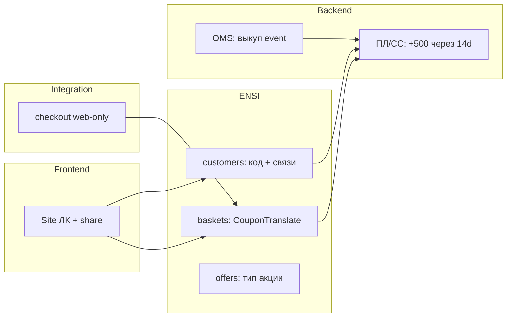

# Реферальная программа ИМ — one-pager

**Дата:** 2026-07-02 · **Владелец:** Александр · **Статус:** старт research  
**Jira:** [`OPSOMN001-743`](https://jira.gloria-jeans.ru/browse/OPSOMN001-743) (Новая, High)  
**Пакет:** [`README.md`](README.md) · [`00-requirements.md`](00-requirements.md) · [`00-PLAN.md`](00-PLAN.md)

---

## Что хотим

Реферальная программа **интернет-магазина**:

1. Каждый участник с ЛК/КЛ видит **свой уникальный промокод** и делится им.
2. Приглашённый **без выкупленных заказов в ИМ** получает **−20%** (как APP20), 1 раз, **только на сайте**.
3. После **выкупа** заказа приглашённого — через **14 дней** реферер получает **500 бонусов** (TTL 180 дней).
4. При **отмене** — повтор; при **возврате после выкупа** — нет; бонусы реферера **не отзываются**.

---

## Что уже есть (опоры)

| Компонент | As-is | Confidence |
|---|---|---|
| Применение буквенного промокода | Baskets → `RegisterPromoCodeAction` → СС CouponTranslate | confirmed (code + Conf `149781892`) |
| Rollback при отмене (APP20) | ИС `couponTranslate(rollback)` + in-basket rollback | high (OPSOMN-12310, но регресс OPSOMN001-617) |
| Одноразовость / eligibility | Правила на **Сервере скидок** (APP20), не в e-com коде | high (Confluence `149756449`) |
| Стандартные бонусы за заказ | Существующий контур ПЛ при checkout | proxy — уточнить на Stage 05 |

---

## Чего нет (предварительно)

| Компонент | Verdict |
|---|---|
| UI реферального блока в ЛК (Site) | 🔴 не найдено |
| Генерация/хранение unique promo per customer | 🔴 не найдено в ENSI customers |
| Связь referrer ↔ referee ↔ order | 🔴 нет |
| Отложенное начисление +500 через 14 дней | 🔴 паттерн не найден |
| Web-only channel restriction для нового promo type | 🟡 нужно спроектировать (есть опыт APP20/МП) |
| Аналитика воронки | 🔴 open question |

---

## Главные риски

1. **Отложенное начисление бонусов (+14d)** — может потребовать новый cron/job или доработку ПЛ/СС (Stage 05).
2. **Per-user промокоды** — СС может не поддерживать «N уникальных кодов → одна акция» out of the box; возможен batch на СС или proxy-коды через ENSI.
3. **«Выкуп» vs «доставлен» vs частичный выкуп** — нужна однозначная OMS-семантика (Stage 04).
4. **Rollback edge cases** — APP20 уже давал prod-регрессы (OPSOMN001-617); рефералка наследует ту же CouponTranslate-механику.
5. **Не путать** с HR «Приведи друга» (DEVFIN001).

---

## Зоны ответственности

---

## Следующие шаги

1. **Stage 01** — APP20 end-to-end (эталон для −20% и rollback).
2. **Stage 02** — дизайн unique promo + referrer registry (ENSI vs СС).
3. **Stage 05** — критический path: отложенное начисление (интервью с владельцем ПЛ).

**Оценка сроков:** преждевременно до Stage 09 (зависит от СС/ПЛ).

---

## Resume

Продолжить с [`00-PLAN.md`](00-PLAN.md) → Stage 01. Sync Integration repo перед глубоким код-ревью.
