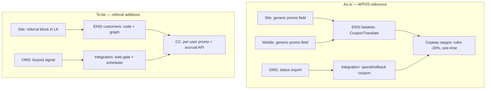

# Реферальная программа ИМ — затронутые системы и доработки

**Jira:** [`OPSOMN001-743`](https://jira.gloria-jeans.ru/browse/OPSOMN001-743)  
**Дата:** 2026-07-02 · **Статус:** research (as-is + gap), **не implementation**  
**Confidence:** high для архитектурных выводов по локальному коду; medium для конфигурации Сервера скидок (вне репо)

> Этот документ отвечает на вопрос: **какие системы затронет фича и какие доработки потребуются**.
> Stage 01 в плане = **исследование эталона APP20**, не разработка.

---

## Executive summary

Реферальная программа — **greenfield в e-com**: в коде нет referral-логики, UI, хранения связей referrer↔referee.

Переиспользуется **контур одноразовых промокодов** (APP20): baskets → CouponTranslate → Сервер скидок → Integration rollback при отмене.

**Три зоны максимального риска:**

1. **Per-user уникальные промокоды** — сегодня APP20 один на всех; нужна новая модель (ENSI customers + конфиг СС).
2. **Web-only** — в коде **нет** channel-gate для промо; только marketing или конфиг СС.
3. **+500 бонусов через 14 дней** — **нет** API начисления и отложенных job'ов; нужны СС + Integration (+ возможно Camunda).

---

## Карта систем (who does what today → what changes)

---

## 1. Site (Angular, gj-ng-front)

### As-is
- ЛК = **попап** `profile-popup`, не отдельный route.
- Промокод в чекауте — generic `promo-code-field` → `BasketFacade.addPromoCode`.
- Лояльность: `profile-discount` (карта, QR, баланс). **APP20 в FE не захардкожен**.
- Share/copy: `shared-control`, `copy-to-clipboard.util`, аналитика `analytic-promocode`, `analytic-share-basket`.

### Доработки (research estimate)
| # | Доработка | Сложность | Зависимости |
|---|---|---|---|
| S1 | Блок «Пригласи друга» в profile-popup: код, copy, share | M | API контракт от backend |
| S2 | Новый endpoint в `endpoints.const.ts` + ProfileFacade/effect | M | ENSI customers-api-web |
| S3 | i18n ru/en/kz | S | — |
| S4 | Аналитика: `referral_view`, `referral_copy`, `referral_share` | S | ECD/WA согласование |
| S5 | Опционально: лендинг акции (open question Q4) | M–L | ECD |

**Не нужно:** менять checkout promo field для реферера (он только шарит код). Приглашённый вводит код в существующем поле.

---

## 2. Mobile App (React Native)

### As-is
- Полноценный Profile stack: `PromocodesScreen`, `BonusDetailsScreen`, `QRCodeScreen`.
- Generic promo в чекауте. **Referral UI отсутствует**.

### Доработки
| # | Доработка | Сложность | Примечание |
|---|---|---|---|
| M1 | **Явный запрет** применения referral-кода в МП | S–M | FR-03: только web |
| M2 | Опционально: показ «пригласи друга» в профиле (read-only + share) | M | Если бизнес хочет шеринг из приложения |
| M3 | Backend validation обязательна | — | FE-only block недостаточен |

> Если рефералка **строго web-only**, МП может ограничиться backend-отказом при apply + отсутствием поля для referral-типа промо.

---

## 3. ENSI — baskets

### As-is (переиспользуем)
- `SetBasketDiscountAction` → `RegisterPromoCodeAction` (CouponTranslate Type=30) → GetDiscount.
- Rollback: `RollbackRegisteredPromoCodeAction` при удалении промо / смене адреса.
- «Зарегистрированный» код = **13 цифр** (`ChecksRegisteredPromoCode`).
- Anti-bruteforce: `promo_code_failed_checks_count`, block 5 мин.

### Доработки
| # | Доработка | Сложность | Примечание |
|---|---|---|---|
| B1 | Поддержка **уникальных referral-кодов** (формат TBD: буквенный vs 13-digit EAN) | M | Q2: алгоритм генерации |
| B2 | Валидация eligibility приглашённого | M | «нет выкупленных заказов» — likely на СС или через customers |
| B3 | Channel hint в запрос к СС (если gate на baskets) | M | Альтернатива: gate в Integration |
| B4 | Rollback parity с APP20 при cancel | S | Reuse existing paths |

**Offers** (`catalog/offers`) — **не участвует** в промо-логике; только цены/регионы.

---

## 4. ENSI — customers (+ customers-api-web)

### As-is
- **Нет** referral, personal promo, referrer graph.
- Profile API: card, bonuses (прокси к ПЛ), orders.

### Доработки (новый домен)
| # | Доработка | Сложность | Примечание |
|---|---|---|---|
| C1 | Генерация **уникального промокода** на клиента (идемпотентно) | M | Q2: формат, коллизии |
| C2 | Хранение **referrer ↔ referee ↔ order** | M–L | Новая таблица/сущность |
| C3 | API: `GET /referral/code` (или в profile payload) | M | Site/Mobile consume |
| C4 | Eligibility check API для приглашённого | M | «0 выкупов в ИМ» |
| C5 | OpenAPI-first → regen clients | S | ensi convention |

**Альтернатива:** хранить коды только на СС (batch per customer) — тогда customers только хранит `referral_code_id`. Архитектурное решение **TBD** (Stage 02).

---

## 5. Integration Service

### As-is (переиспользуем)
- `DiscountService::couponTranslate(rollback)` — откат трансляции.
- V4 create: rollback при fail create; `checkAndRollbackPreTranslatedPromoCode`.
- V1 STATUS_UPDATE: rollback при `CANCELLED`/`LOST` (OPSOMN-12554).
- `returnLoyalty` — возврат списанных бонусов/купонов.
- **Нет** channel-gate для промо. `sourceId` (web/mobile) используется только для **платежей**.

### Доработки
| # | Доработка | Сложность | Примечание |
|---|---|---|---|
| I1 | **Web-only gate** при apply referral promo | M | Новая проверка channel/source |
| I2 | Передача `referrer_id` / `referral_code` в order customAttributes | S | Для трассировки |
| I3 | **Таблица pending referral rewards** | M | referrer, referee, order, buyout_at, accrue_at |
| I4 | **Cron job** (+14d): начисление 500 бонусов | L | Новый паттерн в integration-cron |
| I5 | Обработка status-update: фиксация «выкупа» приглашённого | M | Stage 04 |
| I6 | Cancel в окне 14d → отмена pending reward | M | FR-05 |
| I7 | Return после выкупа → не начислять / не reuse promo | M | FR-05 |
| I8 | Новый метод **bonus accrual** в DiscountClient | M | Зависит от СС API |
| I9 | Hardening rollback (OPSOMN001-617 lessons) | M | Idempotency, не silent skip |

---

## 6. Сервер скидок (ПЛ / WWWDK) — **вне репозитория**

### As-is
- APP20: −20%, one-time, eligibility «нет выкупа» — **конфиг на СС**, не в коде GJ.
- API: GetDiscount, CouponTranslate, BonusSpend, BonusSpendExt, returnCoupon.
- **Нет** typed API «начислить N бонусов» в Integration client.

### Доработки (критический внешний контур)
| # | Доработка | Owner | Примечание |
|---|---|---|---|
| D1 | Новый **тип акции** referral −20% (или клон APP20) | СС + маркeting | Per-user codes |
| D2 | Механика **N уникальных кодов → одна акция** | СС | Может не быть OOTB |
| D3 | Eligibility: 0 выкупов, 1 use per referee | СС | Как APP20 |
| D4 | **Accrual API**: +500 бонусов, TTL 180d | СС / 1C | **Блокер Stage 05** |
| D5 | Accrual **без clawback** при return invitee | СС | FR: бонусы рефереру не списываются |
| D6 | Web-only restriction (если на стороне СС) | СС | Альтернатива I1 |

> **Без D4 фича не закрывается.** Нужна встреча с владельцем СС/ПЛ.

---

## 7. OMS (Starfish) + Camunda

### As-is
- Два словаря статусов: order-level (`delivered`, `deliveredpartly`, `canceled`) и Camunda (`COMPLETED`, `LOST`, `CANCELLED`).
- **«Выкуп»** ≈ `COMPLETED` (releaseProcess) / order `delivered` / bucket `bought` в настройке `customerOrderStatStatuses` (Settings DB, runtime).
- На каждый status change → `STATUS_UPDATED` → `dwhStatusUpdate` → export `status-update` в Integration.
- Лояльность в OMS: только **return списанных** (`gjOrderLoyaltyReturn`), **не accrual**.
- Loymax integration в коде OMS есть, но **для GJ не подключён**.

### Доработки
| # | Доработка | Сложность | Примечание |
|---|---|---|---|
| O1 | Зафиксировать контракт «выкуп» для referral | S | `customerOrderStatStatuses.bought` на prod |
| O2 | Убедиться, что `status-update` export несёт данные для Integration trigger | S | Частичный выкуп `deliveredpartly` — open |
| O3 | **Опционально:** BPMN-процесс с timer P14D вместо Integration cron | L | Архитектурная развилка |
| O4 | **Скорее не нужно:** менять releaseProcess для accrual | — | Accrual — зона СС/ИС |

**Partial fulfillment:** если `deliveredpartly` = выкуп — нужно бизнес-решение (Q7).

---

## 8. Admin GUI (ENSI)

### Доработки (вероятно)
| # | Доработка | Сложность |
|---|---|---|
| A1 | Настройка referral-акции (если не только СС) | M |
| A2 | Просмотр referral-связей / ручной resolve | L (optional) |

---

## 9. DWH / Analytics

### Доработки
| # | Доработка | Owner |
|---|---|---|
| W1 | События воронки: view → share → apply → order → buyout → reward | WA + FE |
| W2 | DWH: referral attribution в заказах | DWH |
| W3 | `status-update` уже несёт статусы — использовать для сверки | — |

---

## 10. Системы, которые **не затронуты** (или минимально)

| Система | Почему |
|---|---|
| **Gloria OTS** | Рефералка — pre-checkout / loyalty, не логистика |
| **1С (WMS/retail)** | Кроме возможного accrual через ПЛ-контур |
| **Offers/PIM** | Нет promo rules |
| **Order-group-service** | Нет связи с promo |
| **HR «Приведи друга»** | Другой домен (DEVFIN001) |

---

## Сводная таблица: объём доработок по системам

| Система | Reuse APP20 | New work | Risk |
|---|---|---|---|
| **Сервер скидок** | CouponTranslate, GetDiscount | Per-user codes, accrual API, no-clawback | 🔴 Critical |
| **Integration** | Rollback paths | Web gate, scheduler +14d, pending table, accrual client | 🔴 High |
| **ENSI customers** | Profile API | Code gen, referrer graph, new endpoints | 🟠 Medium |
| **ENSI baskets** | Full promo lifecycle | Referral code format, eligibility hook | 🟡 Low–Med |
| **Site** | Promo field, share/copy | Referral LK block, analytics | 🟡 Medium |
| **Mobile** | — | Block apply / optional share UI | 🟢 Low (if web-only) |
| **OMS** | status-update export | Define «buyout» contract | 🟡 Medium |
| **Admin GUI** | — | Optional config UI | 🟢 Low |
| **DWH/Analytics** | status stream | Funnel events | 🟡 Medium |

---

## Архитектурные развилки (нужны решения до оценки)

| # | Вопрос | Варианты |
|---|---|---|
| R1 | Где хранить unique promo + graph? | ENSI customers vs СС vs hybrid |
| R2 | Где timer +14d? | Integration cron vs Camunda P14D vs СС scheduler |
| R3 | Где web-only gate? | Integration vs baskets vs СС |
| R4 | Формат referral code | Буквенный (как APP20 input) vs 13-digit EAN |
| R5 | Частичный выкуп триггерит reward? | Да / нет / только full `delivered` |
| R6 | Accrual API на СС существует? | Да (какой) / нет (строим) |

---

## Open questions → owners

| Q | Вопрос | Кому |
|---|---|---|
| Q2 | Алгоритм unique promo | BA + СС + ensi-architect |
| Q3 | +14d mechanism | integration-architect + владелец ПЛ |
| Q4 | Лендинг vs ЛК | ECD + product |
| Q5 | Analytics | WA |
| Q7 | Статус «выкуп» | oms + BA (проверить `customerOrderStatStatuses` prod) |
| Q8 | Тип акции на СС | СС + marketing |

---

## Что дальше в **research** (не implementation)

| Stage | Тема | Цель |
|---|---|---|
| ~~00~~ | Setup | ✅ Done |
| 01 | APP20 deep-dive + Confluence СС | Подтвердить правила DS22, rollback gaps |
| 02 | Unique promo + graph design | Развилка R1, R4 |
| 03 | Web-only channel | Развилка R3 |
| 04 | Buyout trigger | R5, prod settings |
| 05 | +500 accrual | **R2, R6 — блокер** |
| 06 | Cancel/return matrix | FR-05 test cases |
| 07–08 | FE + analytics spec | Contract draft |
| 09 | Synthesis + indicative estimate | Roadmap |

---

## Связанные документы

- [`00-requirements.md`](00-requirements.md)
- [`ONE-PAGER.md`](ONE-PAGER.md)
- [`../2026-06-03-app20-cancel-restore-OPSOMN001-617.md`](../2026-06-03-app20-cancel-restore-OPSOMN001-617.md)
- Confluence `149781892`, `149756449`, `130133718`
