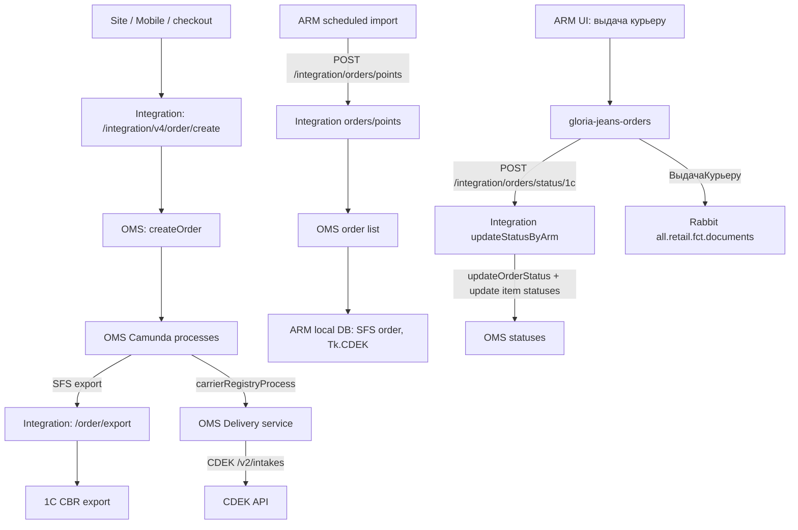

# SFS CDEK as-is: жизненный цикл заказа и границы систем

Дата: 2026-06-26

Цель документа: зафиксировать текущую as-is логику SFS CDEK как базу для проектирования Яндекс Express SFS. Основной вопрос расследования: кто создает заказ, кто регистрирует/вызывает курьера в ТК, кто передает статусы, и какую роль играют Integration Service, OMS, ARM/Gloria Retail, 1C и OTS.

## Краткий вывод

Для SFS CDEK магазинный контур **не интегрируется напрямую с API CDEK**.

Разделение такое:

- Ecom/Integration создает заказ в OMS.
- OMS/Camunda ведет процесс и запускает регистрацию/вызов курьера через OMS Delivery service.
- OMS Delivery service вызывает CDEK API.
- ARM/Gloria Retail забирает SFS заказы из OMS через Integration, исполняет магазинные операции и отправляет статусы обратно через Integration.
- Integration на обратном пути не просто проксирует XML, а обновляет статус заказа и статусы позиций в OMS.
- OTS в найденном SFS CDEK потоке не участвует; он остается в складских/других ветках.

## Схема



## Системы и ответственность

### Integration Service

Роль:

- принимает создание заказа от ecom;
- передает заказ в OMS;
- отдает ARM список заказов по магазину;
- принимает статусы из ARM;
- пересчитывает статусы позиций по составу, который прислал ARM;
- вызывает OMS API для обновления статуса заказа и позиций;
- выполняет внешние экспорты из OMS process, например `1c-cbr`, `1c-ecom`, `ots`, но для SFS релизный процесс идет в `1c-cbr`.

Ключевые файлы:

- `platform/integration/integration/www/app/Service/UserApi/routes/api.php`
  - `POST /integration/orders/points`
  - `POST /integration/orders/status/1c`
  - `POST /integration/v2/orders/status/1c`
  - `POST /integration/v4/order/create`
  - `POST /order/export`
- `platform/integration/integration/www/app/Service/UserApi/Services/V4/Order/OrderService.php`
  - выбранный delivery interval заполняет `fulfillmentTypeId`, `carrierId`, `carrierTariffId`;
  - далее вызывается `OmsClient::createOrder($order)`.
- `platform/integration/integration/www/app/Service/UserApi/Http/Controllers/V1/Order/OrderQueryController.php`
  - метод `getOrdersByShopId()` обслуживает ARM pull endpoint `/integration/orders/points`.
- `platform/integration/integration/www/app/Service/UserApi/Http/Controllers/V2/Order/OrderActionController.php`
  - метод `updateStatusByArm()` принимает статусы ARM.
- `platform/integration/integration/www/app/Service/UserApi/Services/V2/Order/OrderService.php`
  - `updateStatusByArmV2()`;
  - `updateArmOrderStatus()` вызывает `OmsClient::updateOrderStatus`;
  - для позиций вызывает `OmsClient::updateOrderItemStatusByOrderId`.
- `platform/integration/integration/www/app/Service/OmsClient/Clients/Client.php`
  - `updateOrderStatus()` -> `/client/order/status/{clientOrderId}/{statusId}/update`;
  - `updateOrderItemStatusByOrderId()` -> `/item/status/{orderId}/update`.

### OMS / Camunda

Роль:

- основной orchestrator жизненного цикла заказа;
- хранит и меняет статусы;
- запускает экспорт SFS заказа в `1c-cbr`;
- запускает процесс регистрации/вызова курьера на магазин;
- ожидает события/статусы от ARM;
- для SFS CDEK содержит специальные условия `carrierId == 'cdek'`.

Ключевые BPMN:

- `platform/starfish24/awg/bpmn-process/process/gloriajeans/releaseProcess.bpmn`
- `platform/starfish24/awg/bpmn-process/process/gloriajeans/exportForPicking.bpmn`
- `platform/starfish24/awg/bpmn-process/process/gloriajeans/dispatchProcess.bpmn`
- `platform/starfish24/awg/bpmn-process/process/gloriajeans/carrierRegistryProcess.bpmn`
- `platform/starfish24/awg/bpmn-process/process/gloriajeans/pickingProcess.bpmn`

### OMS Delivery service

Роль:

- реализует интеграцию с ТК для вызова курьера;
- для CDEK вызывает CDEK courier intake API;
- умеет проверять статус вызова курьера.

Ключевые файлы:

- `platform/starfish24/core/Delivery/src/main/java/com/starfish24/delivery/controller/CarrierController.java`
  - `POST /carrier/{particularCarrierId}/couriercall/request`;
  - `GET /carrier/{particularCarrierId}/couriercall/{carrierCourierCallId}/request`.
- `platform/starfish24/core/Delivery/src/main/java/com/starfish24/delivery/service/carrier/CarrierServiceImpl.java`
  - выбирает `CourierRequestService` по carrier.
- `platform/starfish24/core/Delivery/src/main/java/com/starfish24/delivery/service/carriers/cdek/CdekCourierRequestServiceImpl.java`
  - собирает request body для CDEK;
  - вызывает `cdekClient.courierRequest(...)`.
- `platform/starfish24/core/Delivery/src/main/java/com/starfish24/delivery/service/client/CdekClientImpl.java`
  - отправляет запрос на `cdek.courier.url`, в конфиге это `/v2/intakes`.
- `platform/starfish24/awg/cloud-configs/delivery-gj-prod.yaml`
  - `cdek.courier.url: https://api.cdek.ru/v2/intakes`.

### ARM / Gloria Retail

Роль:

- магазинный UI и backend для исполнения SFS;
- по расписанию забирает заказы из OMS через Integration;
- создает локальные SFS документы;
- сейчас для SFS жестко ставит `Tk.CDEK`;
- дает экран выдачи курьеру;
- при выдаче отправляет `DELIVERING` в OMS через Integration;
- при продаже/завершении отправляет `COMPLETED`;
- формирует документ `ВыдачаКурьеру` и отправляет его в Rabbit.

Ключевые репозитории:

- `platform/arm/gloria-jeans-ui-server`
- `platform/arm/gloria-jeans-orders`
- `platform/arm/gloria-jeans-core`

Ключевые файлы:

- `platform/arm/gloria-jeans-orders/src/main/java/ru/gloria_jeans/orders/component/OrdersOmsImportJob.java`
  - по расписанию вызывает `importOrdersFromOms()` и `importOmsOrdersToLocalDatabase()`.
- `platform/arm/gloria-jeans-orders/src/main/java/ru/gloria_jeans/orders/configuration/QuartzConfig.java`
  - планирует `ordersOmsImportJob` с интервалом `orders.import_job_timeout`.
- `platform/arm/gloria-jeans-orders/src/main/java/ru/gloria_jeans/orders/services/OmsService.java`
  - `getOrdersFromOms()` -> `POST {omsUrl}/integration/orders/points`;
  - `sentOrdersToOms()` -> `POST {omsUrl}/integration/orders/status/1c`;
  - `updateOmsStatusAndWriteExportStatus()` собирает XML статуса для OMS.
- `platform/arm/gloria-jeans-orders/src/main/java/ru/gloria_jeans/orders/services/ImportOrdersFromOmsService.java`
  - при `WAIT_EXPORT_TO_WAREHOUSE` создает локальный SFS заказ;
  - при `ORDER_FOR_SHIPPING` переводит локальный SFS в `READY_FOR_DELIVERY`;
  - при создании SFS `OrderDocument` ставит `ShippingMethod.PICKUP_SFS, Tk.CDEK`.
- `platform/arm/gloria-jeans-ui-server/src/main/java/ru/gloria_jeans/ui/server/jetpackcompose/view/wirehouse/internet_orders/InternetOrderCourierDeliveryScreenView.java`
  - рисует кнопку выдачи курьеру;
  - сейчас кнопка жестко `cdek`.
- `platform/arm/gloria-jeans-orders/src/main/java/ru/gloria_jeans/orders/controller/OrdersController.java`
  - `GET /collect/orders/for/delivery?tk=...`;
  - `POST /finish/issuing/orders?tk=...&employeeId=...`.
- `platform/arm/gloria-jeans-orders/src/main/java/ru/gloria_jeans/orders/services/OrdersService.java`
  - `getOrdersForDelivery(String tk)`;
  - `finishIssuingOrders(...)`;
  - `updateOmsStatusAndWriteExportStatus(...)`;
  - `exportOrderCourierIssues()`.
- `platform/arm/gloria-jeans-orders/src/main/java/ru/gloria_jeans/orders/services/RabbitService.java`
  - отправляет XML документ `ВыдачаКурьеру` в Rabbit.
- `platform/arm/gloria-jeans-core/src/main/java/ru/gloria_jeans/core/v1/orders/enums/Tk.java`
  - сейчас есть `CDEK`, `PICK_POINT`, `RUSSIAN_POST`;
  - Яндекс Express в main не найден.

### 1C

В текущем найденном SFS CDEK потоке 1C виден как учетный/документный контур:

- OMS `releaseProcess` для SFS экспортирует заказ в `1c-cbr`;
- ARM формирует `ВыдачаКурьеру` и отправляет документ в Rabbit;
- Java ARM использует onec-db-mapper/локальную retail DB.

При этом UI выдачи курьеру и отправка статусов находятся в Java ARM, а не в 1C форме.

### OTS

По найденным BPMN OTS не участвует в SFS CDEK:

- в `releaseProcess.bpmn` SFS ветка идет в `1c-cbr`;
- OTS export в `releaseProcess.bpmn` привязан к другой ветке, например C&C;
- в `exportForPicking.bpmn` OTS вызывается только на ветках `fulfillment`, SFS идет мимо OTS.

## Детальный lifecycle

### 1. Выбор доставки и создание заказа

В ecom checkout выбирается delivery interval. Integration V4 заполняет shipping:

- `deliveryCost`
- `actualDeliveryCost`
- `fulfillmentTypeId`
- `carrierId`
- `carrierTariffId`
- `deliveryIntervalId`
- `dispatchWarehouseId`
- `dispatchDate`

Файл:

- `platform/integration/integration/www/app/Service/UserApi/Services/V4/Order/OrderService.php`

Дальше Integration создает заказ в OMS через `OmsClient::createOrder($order)`.

Фактическое значение для SFS CDEK должно быть:

- `fulfillmentTypeId = sfs`
- `carrierId = cdek`
- `deliveryTypeId = delivery`

### 2. Маппинг типа доставки в Integration

В Integration уже есть явное правило:

`delivery + sfs + cdek -> SFS_CDEK = 111`

Файлы:

- `platform/integration/integration/www/app/Service/Consts/Contracts/Maps/Delivery/GloriaJeans/DeliveryTypeCodeMapByRulesContract.php`
- `platform/integration/integration/www/app/Service/Consts/Contracts/Maps/Delivery/Cbr/DeliveryTypeCodeMapByRulesContract.php`
- `platform/integration/integration/www/app/Service/Consts/Enums/Delivery/GloriaJeans/DeliveryTypeCodeEnum.php`

Это важно для будущего Яндекс Express: аналогичного правила для `delivery + sfs + yandex` или отдельного `yandexExpress` сейчас нет.

### 3. OMS release process: SFS уходит в 1C CBR, не в OTS

В `releaseProcess.bpmn` есть gateway:

- если `fulfillmentType == 'sfs'`, заказ идет на `Activity_1wlfbmv`;
- `Activity_1wlfbmv` называется "Выгрузка заказа в 1С ЦБР";
- destination: `1c-cbr`.

В этом же файле есть `Activity_1fn5io6` "Выгрузка заказа в OTS", но она связана с другой веткой, например `deliveryTypeId == 'pickupinstore'`.

Вывод: SFS CDEK не уходит в OTS на release step.

### 4. OMS exportForPicking: SFS не уходит в OTS

В `exportForPicking.bpmn` два места с экспортом в OTS:

- "Выгрузка заказа в OTS (подтверждение частичного резерва)";
- "Выгрузка заказа в OTS (подтверждение заказ)".

Оба связаны с ветками `fulfillment`.

Для SFS процесс идет через ветки "Да" в gateway "C&R или SFS?", минуя OTS, после чего ставится:

- статус заказа `WAIT_EXPORT_TO_WAREHOUSE`;
- статус позиций `WAIT_EXPORT_TO_WAREHOUSE`.

Это тот статус, который потом забирает ARM.

### 5. ARM импортирует SFS заказ

ARM сам по расписанию выполняет import job:

- `OrdersOmsImportJob.execute()`
  - `importOrdersFromOms()`
  - `importOmsOrdersToLocalDatabase()`

`ImportOrdersFromOmsService.importOrdersFromOms()` строит request по текущему магазину:

- `OrderCreatePushRequestMapper.map(referenceService.getCurrentWarehouse().getIdd())`

Затем вызывает:

- `OmsService.getOrdersFromOms(request)`
- HTTP `POST {omsUrl}/integration/orders/points`

На стороне Integration:

- route `/integration/orders/points`
- controller `OrderQueryController@getOrdersByShopId`
- service `getOrderListByShopId($shopId)`
- presenter `OrderList1CAPMPresenter` / `Order1CAPMPresenter`

### 6. ARM создает локальный SFS документ

Когда в ответе OMS/Integration приходит SFS заказ в статусе `WAIT_EXPORT_TO_WAREHOUSE`, ARM создает локальные сущности.

В `ImportOrdersFromOmsService.processOrderDocument()`:

```java
DocumentMapper.map(
    omsResponseOrder,
    OrderType.SFS,
    OrderStatus.NEW,
    idd,
    ShippingMethod.PICKUP_SFS,
    Tk.CDEK,
    warehouse.getIdd(),
    warehouse.getFirm().getIdd()
)
```

Вывод: текущий main-код ARM жестко считает SFS доставку курьером как `Tk.CDEK`.

### 7. OMS переводит SFS к выдаче

В `dispatchProcess.bpmn` есть шаги, которые переводят заказ в `ORDER_FOR_SHIPPING`.

Кодовые точки:

- `Activity_0gtmk0o` "Смена статуса заказа на ORDER_FOR_SHIPPING";
- `Activity_1stz86r` "Смена статуса заказа на ORDER_FOR_SHIPPING" для `carrierId == 'gjexpress'`;
- текстовая аннотация: "АРМ забирает заказ в этом статусе".

В ARM это соответствует логике:

- если OMS order status `ORDER_FOR_SHIPPING` и order type SFS, локальный заказ становится `READY_FOR_DELIVERY`.

Файл:

- `platform/arm/gloria-jeans-orders/src/main/java/ru/gloria_jeans/orders/services/ImportOrdersFromOmsService.java`

### 8. OMS запускает процесс вызова курьера

В `dispatchProcess.bpmn` есть service task:

- "Запуск процесса вызова курьера на магазин выдачи";
- delegate: `carrierRegistryActivity`;
- processId: `carrierRegistryProcess`.

Файл:

- `platform/starfish24/awg/bpmn-process/process/gloriajeans/dispatchProcess.bpmn`

Java delegate:

- `platform/starfish24/core/Camunda/src/main/java/com/starfish24/bpm/engine/activity/CarrierRegistryActivity.java`
  - берет `carrierId`, `dispatchWarehouseId`, `processId`, `dispatchDate`;
  - вызывает `CarrierRegistryService.register(...)`.
- `platform/starfish24/core/Camunda/src/main/java/com/starfish24/bpm/engine/services/CarrierRegistryServiceImpl.java`
  - стартует BPM process с business key `dispatchWarehouseId + "_" + carrierId + "_" + dispatchDate`.

### 9. carrierRegistryProcess вызывает курьера CDEK

В `carrierRegistryProcess.bpmn`:

- для `carrierId == 'cdek'` выставляется таймер `12:00`;
- затем выполняется task "Вызов курьера в магазин";
- дальше для CDEK выполняется проверка вызова курьера через topic `carrierCourierCallTracking`.

Файлы:

- `platform/starfish24/awg/bpmn-process/process/gloriajeans/carrierRegistryProcess.bpmn`
- `platform/starfish24/core/Camunda/src/main/java/com/starfish24/bpm/engine/activity/CarrierCourierCallActivity.java`
- `platform/starfish24/core/camunda-worker/src/main/java/com/starfish24/handlers/CarrierCourierCallTrackingHandler.java`

`CarrierCourierCallActivity` вызывает Delivery service:

- `POST /carrier/{carrierId}/couriercall/request`.

`CarrierCourierCallTrackingHandler` проверяет статус:

- `GET /carrier/{particularCarrierId}/couriercall/{carrierCourierCallId}/request`.

### 10. OMS Delivery вызывает CDEK API

В Delivery service:

- `CarrierController.callCourier()` получает `POST /carrier/{particularCarrierId}/couriercall/request`;
- `CarrierServiceImpl.callCourier()` выбирает `CourierRequestService`;
- для CDEK используется `CdekCourierRequestServiceImpl`;
- он вызывает `cdekClient.courierRequest(...)`;
- `CdekClientImpl.courierRequest()` делает `postForObject(callCourierUrl, ...)`.

В конфиге:

- `platform/starfish24/awg/cloud-configs/delivery-gj-prod.yaml`
  - `cdek.courier.url: https://api.cdek.ru/v2/intakes`.

Вывод: вызов курьера CDEK выполняет OMS Delivery service, не ARM.

### 11. ARM UI показывает заказы на выдачу курьеру

UI:

- `InternetOrderCourierDeliveryScreenView`
  - кнопка жестко `cdek`;
  - action ведет на screen списка заказов с `tk=Tk.CDEK.getName()`.

Backend ARM:

- `OrdersController.getCollectOrdersForDelivery(tk)`
  - `GET /collect/orders/for/delivery?tk=...`;
- `OrdersService.getOrdersForDelivery(String tk)`
  - переводит `tk` через `Tk.fromString(tk)`;
  - ищет `OrderStatus.READY_FOR_DELIVERY`;
  - фильтрует по transport company и `ShippingMethod.PICKUP_SFS`.

Вывод: текущая выдача курьеру в ARM CDEK-only по UI и по локальному mapping.

### 12. ARM завершает выдачу курьеру

UI вызывает:

- `POST /internet/orders/finish/issuing/orders`.

Дальше backend:

- `OrdersController.finishIssuingOrders(tk, employeeId)`;
- `OrdersService.finishIssuingOrders(transportCompany, employeeId)`.

Логика:

- берет отсканированные документы по `transportCompany` и `PICKUP_SFS`;
- формирует `OrderCourierIssue`;
- сохраняет документы выдачи курьеру;
- отправляет в OMS статус `DELIVERING`;
- локально переводит документ в `ISSUED_TO_COURIER`;
- списывает резерв `OMNI_RESERVE`;
- запускает `exportOrderCourierIssues()`.

Файлы:

- `platform/arm/gloria-jeans-orders/src/main/java/ru/gloria_jeans/orders/controller/OrdersController.java`
- `platform/arm/gloria-jeans-orders/src/main/java/ru/gloria_jeans/orders/services/OrdersService.java`

### 13. ARM отправляет статус в OMS через Integration

ARM собирает XML:

- `OmsService.updateOmsStatusAndWriteExportStatus(...)`;
- `RequestOrderMapper.map(...)`;
- `OmsOrderStatusRequestMapper.map(...)`.

Дальше:

- `OmsService.sentOrdersToOms(...)`;
- `POST {omsUrl}/integration/orders/status/1c`.

На стороне Integration:

- `POST /integration/orders/status/1c`;
- `POST /integration/v2/orders/status/1c`;
- V2 controller вызывает `OrderService.updateStatusByArmV2($data['order'])`.

Integration:

- получает `order_id`, `status_code`, `items`;
- проверяет текущий статус OMS;
- обновляет статус заказа через `OmsClient::updateOrderStatus`;
- собирает статусы позиций:
  - товары, пришедшие от ARM, получают статус;
  - отсутствующие/недособранные могут стать `CANCELLED`;
  - для `SUSPENDED` есть особая логика;
- обновляет позиции через `OmsClient::updateOrderItemStatusByOrderId`.

Вывод: OMS не опрашивает магазин за статусами. Статусы из магазина идут push-ом: ARM -> Integration -> OMS.

### 14. ARM отправляет документ "ВыдачаКурьеру" в Rabbit

После выдачи:

- `OrdersController.finishIssuingOrders()` вызывает `ordersService.exportOrderCourierIssues()`;
- `OrdersService.exportOrderCourierIssues()` отправляет невыгруженные `OrderCourierIssue`;
- `RabbitService.finishIssuingOrders()` отправляет XML в Rabbit.

Rabbit headers:

- `country`;
- `service`;
- `type`;
- `source`;
- `documentHeader`.

Exchange:

- `all.retail.fct.documents`.

Файлы:

- `platform/arm/gloria-jeans-orders/src/main/java/ru/gloria_jeans/orders/services/RabbitService.java`
- `platform/arm/gloria-jeans-orders/src/main/java/ru/gloria_jeans/orders/configuration/RabbitMQConfig.java`

### 15. Завершение заказа

При продаже/появлении чеков ARM переводит локальный заказ в `COMPLETED` и отправляет в OMS статус `COMPLETED`.

Кодовая точка:

- `OrdersService` около логики обработки `purchasedReceipts`;
- вызов `updateOmsStatusAndWriteExportStatus(receipt.getOrderNumber(), StatusCode.COMPLETED, ...)`.

В OMS `releaseProcess.bpmn` при `COMPLETED` есть gateway "SFS и CDEK?":

- если `fulfillmentType == 'sfs' && carrierId == 'cdek'`;
- всем товарам ставится `COMPLETED`.

Файл:

- `platform/starfish24/awg/bpmn-process/process/gloriajeans/releaseProcess.bpmn`

Для Яндекс Express это место нужно будет расширять, если новый carrier id не `cdek`.

## Статусы в as-is потоке

Упрощенная последовательность:

1. Создание заказа в OMS.
2. `WAIT_EXPORT_TO_WAREHOUSE`
   - OMS готовит заказ к передаче в магазин;
   - ARM импортирует заказ и создает локальный документ `NEW`.
3. `ORDER_FOR_SHIPPING`
   - OMS переводит заказ к выдаче курьеру;
   - ARM при следующем импорте переводит локальный документ в `READY_FOR_DELIVERY`.
4. `DELIVERING`
   - ARM отправляет при выдаче заказа курьеру;
   - OMS ловит событие `DELIVERING (АРМ)`.
5. `COMPLETED`
   - ARM отправляет после завершения продажи/чека;
   - OMS завершает заказ и позиции.

Дополнительные статусы:

- `SUSPENDED` - частичная/проблемная сборка, Integration мапит позиции особым образом.
- `CANCELLED` / `CANCELLING` - отмены, есть отдельные ветки в ARM и OMS.
- `ORDER_PICKUP` - используется в picking process и некоторых ARM операциях, но ключевой SFS выдаче курьеру соответствует `DELIVERING`.

## Проверенные факты по вопросу "кто с кем интегрируется"

### Магазин/ARM и ТК

Подтверждено по коду ARM:

- прямых вызовов CDEK API из `gloria-jeans-orders`, `gloria-jeans-ui-server`, `gloria-jeans-core` не найдено;
- есть только `Tk.CDEK`, UI, фильтрация, локальные документы, статусы в OMS, Rabbit-документы.

Вывод: ARM не интегрируется с ТК как API-клиент CDEK.

### OMS и ТК

Подтверждено:

- `carrierRegistryProcess` вызывает курьера;
- Camunda activity/worker вызывает Delivery service;
- Delivery service вызывает CDEK courier API;
- CDEK URL находится в `delivery-gj-prod.yaml`.

Вывод: регистрация/вызов курьера - зона OMS/Delivery.

### OMS и магазинные статусы

Подтверждено:

- ARM сам отправляет статусы через `POST /integration/orders/status/1c`;
- Integration обновляет OMS.

Вывод: OMS не "забирает" статусы магазина сам; магазинный контур их пушит.

### OMS и OTS

Подтверждено:

- SFS ветка в `releaseProcess` идет в `1c-cbr`;
- OTS в `releaseProcess` и `exportForPicking` не используется для SFS CDEK.

Вывод: OTS не является участником as-is SFS CDEK исполнения.

## Как использовать AS-IS для Яндекс Экспресс

Этот документ описывает локальную версию CDEK SFS и остается эталоном магазинного lifecycle, но не спецификацией новой версии Starfish24.

Актуальные выводы:

- Яндекс Экспресс должен сохранить SFS reserve/assembly/handover/status flow.
- `yandexNextDayDelivery` не является кандидатом: это отдельный складской продукт.
- По сообщению Starfish24, Yandex Express capability уже существует в новых версиях OMS и требует настройки 1–2 недели.
- Поэтому локальные CDEK-specific BPMN gateway используются как acceptance checklist, а не как доказательство обязательной разработки OMS со стороны e-commerce.
- E-commerce должен получить exact interval/order contract и адаптировать Integration, customer-api-web, Site и Mobile.
- Retail/ARM/1C должен подтвердить, что carrier identity не ломает существующую сборку и выдачу курьеру.
- OTS остается вне target, если тестовый order route Starfish24 подтверждает экспорт SFS в `1c-cbr`.

Обязательный открытый вопрос Starfish24:

> Предоставить пример delivery interval и OMS order из новой версии с Яндекс Экспресс: точные carrier/tariff/delivery/fulfillment ids, source store, dynamic price, prepaid restriction, timezone/working-hours semantics и quote TTL.

Детальный target и нарезка находятся в `sfs-yandex-target-process.md` и `implementation-slices.md`.

## Риски интерпретации

- Документ построен по локальным main/current branches. Новая версия Starfish24 и retail feature/release branches могут содержать более свежую реализацию.
- Настройки OMS могут отличаться по окружениям; для runtime-истины нужно проверять deployed config/settings.
- В OMS есть несколько похожих компонентов Camunda: embedded Java delegates и external workers. Для бизнес-границы это не меняет вывод: вызов курьера идет через OMS/Delivery, не через ARM.
