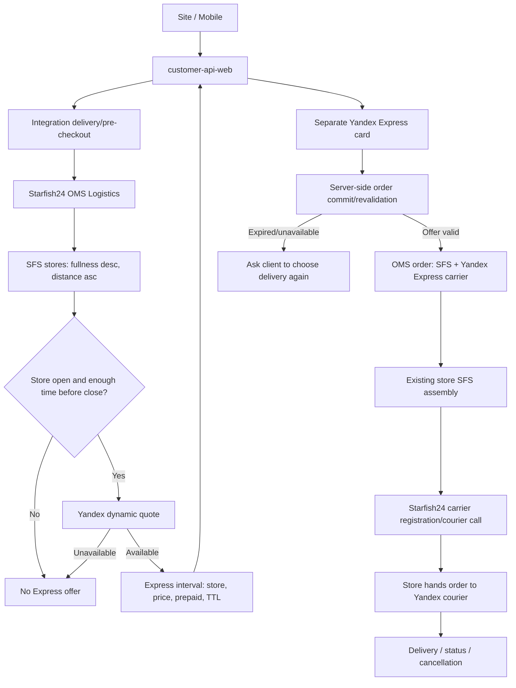

# Yandex Express SFS: target process

Дата актуализации: 2026-07-10

## Цель

Добавить отдельный пользовательский способ «Яндекс Экспресс», сохранив магазинный SFS lifecycle: магазин получает, собирает и передает заказ курьеру; Яндекс выполняет доставку клиенту.

`yandexNextDayDelivery` полностью исключен из target: это доставка со склада в ПВЗ.

## Архитектурное решение

- Frontend method: отдельный `express` рядом со стандартной courier delivery.
- OMS carrier: отдельный carrier из новой версии Starfish24; точная строка открыта.
- Fulfillment: `sfs`.
- OMS delivery type: ожидаемо `delivery`, но фиксируется только после payload Starfish24.
- Order lifecycle: общий SFS lifecycle, carrier-specific транспортная часть принадлежит Starfish24.
- Retail: тот же операционный процесс магазина, но carrier/учетный mapping должен быть распознан.
- OTS: вне target, пока Starfish24 не покажет обратное в реальном order route.

## Source status

Подтверждено локальным e-commerce кодом:

- V4 Integration переносит carrier/fulfillment из server-side selected interval;
- Integration не знает отдельный Yandex Express carrier и не имеет его SFS/CBR mapping;
- customer-api-web относит к Express только `gjexpress`;
- Site и Mobile не имеют завершенного активного Express delivery flow.

Получено от Starfish24, но требует contract evidence:

- интеграция Яндекс Экспресс реализована в новых OMS-версиях;
- GJ требуется настройка, ориентир 1–2 недели.

Локальные BPMN `dispatchProcess`, `carrierRegistryProcess`, `releaseProcess` остаются AS-IS evidence, но не являются доказательством target version Starfish24.

## Target flow



## Availability and source-store selection

Starfish24/OMS Logistics is source of truth. Frontend and Integration must not calculate store opening hours or select a store independently.

Eligibility:

```text
store can assemble selected basket
AND store participates in pilot/Yandex Express
AND store is open in source-store timezone
AND now + picking SLA + handover buffer <= store close
AND Yandex returned a valid quote
AND availablePaymentTypes = [prepaid]
```

Selection priority:

1. Quantity/fullness descending.
2. Distance from store to client ascending.
3. Applicable carrier tariff priority.
4. Delivery date/time.

Important edge cases:

- warehouse availability must not suppress Express;
- CDEK and Yandex Express may both be shown;
- missing timezone/schedule should be fail-closed for Express, not treated as 24/7;
- holiday/special schedule overrides regular hours;
- an open store may still be ineligible near closing;
- delivery to the client may finish after store close if the order was handed over before close.

## Starfish24 contract boundary

Starfish24 owns:

- carrier and tariff configuration;
- pilot availability and independent disable switch;
- store ranking and working-hours/cutoff logic;
- Yandex quote and its TTL;
- prepaid restriction in the delivery option;
- carrier registration/courier call/cancel/tracking;
- OMS/Camunda state transitions and retries;
- test-stand evidence that CDEK SFS is unchanged.

Open question to ask Starfish24:

> Provide one real test payload for delivery interval and resulting OMS order, including carrier/tariff/delivery/fulfillment ids, store id, dynamic price, payment types, interval timestamps, timezone semantics and offer expiration. Also identify the OMS version/configuration where this is supported.

Until this answer, all field names in target examples are placeholders.

## Integration Service target

### Pre-checkout and order create

- Preserve the server-side selected interval as source of truth.
- Pass exact `carrierId`, `carrierTariffId`, `fulfillmentTypeId`, interval id/store and cost to OMS.
- Revalidate delivery option at commit.
- Do not substitute CDEK automatically if Express disappeared.
- Return a business error that lets Site/Mobile refresh delivery methods.

The active V4 code already assigns `fulfillmentTypeId`, `carrierId` and `deliveryIntervalId` from selected interval; expected work here is contract testing rather than carrier-specific branching.

### Accounting/export

After receiving Starfish24 and Retail/1C values:

- add a separate OMS carrier enum;
- add/confirm `SFS_YANDEX_EXPRESS` accounting code and name;
- add GloriaJeans and CBR mapping rules;
- update active legacy V1 resolver/CBR mutator branches;
- add/confirm ARM delivery good id/barcode mapping;
- do not add OTS mapping for the SFS route;
- regression-test CDEK SFS and historical Yandex Next Day.

## customer-api-web target

Support both contract generations:

- old delivery response: classify the new carrier into `deliveryExpress`;
- General Data: expose separate delivery method `express`;
- do not classify `yandexNextDayDelivery` as Express;
- fix `DeliveryType::toClientResponse()` for `EXPRESS`;
- pass dynamic price, `prepaid`, interval/store and selected state;
- keep warehouse courier options alongside Express;
- on commit failure refresh methods and require explicit reselection.

Carrier classification should be an explicit allowlist/config or semantic backend field. A global rename of `EXPRESS_CARRIER_ID=gjexpress` is unsafe if GJ Express remains active.

## Site target

- Add `EXPRESS` to active delivery method/state contracts.
- Render a separate card «Яндекс Экспресс» with SLA and dynamic price.
- Reuse courier address where appropriate, but keep a distinct selected method/interval.
- Never apply generic free-delivery threshold to Express.
- Show only prepaid methods and reset previously selected COD.
- Preserve both Express and standard courier cards.
- Handle disappearing/expired offer without silent fallback.
- Send analytics for impression, select, price, unavailable and order success/failure.

## Mobile target

- Add Express method, route/screen mode, state and selection handling.
- Reuse courier interval UI only if carrier/method identity remains distinct.
- Implement the same price/payment/availability/stale-offer rules as Site.
- Define compatibility for old app versions: backend must not auto-select an unsupported Express method.
- Roll out behind server/config gating and collect versioned analytics.

The existing text label «Экспресс» is not evidence of implemented checkout support.

## Retail/ARM/1C target

The business requirement says the store process does not materially change. This still requires technical confirmation:

- order import accepts the new carrier/accounting type;
- store sees the usual SFS assembly task;
- courier handover action is not CDEK-hardcoded;
- delivery good/barcode is correct;
- statuses return through the existing Integration route;
- Yandex callbacks and ARM statuses do not conflict at finalization.

If Retail can treat the carrier as ordinary SFS without a new accounting type, document that explicit decision and remove unnecessary Integration mappings.

## Error handling

| Situation | Expected behavior |
|---|---|
| Store closed / cutoff passed | OMS does not return Express offer. |
| Missing store timezone/schedule | Fail closed for Express and alert on configuration. |
| Yandex quote unavailable | Hide Express; leave other methods. |
| Quote expires before commit | Reject Express selection as a business error; refresh methods. |
| Dynamic price changes | Show refreshed price and require confirmation if contract requires it. |
| Carrier registration fails after order creation | Starfish24 retry/incident/compensation contract; no silent CDEK switch. |
| Cancellation after Yandex registration | Cancel external claim idempotently, then continue SFS compensation. |

## Rollout

1. Configure one test store per pilot timezone with Yandex Express disabled by default.
2. Validate interval/order payload contract.
3. Deploy backward-compatible Integration/BFF changes.
4. Release Site and supported Mobile versions behind gating.
5. Enable test stores, run E2E happy/cancel/stale-offer/closed-store cases.
6. Enable pilot cities in waves; keep CDEK independently available.
7. Rollback by disabling Starfish24 availability for new orders; existing orders continue their carrier lifecycle.

## Open questions

1. Exact payload and carrier/tariff/delivery identifiers from Starfish24.
2. Exact OMS version and scope of the stated 1–2 week configuration.
3. Whether quote TTL exists and how price change is represented.
4. Minimum picking/handover buffer before store close.
5. Holiday/special schedule source and freshness.
6. Retail accounting code/name/barcode/good id decision.
7. Site/Mobile launch waves and minimum supported app version.
8. Final status owner when ARM and Yandex callbacks arrive in different order.
