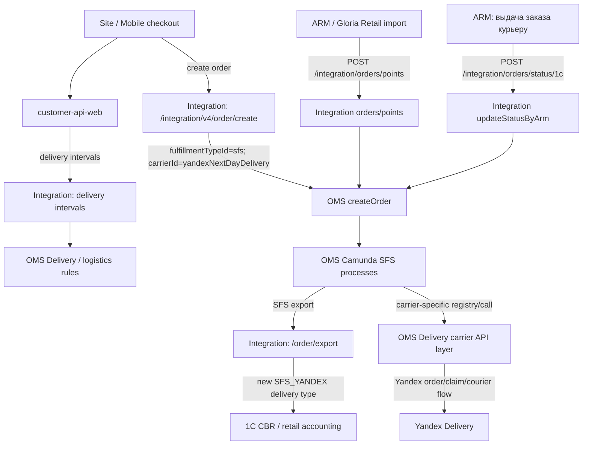

# SFS Yandex target process: целевая схема интеграции

Дата: 2026-06-28

Цель документа: описать целевой процесс подключения Яндекс-доставки для SFS, если carrier в OMS остается существующим `yandexNextDayDelivery`, а для учетного/магазинного контура вводится новый тип доставки SFS. Это продолжение `sfs-cdek-as-is.md`.

Важно: документ фиксирует текущую рабочую гипотезу. Предыдущая заметка `docs/research/2026-06-25-yandex-express-sfs-investigation.md` рассматривала вариант с отдельным express carrier (`gjexpress` / условный `yandexExpress`). После уточнения этот вариант считаем устаревшей развилкой: carrier не новый, новый именно delivery type для SFS.

## Краткий вывод

Если использовать `yandexNextDayDelivery` как ТК для SFS, то с точки зрения ecom это не "еще один OTS/Yandex warehouse flow", а расширение существующего SFS-процесса:

- Site/Mobile/customer-api-web должны увидеть и создать SFS-интервал с `carrierId = yandexNextDayDelivery`.
- Integration должен передать заказ в OMS как `delivery + sfs + yandexNextDayDelivery`.
- Integration должен замапить такую комбинацию в новый справочный тип доставки, например `SFS_YANDEX`, а не в существующий `YANDEX = 10`.
- OMS/Camunda должен вести SFS-заказ по магазинному процессу, но иметь отдельную ветку вызова/регистрации Яндекс-курьера.
- OMS Delivery уже содержит часть поддержки `yandexNextDayDelivery` для расчета/регистрации/отмены/трекинга заказа, но в найденном коде нет `CourierRequestService` и `CallCourierStatusService` для `yandexNextDayDelivery`.
- ARM/Gloria Retail должен уметь принять SFS-заказ с новой ТК/типом и выполнить выдачу курьеру; текущая main-ветка, которую мы смотрели, для SFS явно CDEK-only.
- OTS в SFS-процесс не добавляем.

## Целевая схема



## Договоренность по идентификаторам

### Carrier

Используем существующий OMS carrier:

- `yandexNextDayDelivery`
- Integration enum: `platform/integration/integration/www/app/Service/Consts/Enums/Delivery/Oms/CarrierIdEnum.php`
- OMS Delivery enum: `platform/starfish24/core/Delivery/src/main/java/com/starfish24/delivery/service/carrier/CarrierEnum.java`

Это важно, потому что в OMS Delivery уже есть реализации под этот carrier:

- `YandexNextDayDeliveryCalculationServiceImpl`
- `YandexAnotherDayOrderRegistrationServiceImpl`
- `YandexAnotherDayOrderCancellationServiceImpl`
- `YandexAnotherDayTrackingRequestServiceImpl`
- `YandexClientImpl`

### Delivery type

Нужен новый справочный тип доставки для комбинации:

```text
deliveryTypeId = delivery
fulfillmentTypeId = sfs
carrierId = yandexNextDayDelivery
```

Существующий `DeliveryTypeCodeEnum::YANDEX = 10` использовать для SFS нельзя без подтверждения 1C/retail: он уже используется как отдельный Яндекс-тип не-SFS сценария. Для SFS рядом с текущими кодами логично добавить новый тип, например:

```text
SFS_CDEK = 111
SFS_PICKPOINT = 112
SFS_RUSSIANPOST = 113
SFS_GLORIAJEANS_EXPRESS = 114
SFS_YANDEX = <новый код из справочника>
```

Открытый вопрос: фактический код и название должен дать владелец справочника 1C/retail. Рабочее имя в ecom-документации: `SFS_YANDEX`, название: `SFS курьером Яндекс` или `SFS Яндекс Express`.

## Integration Service: ожидаемые изменения

Integration не должен выбирать между CDEK и Yandex как операционный переключатель. Его роль в целевой схеме: принять уже выбранный carrier от checkout/OMS, корректно создать заказ и корректно отдать справочный тип в 1C/CBR/ecom export.

Точки изменения:

- `DeliveryTypeCodeEnum.php`
  - добавить новый `SFS_YANDEX = <код из справочника>`.
- `DeliveryTypeCodeNameEnum.php`
  - добавить имя для нового SFS-типа.
- `DeliveryTypeCodeMapByRulesContract.php` в `GloriaJeans`
  - добавить правило `DELIVERY + SFS + YANDEX -> SFS_YANDEX`;
  - для barcode вероятно использовать существующий `CarrierBarcodeEnum::YANDEX`, но это нужно подтвердить с 1C/retail.
- `DeliveryTypeCodeNameMapByRulesContract.php`
  - добавить имя для `DELIVERY + SFS + YANDEX`.
- `DeliveryTypeCodeMapByRulesContract.php` в `Cbr`
  - добавить правило `DELIVERY + SFS + YANDEX -> SFS_YANDEX`.
- `UserApi/Services/V1/Order/OrderService.php`
  - в старом resolver-е SFS сейчас есть CDEK и `gjexpress`, но нет Yandex.
- `UserApi/Mutators/V1/Order/OrderExportCbrMutator.php`
  - добавить SFS Yandex для CBR export.
- При необходимости проверить `OrderExportEcomMutator.php`
  - если новый тип должен уходить в ecom/1C-ecom export, а не только CBR.

Подтвержденные разрывы сейчас:

- `CarrierIdEnum::YANDEX = 'yandexNextDayDelivery'` есть.
- `DeliveryTypeCodeEnum::YANDEX = 10` есть.
- `SFS_CDEK`, `SFS_PICKPOINT`, `SFS_RUSSIANPOST`, `SFS_GLORIAJEANS_EXPRESS` есть.
- Правила `DELIVERY + SFS + YANDEX` не найдено.
- `DeliveryGoodIdMap` уже содержит `YANDEX => 'UPR010640F0001'`, но это good_id доставки, а не доказательство готовности SFS-типа.

## OMS/Camunda: ожидаемые изменения

### 1. Не заводить OTS для SFS

По as-is SFS идет в магазинный контур, а не в OTS:

- `releaseProcess.bpmn`: `${fulfillmentType == 'sfs'}` ведет в экспорт `1c-cbr`.
- OTS export остается в складских/других ветках.

Для Яндекс SFS это должно сохраниться.

### 2. Отдельный процесс или отдельная ветка

Минимальная доработка: расширить существующий SFS/CDEK carrier registry на Yandex.

Более чистая доработка: сделать carrier-specific subprocess/ветку для Yandex SFS, если внешний протокол отличается от CDEK. По текущим признакам он отличается:

- CDEK SFS использует `CourierRequestService` через endpoint OMS Delivery `/carrier/{carrierId}/couriercall/request`;
- для CDEK найден `CdekCourierRequestServiceImpl` и `CdekCallCourierStatusServiceImpl`;
- для `yandexNextDayDelivery` найдены order registration/cancellation/tracking/calculation, но не найден `CourierRequestService` и `CallCourierStatusService`.

Поэтому гипотеза про "отдельный процесс в Camunda" выглядит обоснованной, но точнее формулировать так:

```text
Нужна отдельная carrier-specific ветка в Camunda для SFS Yandex.
Отдельный BPMN process нужен, если Yandex не может быть выражен теми же activity:
carrierCourierCallActivity + carrierCourierCallTracking.
```

### 3. Файловые точки в BPMN

- `platform/starfish24/awg/bpmn-process/process/gloriajeans/releaseProcess.bpmn`
  - gateway "SFS и CDEK?" сейчас проверяет `${fulfillmentType == 'sfs' && carrierId == 'cdek'}`;
  - для Yandex надо решить, должен ли он вести себя как CDEK в этом gateway;
  - если да, условие расширить до CDEK/Yandex или заменить на вычисляемый признак SFS courier carrier.
- `platform/starfish24/awg/bpmn-process/process/gloriajeans/dispatchProcess.bpmn`
  - SFS ветка запускает `carrierRegistryProcess`;
  - есть особые условия для `carrierId == 'gjexpress'`;
  - надо добавить маршрут для `carrierId == 'yandexNextDayDelivery'`.
- `platform/starfish24/awg/bpmn-process/process/gloriajeans/carrierRegistryProcess.bpmn`
  - сейчас carrier-specific условия найдены для `carrierId == 'cdek'`;
  - надо добавить Yandex route или вынести в отдельный `carrierRegistryYandexSfsProcess`.

### 4. OMS Delivery

Нужно подтвердить, какой API Яндекса должен использоваться для SFS:

- если SFS Yandex должен создавать order/claim и дальше отслеживать order status, то надо переиспользовать/адаптировать `YandexAnotherDayOrderRegistrationServiceImpl` и tracking;
- если SFS Yandex требует именно вызова курьера из магазина, аналогично CDEK intake, то в OMS Delivery не хватает реализации `CourierRequestService` под `yandexNextDayDelivery`;
- если вызов курьера происходит не отдельным courier-call endpoint, а через создание/подтверждение заказа в Яндексе, Camunda activity должны отражать это явно, а не называться "Вызов курьера" по CDEK-смыслу.

## Включение и отключение CDEK/Yandex для SFS

Правильная точка переключения: не Integration.

Рекомендуемая модель:

- OMS Delivery/logistics rules отдают доступные SFS-интервалы по carrier;
- CDEK и Yandex могут быть включены одновременно, по магазинам/городам/тарифам/датам;
- checkout выбирает конкретный interval, а в заказ уходит конкретный `carrierId`;
- Integration только мапит выбранную комбинацию в справочник.

Почему не глобальный флаг в Integration:

- Integration не владеет расчетом доступности интервалов;
- в заказе уже есть `fulfillmentTypeId`, `carrierId`, `carrierTariffId`;
- глобальный switch сломает сценарий, где часть магазинов работает на CDEK, часть на Yandex.

Допустимый дополнительный guard в Integration:

- временный feature flag "разрешить создание SFS_YANDEX" для безопасного rollout;
- он не должен быть основным механизмом выбора ТК.

## customer-api-web / фронт

Риск: сейчас express-блок в customer-api-web завязан на `carrierId == 'gjexpress'`:

- `CommonDeliveryData::EXPRESS_CARRIER_ID = 'gjexpress'`;
- `isExpressDelivery()` возвращает true только для `gjexpress`.

Если SFS Yandex должен отображаться как "Экспресс-доставка" отдельной кнопкой/блоком, то есть развилка:

1. Считать `yandexNextDayDelivery` express carrier для UI.
2. Не трогать express-блок, а показывать Yandex SFS как обычную курьерскую доставку с отдельным названием/интервалом.

С учетом пользовательской постановки "Яндекс Express SFS" вероятнее нужен вариант 1, но он конфликтует с текущей жесткой проверкой `gjexpress`. Это отдельная задача customer-api-web/site/mobile, а не Integration.

## ARM / Gloria Retail / 1C

По найденному main-коду retail SFS сейчас выглядит CDEK-only:

- import SFS orders создает документ с `Tk.CDEK`;
- UI выдачи курьеру использует `cdek`;
- `finishIssuingOrders` отправляет статус в OMS через Integration.

Вводная по расследованию: розница делала тестовые доработки для КСЕ/Яндекс, но в main-ветке это не доказано. Для ecom-проекта нужно получить от retail команды:

- новый код delivery type для SFS Yandex;
- barcode/transport company id для 1C/ARM;
- подтверждение, что import SFS order умеет `yandexNextDayDelivery`;
- подтверждение, что кнопка "выдача заказа курьеру" и обратные статусы работают для Yandex;
- целевую ветку/релиз retail, где это реализовано.

## Целевой lifecycle

1. OMS Delivery/logistics rules возвращает SFS-интервалы CDEK и/или Yandex в зависимости от включения carrier для магазина.
2. customer-api-web/site/mobile показывает пользователю доступную доставку.
3. При создании заказа Integration получает выбранный interval и передает в OMS:
   - `deliveryTypeId = delivery`;
   - `fulfillmentTypeId = sfs`;
   - `carrierId = yandexNextDayDelivery`;
   - `carrierTariffId = <из интервала>`.
4. Integration при export/order mapping определяет новый справочный тип `SFS_YANDEX`.
5. OMS release process ведет заказ по SFS-ветке и экспортирует его в `1c-cbr`.
6. ARM/Gloria Retail забирает заказ из OMS через Integration `/integration/orders/points`, видит ТК Yandex и создает магазинный документ.
7. OMS dispatch/carrier registry запускает Yandex-specific регистрацию/вызов курьера.
8. Магазин собирает и выдает заказ курьеру.
9. ARM отправляет статус в Integration через `/integration/orders/status/1c` или `/integration/v2/orders/status/1c`.
10. Integration обновляет OMS order status и item statuses.
11. OMS/Delivery получает дальнейшие статусы от Yandex или проверяет tracking по carrier-specific механике.

## Гипотезы под проверку

### H1. `yandexNextDayDelivery` можно использовать для SFS без нового carrier

Что проверить:

- OMS Delivery registration/tracking API подходит для отправки из магазина;
- credentials/legal entity работают для магазинов, а не только склада;
- тарифы/интервалы могут быть ограничены магазином.

### H2. Нужен новый SFS delivery type, но не новый carrier

Что проверить:

- 1C/retail справочник содержит новый код;
- CBR export ожидает именно новый delivery type;
- barcode должен быть `CarrierBarcodeEnum::YANDEX` или новый.

### H3. Camunda лучше расширять отдельной Yandex SFS веткой

Что проверить:

- может ли Yandex flow лечь в `carrierCourierCallActivity`;
- есть ли готовая реализация courier-call в других ветках/релизах;
- какой статус должен выставляться после успешной регистрации/вызова courier.

### H4. Переключение CDEK/Yandex должно жить в OMS Delivery rules

Что проверить:

- где сейчас для SFS CDEK включаются магазины/тарифы;
- есть ли админка/конфиг для carrier availability;
- как отключить carrier для одного магазина без деплоя Integration.

### H5. customer-api-web должен расширить понятие express

Что проверить:

- должен ли `yandexNextDayDelivery` попадать в express-блок ответа;
- не используется ли `yandexNextDayDelivery` в других сценариях, где его нельзя показывать как express;
- нужна ли классификация по `fulfillmentTypeId=sfs` + carrier, а не только по carrier.

## Открытые вопросы

- Какой точный код нового delivery type в справочнике 1C?
- Какое пользовательское название должно быть у типа: "SFS курьером Яндекс", "Яндекс Express", другое?
- Нужен ли отдельный courier-call в Yandex API или достаточно order registration/confirmation?
- Кто владеет включением carrier по магазинам: OMS delivery config, logistics service, retail master data?
- Нужно ли одновременно показывать CDEK и Yandex SFS, или всегда выбирать один carrier по правилу?
- Какие статусы от Yandex должны менять OMS order/item statuses, а какие остаются информационными?
- Есть ли retail-ветка с готовым Yandex SFS и как она называется?

## Команды для продолжения расследования

```bash
rg -n "DELIVERY.*SFS.*YANDEX|SFS_YANDEX|yandexNextDayDelivery" platform/integration/integration/www/app/Service
rg -n "yandexNextDayDelivery|carrierId == 'cdek'|carrierRegistryProcess|carrierCourierCall" platform/starfish24/awg/bpmn-process/process/gloriajeans
rg -n "implements CourierRequestService|implements CallCourierStatusService|YANDEX_NEXT_DAY_DELIVERY" platform/starfish24/core/Delivery/src/main/java
rg -n "EXPRESS_CARRIER_ID|isExpressDelivery|gjexpress|yandexNextDayDelivery" platform/ensi/apps/customers-api-web/app
rg -n "Tk\\.CDEK|yandex|яндекс|courier|ВыдачаКурьеру" platform/1s8-enterprise platform/arm
```

